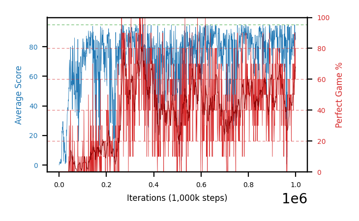

# b32c-c51eps3125e4seed1

Blue is average score (food eaten) on the left axis, red is perfect-game percentage on the right.

Latest eval: step 1000000, avg score 84.9, perfect games 80%.

## Config

| setting | value |
|---|---|
| policy_name | b32c-c51eps3125e4seed1 |
| seed | 1 |
| zeroed_observations | none |
| learning_rate | 0.0001 |
| adam_epsilon | 0.0003125 |
| batch_size | 128 |
| discount | 0.9975 |
| target_update_period | 1000 |
| target_update_tau | 1.0 |
| gradient_clipping | none |
| n_step_update | 1 |
| initial_epsilon | 0.4 |
| min_epsilon | 0.002 |
| epsilon_schedule | bootstrap on avg_reward [2, 5, 10, 15, 20] then geometric to floor by 80% trailing-30 perfect |
| guided_fraction | 0.8 |
| forking | up to 4 live branches including the main line, fork p=0.5 at length >= 85, branch capped at 60 steps, one branch advanced per iteration |
| exploration_shield | 80% of refinement-phase episodes draw the epsilon move from non-fatal actions; greedy moves never shielded |
| fc_layer_params | (200, 100, 100) |
| algo | c51 (distributional), 51 atoms over [-5.0, 120.0] at 2.500 spacing, cross-entropy loss, double (online argmax) target selection, standard init |
| replay_buffer | cpprb prioritized, capacity 100000 |
| priority_exponent (alpha) | 0.6 |
| priority_signal | kl (SNEK_PRIORITY_SIGNAL=td_error; a distributional agent has no TD error) |
| importance_sampling_beta | disabled |
| max_steps | 1000000 |
| initial_populate_steps | 1000 |
| eval | 10 episodes every 1000 steps |
| grid | 9x9, max possible score 95 |
| DEATH_REWARD | -5.0 |
| FOOD_REWARD | 1.0 |
| FOOD_DISTANCE_REWARD | 0.0 |
| CHASE_SAFE_SHAPING | off |
| eval_only | False |
| min_checkpoint_score | 40.0 |
| c51_support_note | support [-5.0, 120.0] is below the derived maximum return 194.0, so a return above 120.0 would be clipped. Measured max is 105.0 (14% headroom); spacing 2.500. This is a judgement, not an error. |

## Evals

1001 evals so far. Full series in [`b32c-c51eps3125e4seed1_evals.json`](b32c-c51eps3125e4seed1_evals.json).

| step | avg score | trailing avg | min score | max score | avg reward | perfect % | epsilon |
|---|---|---|---|---|---|---|---|
| 0 | 0.1 | 0.1 | 0 | 1/95 | -4.9 | 0 | 0.4 |
| 1000 | 0.8 | 0.8 | 0 | 3/95 | 0.3 | 0 | 0.4 |
| 2000 | 1.4 | 1.1 | 1 | 4/95 | 0.9 | 0 | 0.4 |
| ... | | | | | | | |
| 989000 | 82.4 | 82.12 | 18 | 95/95 | 140.25 | 60 | 0.0048 |
| 990000 | 84.2 | 81.82 | 37 | 95/95 | 152.0 | 70 | 0.0046 |
| 991000 | 80.4 | 83.06 | 42 | 95/95 | 117.0 | 40 | 0.0046 |
| 992000 | 88.4 | 84.76 | 65 | 95/95 | 146.25 | 60 | 0.0044 |
| 993000 | 73.6 | 81.8 | 34 | 95/95 | 131.0 | 60 | 0.0043 |
| 994000 | 88.0 | 82.92 | 29 | 95/95 | 155.8 | 70 | 0.0041 |
| 995000 | 87.6 | 83.6 | 36 | 95/95 | 135.5 | 50 | 0.004 |
| 996000 | 94.8 | 86.48 | 93 | 95/95 | 183.4 | 90 | 0.0039 |
| 997000 | 90.5 | 86.9 | 50 | 95/95 | 179.1 | 90 | 0.0038 |
| 998000 | 84.3 | 89.04 | 15 | 95/95 | 142.15 | 60 | 0.0037 |
| 999000 | 89.8 | 89.4 | 46 | 95/95 | 168.0 | 80 | 0.0037 |
| 1000000 | 84.9 | 88.86 | 1 | 95/95 | 164.0 | 80 | 0.0036 |
