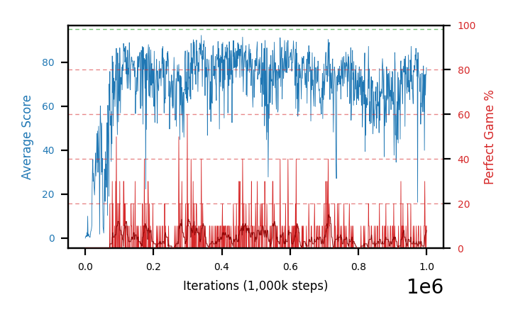

# b32d-c51eps3125e4seed2

Blue is average score (food eaten) on the left axis, red is perfect-game percentage on the right.

Latest eval: step 1000000, avg score 77.5, perfect games 10%.

## Config

| setting | value |
|---|---|
| policy_name | b32d-c51eps3125e4seed2 |
| seed | 2 |
| zeroed_observations | none |
| learning_rate | 0.0001 |
| adam_epsilon | 0.0003125 |
| batch_size | 128 |
| discount | 0.9975 |
| target_update_period | 1000 |
| target_update_tau | 1.0 |
| gradient_clipping | none |
| n_step_update | 1 |
| initial_epsilon | 0.4 |
| min_epsilon | 0.002 |
| epsilon_schedule | bootstrap on avg_reward [2, 5, 10, 15, 20] then geometric to floor by 80% trailing-30 perfect |
| guided_fraction | 0.8 |
| forking | up to 4 live branches including the main line, fork p=0.5 at length >= 85, branch capped at 60 steps, one branch advanced per iteration |
| exploration_shield | 80% of refinement-phase episodes draw the epsilon move from non-fatal actions; greedy moves never shielded |
| fc_layer_params | (200, 100, 100) |
| algo | c51 (distributional), 51 atoms over [-5.0, 120.0] at 2.500 spacing, cross-entropy loss, double (online argmax) target selection, standard init |
| replay_buffer | cpprb prioritized, capacity 100000 |
| priority_exponent (alpha) | 0.6 |
| priority_signal | kl (SNEK_PRIORITY_SIGNAL=td_error; a distributional agent has no TD error) |
| importance_sampling_beta | disabled |
| max_steps | 1000000 |
| initial_populate_steps | 1000 |
| eval | 10 episodes every 1000 steps |
| grid | 9x9, max possible score 95 |
| DEATH_REWARD | -5.0 |
| FOOD_REWARD | 1.0 |
| FOOD_DISTANCE_REWARD | 0.0 |
| CHASE_SAFE_SHAPING | off |
| eval_only | False |
| min_checkpoint_score | 40.0 |
| c51_support_note | support [-5.0, 120.0] is below the derived maximum return 194.0, so a return above 120.0 would be clipped. Measured max is 105.0 (14% headroom); spacing 2.500. This is a judgement, not an error. |

## Evals

1001 evals so far. Full series in [`b32d-c51eps3125e4seed2_evals.json`](b32d-c51eps3125e4seed2_evals.json).

| step | avg score | trailing avg | min score | max score | avg reward | perfect % | epsilon |
|---|---|---|---|---|---|---|---|
| 0 | 0.0 | 0.0 | 0 | 0/95 | -5.0 | 0 | 0.4 |
| 1000 | 0.7 | 0.7 | 0 | 2/95 | 0.2 | 0 | 0.4 |
| 2000 | 1.0 | 0.85 | 0 | 3/95 | 0.5 | 0 | 0.4 |
| ... | | | | | | | |
| 989000 | 57.5 | 63.28 | 4 | 90/95 | 53.4 | 0 | 0.0119 |
| 990000 | 66.2 | 64.58 | 4 | 91/95 | 63.45 | 0 | 0.0119 |
| 991000 | 78.3 | 67.34 | 37 | 91/95 | 74.65 | 0 | 0.012 |
| 992000 | 57.5 | 63.84 | 10 | 91/95 | 52.95 | 0 | 0.012 |
| 993000 | 74.2 | 66.74 | 25 | 95/95 | 80.05 | 10 | 0.0119 |
| 994000 | 39.9 | 63.22 | 0 | 95/95 | 47.55 | 10 | 0.0119 |
| 995000 | 73.1 | 64.6 | 25 | 95/95 | 99.3 | 30 | 0.0117 |
| 996000 | 74.5 | 63.84 | 30 | 95/95 | 81.7 | 10 | 0.0116 |
| 997000 | 65.0 | 65.34 | 29 | 91/95 | 60.0 | 0 | 0.0116 |
| 998000 | 74.0 | 65.3 | 40 | 95/95 | 79.4 | 10 | 0.0115 |
| 999000 | 74.3 | 72.18 | 43 | 93/95 | 69.75 | 0 | 0.0115 |
| 1000000 | 77.5 | 73.06 | 54 | 95/95 | 83.35 | 10 | 0.0115 |
