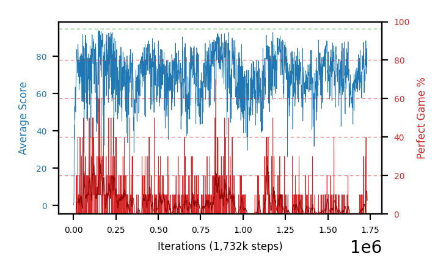

# b33a-c51win10seed1

Blue is average score (food eaten) on the left axis, red is perfect-game percentage on the right.

Latest eval: step 1732000, avg score 79.2, perfect games 0%.

## Config

| setting | value |
|---|---|
| policy_name | b33a-c51win10seed1 |
| seed | 1 |
| zeroed_observations | none |
| learning_rate | 0.0001 |
| adam_epsilon | 0.00015 |
| perfect_game_reward | 10.0 |
| batch_size | 128 |
| discount | 0.9975 |
| target_update_period | 1000 |
| target_update_tau | 1.0 |
| gradient_clipping | none |
| n_step_update | 1 |
| initial_epsilon | 0.4 |
| min_epsilon | 0.002 |
| epsilon_schedule | bootstrap on avg_reward [2, 5, 10, 15, 20] then geometric to floor by 80% trailing-30 perfect |
| guided_fraction | 0.8 |
| forking | up to 4 live branches including the main line, fork p=0.5 at length >= 85, branch capped at 60 steps, one branch advanced per iteration |
| exploration_shield | 80% of refinement-phase episodes draw the epsilon move from non-fatal actions; greedy moves never shielded |
| fc_layer_params | (200, 100, 100) |
| algo | c51 (distributional), 51 atoms over [-5.0, 40.0] at 0.900 spacing, cross-entropy loss, double (online argmax) target selection, standard init |
| replay_buffer | cpprb prioritized, capacity 100000 |
| priority_exponent (alpha) | 0.6 |
| priority_signal | kl (SNEK_PRIORITY_SIGNAL=td_error; a distributional agent has no TD error) |
| importance_sampling_beta | disabled |
| max_steps | 3000000 |
| initial_populate_steps | 1000 |
| eval | 10 episodes every 1000 steps |
| grid | 9x9, max possible score 95 |
| DEATH_REWARD | -5.0 |
| FOOD_REWARD | 1.0 |
| FOOD_DISTANCE_REWARD | 0.0 |
| CHASE_SAFE_SHAPING | off |
| eval_only | False |
| min_checkpoint_score | 40.0 |
| c51_support_note | support [-5.0, 40.0] is below the derived maximum return 104.0, so a return above 40.0 would be clipped. 21% headroom over the measured 33.0; spacing 0.900. This is a judgement, not an error. |

## Evals

1733 evals so far. Full series in [`b33a-c51win10seed1_evals.json`](b33a-c51win10seed1_evals.json).

| step | avg score | trailing avg | min score | max score | avg reward | perfect % | epsilon |
|---|---|---|---|---|---|---|---|
| 0 | 0.1 | 0.1 | 0 | 1/95 | -4.9 | 0 | 0.4 |
| 1000 | 0.8 | 0.8 | 0 | 3/95 | 0.3 | 0 | 0.4 |
| 2000 | 1.5 | 1.15 | 1 | 4/95 | 1.0 | 0 | 0.4 |
| ... | | | | | | | |
| 1721000 | 79.1 | 74.1 | 61 | 95/95 | 77.35 | 20 | 0.0116 |
| 1722000 | 81.9 | 75.88 | 34 | 95/95 | 81.55 | 30 | 0.0114 |
| 1723000 | 75.3 | 76.34 | 55 | 93/95 | 71.2 | 0 | 0.0114 |
| 1724000 | 88.5 | 78.34 | 78 | 95/95 | 87.2 | 20 | 0.0112 |
| 1725000 | 81.2 | 81.2 | 14 | 95/95 | 82.7 | 40 | 0.0109 |
| 1726000 | 82.5 | 81.88 | 33 | 95/95 | 80.25 | 10 | 0.0108 |
| 1727000 | 70.7 | 79.64 | 14 | 93/95 | 66.6 | 0 | 0.0108 |
| 1728000 | 73.3 | 79.24 | 13 | 93/95 | 68.75 | 0 | 0.0109 |
| 1729000 | 84.3 | 78.4 | 74 | 89/95 | 79.3 | 0 | 0.0109 |
| 1730000 | 74.5 | 77.06 | 12 | 89/95 | 69.95 | 0 | 0.011 |
| 1731000 | 79.2 | 76.4 | 43 | 87/95 | 74.65 | 0 | 0.011 |
| 1732000 | 79.2 | 78.1 | 41 | 93/95 | 74.2 | 0 | 0.011 |
