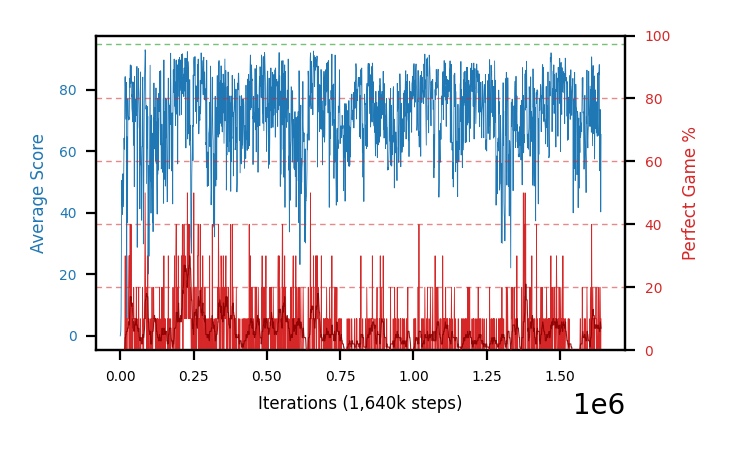

# b33b-c51win10seed2

Blue is average score (food eaten) on the left axis, red is perfect-game percentage on the right.

Latest eval: step 1640000, avg score 65.5, perfect games 10%.

## Config

| setting | value |
|---|---|
| policy_name | b33b-c51win10seed2 |
| seed | 2 |
| zeroed_observations | none |
| learning_rate | 0.0001 |
| adam_epsilon | 0.00015 |
| perfect_game_reward | 10.0 |
| batch_size | 128 |
| discount | 0.9975 |
| target_update_period | 1000 |
| target_update_tau | 1.0 |
| gradient_clipping | none |
| n_step_update | 1 |
| initial_epsilon | 0.4 |
| min_epsilon | 0.002 |
| epsilon_schedule | bootstrap on avg_reward [2, 5, 10, 15, 20] then geometric to floor by 80% trailing-30 perfect |
| guided_fraction | 0.8 |
| forking | up to 4 live branches including the main line, fork p=0.5 at length >= 85, branch capped at 60 steps, one branch advanced per iteration |
| exploration_shield | 80% of refinement-phase episodes draw the epsilon move from non-fatal actions; greedy moves never shielded |
| fc_layer_params | (200, 100, 100) |
| algo | c51 (distributional), 51 atoms over [-5.0, 40.0] at 0.900 spacing, cross-entropy loss, double (online argmax) target selection, standard init |
| replay_buffer | cpprb prioritized, capacity 100000 |
| priority_exponent (alpha) | 0.6 |
| priority_signal | kl (SNEK_PRIORITY_SIGNAL=td_error; a distributional agent has no TD error) |
| importance_sampling_beta | disabled |
| max_steps | 3000000 |
| initial_populate_steps | 1000 |
| eval | 10 episodes every 1000 steps |
| grid | 9x9, max possible score 95 |
| DEATH_REWARD | -5.0 |
| FOOD_REWARD | 1.0 |
| FOOD_DISTANCE_REWARD | 0.0 |
| CHASE_SAFE_SHAPING | off |
| eval_only | False |
| min_checkpoint_score | 40.0 |
| c51_support_note | support [-5.0, 40.0] is below the derived maximum return 104.0, so a return above 40.0 would be clipped. 21% headroom over the measured 33.0; spacing 0.900. This is a judgement, not an error. |

## Evals

1641 evals so far. Full series in [`b33b-c51win10seed2_evals.json`](b33b-c51win10seed2_evals.json).

| step | avg score | trailing avg | min score | max score | avg reward | perfect % | epsilon |
|---|---|---|---|---|---|---|---|
| 0 | 0.0 | 0.0 | 0 | 0/95 | -5.0 | 0 | 0.4 |
| 1000 | 0.9 | 0.9 | 0 | 3/95 | 0.4 | 0 | 0.4 |
| 2000 | 1.5 | 1.2 | 0 | 5/95 | 1.0 | 0 | 0.4 |
| ... | | | | | | | |
| 1629000 | 69.3 | 73.48 | 25 | 95/95 | 67.05 | 10 | 0.0104 |
| 1630000 | 65.1 | 71.28 | 10 | 95/95 | 63.35 | 20 | 0.0102 |
| 1631000 | 78.6 | 72.66 | 22 | 93/95 | 74.5 | 0 | 0.0102 |
| 1632000 | 85.7 | 76.82 | 39 | 95/95 | 83.9 | 10 | 0.0102 |
| 1633000 | 84.9 | 76.72 | 47 | 95/95 | 84.95 | 20 | 0.0101 |
| 1634000 | 88.2 | 80.5 | 61 | 94/95 | 84.55 | 0 | 0.0102 |
| 1635000 | 53.7 | 78.22 | 22 | 93/95 | 49.15 | 0 | 0.0103 |
| 1636000 | 67.6 | 76.02 | 20 | 94/95 | 63.05 | 0 | 0.0103 |
| 1637000 | 73.6 | 73.6 | 27 | 95/95 | 72.75 | 20 | 0.0102 |
| 1638000 | 72.0 | 71.02 | 30 | 95/95 | 69.75 | 10 | 0.0105 |
| 1639000 | 40.3 | 61.44 | 15 | 77/95 | 35.3 | 0 | 0.0106 |
| 1640000 | 65.5 | 63.8 | 14 | 95/95 | 61.9 | 10 | 0.0105 |
