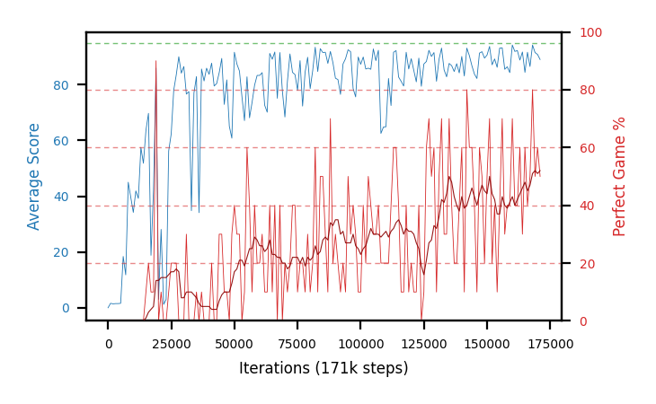

# b36a-c51fc320seed1

Blue is average score (food eaten) on the left axis, red is perfect-game percentage on the right.

Latest eval: step 171000, avg score 89.0, perfect games 50%.

## Config

| setting | value |
|---|---|
| policy_name | b36a-c51fc320seed1 |
| seed | 1 |
| zeroed_observations | none |
| learning_rate | 0.0001 |
| adam_epsilon | 0.00015 |
| perfect_game_reward | 100.0 |
| batch_size | 128 |
| discount | 0.9975 |
| target_update_period | 1000 |
| target_update_tau | 1.0 |
| gradient_clipping | none |
| n_step_update | 1 |
| initial_epsilon | 0.4 |
| min_epsilon | 0.002 |
| epsilon_schedule | bootstrap on avg_reward [2, 5, 10, 15, 20] then geometric to floor by 80% trailing-30 perfect |
| guided_fraction | 0.8 |
| forking | up to 4 live branches including the main line, fork p=0.5 at length >= 85, branch capped at 60 steps, one branch advanced per iteration |
| exploration_shield | 80% of refinement-phase episodes draw the epsilon move from non-fatal actions; greedy moves never shielded |
| fc_layer_params | (320,) |
| algo | c51 (distributional), 51 atoms over [-5.0, 120.0] at 2.500 spacing, cross-entropy loss, double (online argmax) target selection, standard init |
| replay_buffer | cpprb prioritized, capacity 100000 |
| priority_exponent (alpha) | 0.6 |
| priority_signal | kl (SNEK_PRIORITY_SIGNAL=td_error; a distributional agent has no TD error) |
| importance_sampling_beta | disabled |
| max_steps | 3000000 |
| initial_populate_steps | 1000 |
| eval | 10 episodes every 1000 steps |
| grid | 9x9, max possible score 95 |
| DEATH_REWARD | -5.0 |
| FOOD_REWARD | 1.0 |
| FOOD_DISTANCE_REWARD | 0.0 |
| CHASE_SAFE_SHAPING | off |
| eval_only | False |
| min_checkpoint_score | 40.0 |
| c51_support_note | support [-5.0, 120.0] is below the derived maximum return 194.0, so a return above 120.0 would be clipped. 14% headroom over the measured 105.0; spacing 2.500. This is a judgement, not an error. |

## Evals

172 evals so far. Full series in [`b36a-c51fc320seed1_evals.json`](b36a-c51fc320seed1_evals.json).

| step | avg score | trailing avg | min score | max score | avg reward | perfect % | epsilon |
|---|---|---|---|---|---|---|---|
| 0 | 0.0 | 0.0 | 0 | 0/95 | -5.0 | 0 | 0.4 |
| 1000 | 1.6 | 1.6 | 0 | 4/95 | 1.1 | 0 | 0.4 |
| 2000 | 1.4 | 1.5 | 0 | 7/95 | 0.9 | 0 | 0.4 |
| ... | | | | | | | |
| 160000 | 94.2 | 88.72 | 91 | 95/95 | 163.35 | 70 | 0.0046 |
| 161000 | 91.9 | 88.46 | 87 | 95/95 | 130.75 | 40 | 0.0047 |
| 162000 | 92.2 | 89.8 | 86 | 95/95 | 131.5 | 40 | 0.0048 |
| 163000 | 88.8 | 90.28 | 60 | 95/95 | 147.55 | 60 | 0.0047 |
| 164000 | 91.7 | 91.76 | 78 | 95/95 | 120.6 | 30 | 0.0047 |
| 165000 | 84.4 | 89.8 | 16 | 95/95 | 142.7 | 60 | 0.0047 |
| 166000 | 91.6 | 89.74 | 82 | 95/95 | 130.9 | 40 | 0.0047 |
| 167000 | 86.5 | 88.6 | 27 | 95/95 | 135.3 | 50 | 0.0046 |
| 168000 | 94.2 | 89.68 | 89 | 95/95 | 173.3 | 80 | 0.0044 |
| 169000 | 91.5 | 89.64 | 76 | 95/95 | 140.3 | 50 | 0.0044 |
| 170000 | 90.8 | 90.92 | 74 | 95/95 | 149.1 | 60 | 0.0044 |
| 171000 | 89.0 | 90.4 | 64 | 95/95 | 137.8 | 50 | 0.0042 |
