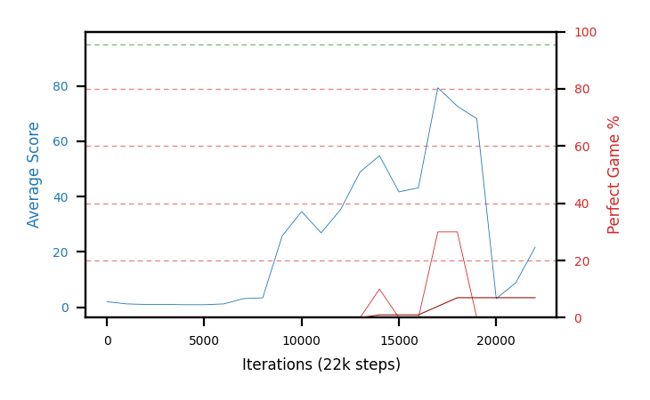

# b36c-c51fc320seed3

Blue is average score (food eaten) on the left axis, red is perfect-game percentage on the right.

Latest eval: step 22000, avg score 21.7, perfect games 0%.

## Config

| setting | value |
|---|---|
| policy_name | b36c-c51fc320seed3 |
| seed | 3 |
| zeroed_observations | none |
| learning_rate | 0.0001 |
| adam_epsilon | 0.00015 |
| perfect_game_reward | 100.0 |
| batch_size | 128 |
| discount | 0.9975 |
| target_update_period | 1000 |
| target_update_tau | 1.0 |
| gradient_clipping | none |
| n_step_update | 1 |
| initial_epsilon | 0.4 |
| min_epsilon | 0.002 |
| epsilon_schedule | bootstrap on avg_reward [2, 5, 10, 15, 20] then geometric to floor by 80% trailing-30 perfect |
| guided_fraction | 0.8 |
| forking | up to 4 live branches including the main line, fork p=0.5 at length >= 85, branch capped at 60 steps, one branch advanced per iteration |
| exploration_shield | 80% of refinement-phase episodes draw the epsilon move from non-fatal actions; greedy moves never shielded |
| fc_layer_params | (320,) |
| algo | c51 (distributional), 51 atoms over [-5.0, 120.0] at 2.500 spacing, cross-entropy loss, double (online argmax) target selection, standard init |
| replay_buffer | cpprb prioritized, capacity 100000 |
| priority_exponent (alpha) | 0.6 |
| priority_signal | kl (SNEK_PRIORITY_SIGNAL=td_error; a distributional agent has no TD error) |
| importance_sampling_beta | disabled |
| max_steps | 3000000 |
| initial_populate_steps | 1000 |
| eval | 10 episodes every 1000 steps |
| grid | 9x9, max possible score 95 |
| DEATH_REWARD | -5.0 |
| FOOD_REWARD | 1.0 |
| FOOD_DISTANCE_REWARD | 0.0 |
| CHASE_SAFE_SHAPING | off |
| eval_only | False |
| min_checkpoint_score | 40.0 |
| c51_support_note | support [-5.0, 120.0] is below the derived maximum return 194.0, so a return above 120.0 would be clipped. 14% headroom over the measured 105.0; spacing 2.500. This is a judgement, not an error. |

## Evals

23 evals so far. Full series in [`b36c-c51fc320seed3_evals.json`](b36c-c51fc320seed3_evals.json).

| step | avg score | trailing avg | min score | max score | avg reward | perfect % | epsilon |
|---|---|---|---|---|---|---|---|
| 0 | 2.0 | 2.0 | 0 | 11/95 | -3.0 | 0 | 0.4 |
| 1000 | 1.2 | 1.2 | 0 | 11/95 | 0.7 | 0 | 0.4 |
| 2000 | 1.0 | 1.1 | 0 | 5/95 | 0.5 | 0 | 0.4 |
| ... | | | | | | | |
| 11000 | 26.9 | 18.76 | 16 | 55/95 | 23.7 | 0 | 0.025 |
| 12000 | 35.3 | 25.2 | 15 | 58/95 | 31.2 | 0 | 0.0125 |
| 13000 | 48.9 | 34.3 | 23 | 92/95 | 44.35 | 0 | 0.0125 |
| 14000 | 54.8 | 40.1 | 25 | 95/95 | 60.2 | 10 | 0.0123 |
| 15000 | 41.7 | 41.52 | 22 | 58/95 | 36.7 | 0 | 0.0123 |
| 16000 | 43.2 | 44.78 | 23 | 67/95 | 38.2 | 0 | 0.0123 |
| 17000 | 79.4 | 53.6 | 64 | 95/95 | 105.6 | 30 | 0.0119 |
| 18000 | 72.7 | 58.36 | 36 | 95/95 | 98.9 | 30 | 0.0115 |
| 19000 | 68.2 | 61.04 | 29 | 88/95 | 64.1 | 0 | 0.0115 |
| 20000 | 3.1 | 53.32 | 1 | 7/95 | 2.6 | 0 | 0.0116 |
| 21000 | 8.8 | 46.44 | 3 | 28/95 | 8.3 | 0 | 0.0116 |
| 22000 | 21.7 | 34.9 | 0 | 88/95 | 21.2 | 0 | 0.0117 |
