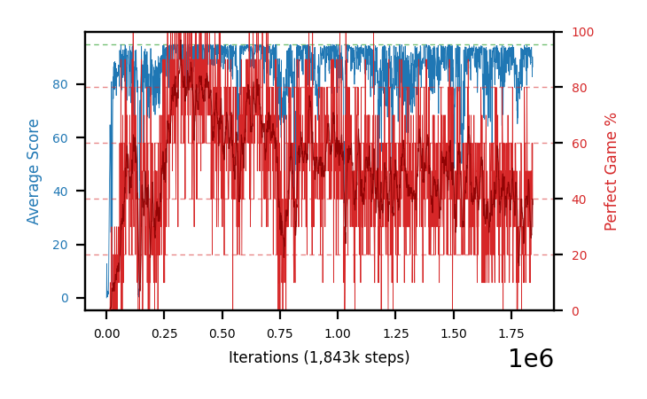

# b36d-c51fc320seed4

Blue is average score (food eaten) on the left axis, red is perfect-game percentage on the right.

Latest eval: step 1843000, avg score 86.5, perfect games 30%.

## Config

| setting | value |
|---|---|
| policy_name | b36d-c51fc320seed4 |
| seed | 4 |
| zeroed_observations | none |
| learning_rate | 0.0001 |
| adam_epsilon | 0.00015 |
| perfect_game_reward | 100.0 |
| batch_size | 128 |
| discount | 0.9975 |
| target_update_period | 1000 |
| target_update_tau | 1.0 |
| gradient_clipping | none |
| n_step_update | 1 |
| initial_epsilon | 0.4 |
| min_epsilon | 0.002 |
| epsilon_schedule | bootstrap on avg_reward [2, 5, 10, 15, 20] then geometric to floor by 80% trailing-30 perfect |
| guided_fraction | 0.8 |
| forking | up to 4 live branches including the main line, fork p=0.5 at length >= 85, branch capped at 60 steps, one branch advanced per iteration |
| exploration_shield | 80% of refinement-phase episodes draw the epsilon move from non-fatal actions; greedy moves never shielded |
| fc_layer_params | (320,) |
| algo | c51 (distributional), 51 atoms over [-5.0, 120.0] at 2.500 spacing, cross-entropy loss, double (online argmax) target selection, standard init |
| replay_buffer | cpprb prioritized, capacity 100000 |
| priority_exponent (alpha) | 0.6 |
| priority_signal | kl (SNEK_PRIORITY_SIGNAL=td_error; a distributional agent has no TD error) |
| importance_sampling_beta | disabled |
| max_steps | 3000000 |
| initial_populate_steps | 1000 |
| eval | 10 episodes every 1000 steps |
| grid | 9x9, max possible score 95 |
| DEATH_REWARD | -5.0 |
| FOOD_REWARD | 1.0 |
| FOOD_DISTANCE_REWARD | 0.0 |
| CHASE_SAFE_SHAPING | off |
| eval_only | False |
| min_checkpoint_score | 40.0 |
| c51_support_note | support [-5.0, 120.0] is below the derived maximum return 194.0, so a return above 120.0 would be clipped. 14% headroom over the measured 105.0; spacing 2.500. This is a judgement, not an error. |

## Evals

1844 evals so far. Full series in [`b36d-c51fc320seed4_evals.json`](b36d-c51fc320seed4_evals.json).

| step | avg score | trailing avg | min score | max score | avg reward | perfect % | epsilon |
|---|---|---|---|---|---|---|---|
| 0 | 0.0 | 0.0 | 0 | 0/95 | -5.0 | 0 | 0.4 |
| 1000 | 12.8 | 12.8 | 0 | 43/95 | 12.3 | 0 | 0.2 |
| 2000 | 3.1 | 7.95 | 1 | 12/95 | 2.6 | 0 | 0.2 |
| ... | | | | | | | |
| 1832000 | 91.6 | 92.26 | 87 | 95/95 | 99.25 | 10 | 0.0054 |
| 1833000 | 87.5 | 91.0 | 28 | 95/95 | 136.75 | 50 | 0.0052 |
| 1834000 | 89.1 | 90.34 | 52 | 95/95 | 107.6 | 20 | 0.0052 |
| 1835000 | 93.0 | 90.26 | 91 | 95/95 | 111.95 | 20 | 0.0052 |
| 1836000 | 90.4 | 90.32 | 73 | 95/95 | 108.9 | 20 | 0.0053 |
| 1837000 | 92.6 | 90.52 | 79 | 95/95 | 141.4 | 50 | 0.0054 |
| 1838000 | 93.8 | 91.78 | 93 | 95/95 | 132.65 | 40 | 0.0055 |
| 1839000 | 88.0 | 91.56 | 37 | 95/95 | 126.85 | 40 | 0.0056 |
| 1840000 | 88.2 | 90.6 | 33 | 95/95 | 146.95 | 60 | 0.0054 |
| 1841000 | 82.8 | 89.08 | 23 | 95/95 | 121.65 | 40 | 0.0055 |
| 1842000 | 90.3 | 88.62 | 53 | 95/95 | 148.6 | 60 | 0.0054 |
| 1843000 | 86.5 | 87.16 | 26 | 95/95 | 114.95 | 30 | 0.0053 |
