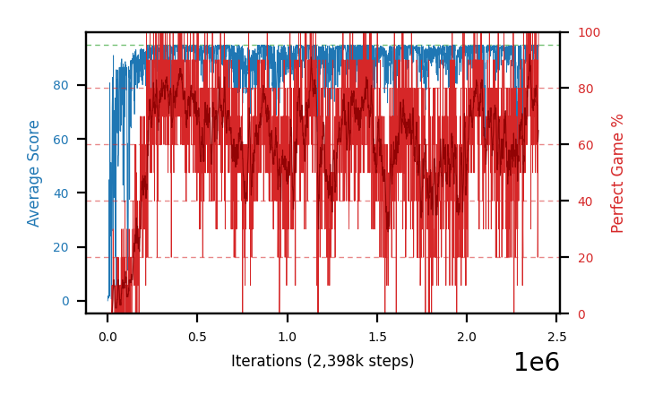

# b38a-c51fc320eps3125seed1

Blue is average score (food eaten) on the left axis, red is perfect-game percentage on the right.

Latest eval: step 2398000, avg score 95.0, perfect games 100%.

## Config

| setting | value |
|---|---|
| policy_name | b38a-c51fc320eps3125seed1 |
| seed | 1 |
| zeroed_observations | none |
| learning_rate | 0.0001 |
| adam_epsilon | 0.0003125 |
| perfect_game_reward | 100.0 |
| batch_size | 128 |
| discount | 0.9975 |
| target_update_period | 1000 |
| target_update_tau | 1.0 |
| gradient_clipping | none |
| n_step_update | 1 |
| initial_epsilon | 0.4 |
| min_epsilon | 0.002 |
| epsilon_schedule | bootstrap on avg_reward [2, 5, 10, 15, 20] then geometric to floor by 80% trailing-30 perfect |
| guided_fraction | 0.8 |
| forking | up to 4 live branches including the main line, fork p=0.5 at length >= 85, branch capped at 60 steps, one branch advanced per iteration |
| exploration_shield | 80% of refinement-phase episodes draw the epsilon move from non-fatal actions; greedy moves never shielded |
| fc_layer_params | (320,) |
| algo | c51 (distributional), 51 atoms over [-5.0, 120.0] at 2.500 spacing, cross-entropy loss, double (online argmax) target selection, standard init |
| replay_buffer | cpprb prioritized, capacity 100000 |
| priority_exponent (alpha) | 0.6 |
| priority_signal | kl (SNEK_PRIORITY_SIGNAL=td_error; a distributional agent has no TD error) |
| importance_sampling_beta | disabled |
| max_steps | 3000000 |
| initial_populate_steps | 1000 |
| eval | 10 episodes every 1000 steps |
| grid | 9x9, max possible score 95 |
| DEATH_REWARD | -5.0 |
| FOOD_REWARD | 1.0 |
| FOOD_DISTANCE_REWARD | 0.0 |
| CHASE_SAFE_SHAPING | off |
| eval_only | False |
| min_checkpoint_score | 40.0 |
| c51_support_note | support [-5.0, 120.0] is below the derived maximum return 194.0, so a return above 120.0 would be clipped. 14% headroom over the measured 105.0; spacing 2.500. This is a judgement, not an error. |

## Evals

2399 evals so far. Full series in [`b38a-c51fc320eps3125seed1_evals.json`](b38a-c51fc320eps3125seed1_evals.json).

| step | avg score | trailing avg | min score | max score | avg reward | perfect % | epsilon |
|---|---|---|---|---|---|---|---|
| 0 | 0.0 | 0.0 | 0 | 0/95 | -5.0 | 0 | 0.4 |
| 1000 | 1.4 | 1.4 | 0 | 4/95 | 0.9 | 0 | 0.4 |
| 2000 | 1.8 | 1.6 | 0 | 8/95 | 1.3 | 0 | 0.4 |
| ... | | | | | | | |
| 2387000 | 91.3 | 93.96 | 74 | 95/95 | 150.05 | 60 | 0.0022 |
| 2388000 | 94.8 | 94.0 | 93 | 95/95 | 183.85 | 90 | 0.0022 |
| 2389000 | 93.8 | 93.86 | 91 | 95/95 | 152.55 | 60 | 0.0022 |
| 2390000 | 93.1 | 93.48 | 84 | 95/95 | 141.9 | 50 | 0.0022 |
| 2391000 | 88.2 | 92.24 | 60 | 95/95 | 146.5 | 60 | 0.0022 |
| 2392000 | 94.8 | 92.94 | 93 | 95/95 | 183.85 | 90 | 0.0022 |
| 2393000 | 94.3 | 92.84 | 92 | 95/95 | 163.0 | 70 | 0.0022 |
| 2394000 | 82.3 | 90.54 | 67 | 95/95 | 101.25 | 20 | 0.0023 |
| 2395000 | 87.9 | 89.5 | 60 | 95/95 | 126.3 | 40 | 0.0024 |
| 2396000 | 94.6 | 90.78 | 93 | 95/95 | 173.7 | 80 | 0.0023 |
| 2397000 | 94.2 | 90.66 | 89 | 95/95 | 173.3 | 80 | 0.0024 |
| 2398000 | 95.0 | 90.8 | 95 | 95/95 | 194.0 | 100 | 0.0023 |
