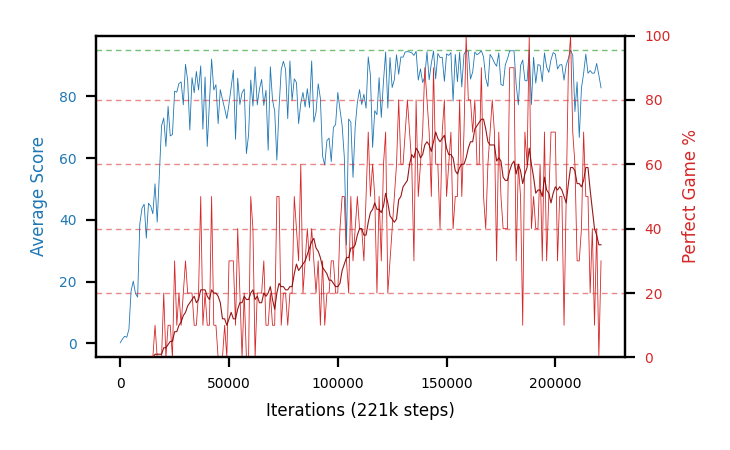

# b39a-c51zeroinitseed1

Blue is average score (food eaten) on the left axis, red is perfect-game percentage on the right.

Latest eval: step 221000, avg score 82.8, perfect games 30%.

## Config

| setting | value |
|---|---|
| policy_name | b39a-c51zeroinitseed1 |
| seed | 1 |
| zeroed_observations | none |
| learning_rate | 0.0001 |
| adam_epsilon | 0.00015 |
| perfect_game_reward | 100.0 |
| batch_size | 128 |
| discount | 0.9975 |
| target_update_period | 1000 |
| target_update_tau | 1.0 |
| gradient_clipping | none |
| n_step_update | 1 |
| initial_epsilon | 0.4 |
| min_epsilon | 0.002 |
| epsilon_schedule | bootstrap on avg_reward [2, 5, 10, 15, 20] then geometric to floor by 80% trailing-30 perfect |
| guided_fraction | 0.8 |
| forking | up to 4 live branches including the main line, fork p=0.5 at length >= 85, branch capped at 60 steps, one branch advanced per iteration |
| exploration_shield | 80% of refinement-phase episodes draw the epsilon move from non-fatal actions; greedy moves never shielded |
| fc_layer_params | (320,) |
| algo | c51 (distributional), 51 atoms over [-5.0, 120.0] at 2.500 spacing, cross-entropy loss, double (online argmax) target selection, zero-expected-Q init |
| replay_buffer | cpprb prioritized, capacity 100000 |
| priority_exponent (alpha) | 0.6 |
| priority_signal | kl (SNEK_PRIORITY_SIGNAL=td_error; a distributional agent has no TD error) |
| importance_sampling_beta | disabled |
| max_steps | 3000000 |
| initial_populate_steps | 1000 |
| eval | 10 episodes every 1000 steps |
| grid | 9x9, max possible score 95 |
| DEATH_REWARD | -5.0 |
| FOOD_REWARD | 1.0 |
| FOOD_DISTANCE_REWARD | 0.0 |
| CHASE_SAFE_SHAPING | off |
| FREE_SPACE_SHAPING | off |
| eval_only | False |
| min_checkpoint_score | 40.0 |
| c51_support_note | support [-5.0, 120.0] is below the derived maximum return 194.0, so a return above 120.0 would be clipped. 14% headroom over the measured 105.0; spacing 2.500. This is a judgement, not an error. |

## Evals

222 evals so far. Full series in [`b39a-c51zeroinitseed1_evals.json`](b39a-c51zeroinitseed1_evals.json).

| step | avg score | trailing avg | min score | max score | avg reward | perfect % | epsilon |
|---|---|---|---|---|---|---|---|
| 0 | 0.2 | 0.2 | 0 | 1/95 | -4.8 | 0 | 0.4 |
| 1000 | 1.4 | 1.4 | 0 | 3/95 | 0.9 | 0 | 0.4 |
| 2000 | 2.3 | 1.85 | 0 | 8/95 | 1.8 | 0 | 0.4 |
| ... | | | | | | | |
| 210000 | 84.7 | 88.08 | 22 | 95/95 | 113.6 | 30 | 0.0036 |
| 211000 | 66.7 | 82.96 | 12 | 95/95 | 94.7 | 30 | 0.0038 |
| 212000 | 82.7 | 80.5 | 13 | 95/95 | 121.1 | 40 | 0.0037 |
| 213000 | 87.5 | 79.34 | 24 | 95/95 | 156.2 | 70 | 0.0037 |
| 214000 | 93.7 | 83.06 | 90 | 95/95 | 142.95 | 50 | 0.0037 |
| 215000 | 87.5 | 83.62 | 63 | 95/95 | 136.75 | 50 | 0.0036 |
| 216000 | 88.4 | 87.96 | 80 | 95/95 | 107.8 | 20 | 0.0037 |
| 217000 | 87.5 | 88.92 | 52 | 95/95 | 126.8 | 40 | 0.0038 |
| 218000 | 87.6 | 88.94 | 79 | 95/95 | 97.05 | 10 | 0.0041 |
| 219000 | 90.7 | 88.34 | 82 | 95/95 | 130.0 | 40 | 0.0041 |
| 220000 | 86.9 | 88.22 | 78 | 93/95 | 85.95 | 0 | 0.0042 |
| 221000 | 82.8 | 87.1 | 17 | 95/95 | 110.8 | 30 | 0.0043 |
