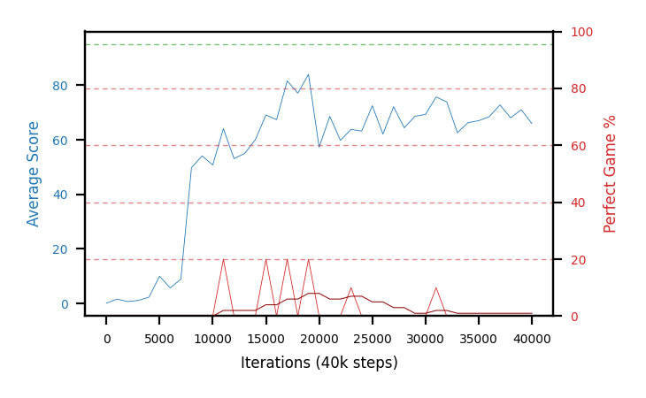

# b39c-c51zeroinitseed3

Blue is average score (food eaten) on the left axis, red is perfect-game percentage on the right.

Latest eval: step 40000, avg score 66.0, perfect games 0%.

## Config

| setting | value |
|---|---|
| policy_name | b39c-c51zeroinitseed3 |
| seed | 3 |
| zeroed_observations | none |
| learning_rate | 0.0001 |
| adam_epsilon | 0.00015 |
| perfect_game_reward | 100.0 |
| batch_size | 128 |
| discount | 0.9975 |
| target_update_period | 1000 |
| target_update_tau | 1.0 |
| gradient_clipping | none |
| n_step_update | 1 |
| initial_epsilon | 0.4 |
| min_epsilon | 0.002 |
| epsilon_schedule | bootstrap on avg_reward [2, 5, 10, 15, 20] then geometric to floor by 80% trailing-30 perfect |
| guided_fraction | 0.8 |
| forking | up to 4 live branches including the main line, fork p=0.5 at length >= 85, branch capped at 60 steps, one branch advanced per iteration |
| exploration_shield | 80% of refinement-phase episodes draw the epsilon move from non-fatal actions; greedy moves never shielded |
| fc_layer_params | (320,) |
| algo | c51 (distributional), 51 atoms over [-5.0, 120.0] at 2.500 spacing, cross-entropy loss, double (online argmax) target selection, zero-expected-Q init |
| replay_buffer | cpprb prioritized, capacity 100000 |
| priority_exponent (alpha) | 0.6 |
| priority_signal | kl (SNEK_PRIORITY_SIGNAL=td_error; a distributional agent has no TD error) |
| importance_sampling_beta | disabled |
| max_steps | 3000000 |
| initial_populate_steps | 1000 |
| eval | 10 episodes every 1000 steps |
| grid | 9x9, max possible score 95 |
| DEATH_REWARD | -5.0 |
| FOOD_REWARD | 1.0 |
| FOOD_DISTANCE_REWARD | 0.0 |
| CHASE_SAFE_SHAPING | off |
| FREE_SPACE_SHAPING | off |
| eval_only | False |
| min_checkpoint_score | 40.0 |
| c51_support_note | support [-5.0, 120.0] is below the derived maximum return 194.0, so a return above 120.0 would be clipped. 14% headroom over the measured 105.0; spacing 2.500. This is a judgement, not an error. |

## Evals

41 evals so far. Full series in [`b39c-c51zeroinitseed3_evals.json`](b39c-c51zeroinitseed3_evals.json).

| step | avg score | trailing avg | min score | max score | avg reward | perfect % | epsilon |
|---|---|---|---|---|---|---|---|
| 0 | 0.1 | 0.1 | 0 | 1/95 | -4.9 | 0 | 0.4 |
| 1000 | 1.6 | 1.6 | 0 | 4/95 | 1.1 | 0 | 0.4 |
| 2000 | 0.7 | 1.15 | 0 | 4/95 | 0.2 | 0 | 0.4 |
| ... | | | | | | | |
| 29000 | 68.6 | 67.94 | 58 | 80/95 | 64.05 | 0 | 0.0117 |
| 30000 | 69.3 | 67.3 | 33 | 89/95 | 66.55 | 0 | 0.0117 |
| 31000 | 75.7 | 70.02 | 61 | 95/95 | 82.45 | 10 | 0.0116 |
| 32000 | 73.9 | 70.38 | 66 | 85/95 | 70.7 | 0 | 0.0116 |
| 33000 | 62.6 | 70.02 | 5 | 86/95 | 58.05 | 0 | 0.0116 |
| 34000 | 66.3 | 69.56 | 54 | 82/95 | 64.0 | 0 | 0.0116 |
| 35000 | 67.0 | 69.1 | 36 | 86/95 | 64.25 | 0 | 0.0116 |
| 36000 | 68.5 | 67.66 | 15 | 92/95 | 65.75 | 0 | 0.0116 |
| 37000 | 72.8 | 67.44 | 57 | 82/95 | 69.6 | 0 | 0.0116 |
| 38000 | 68.1 | 68.54 | 15 | 82/95 | 65.8 | 0 | 0.0116 |
| 39000 | 71.0 | 69.48 | 53 | 82/95 | 68.25 | 0 | 0.0116 |
| 40000 | 66.0 | 69.28 | 40 | 84/95 | 64.15 | 0 | 0.0116 |
