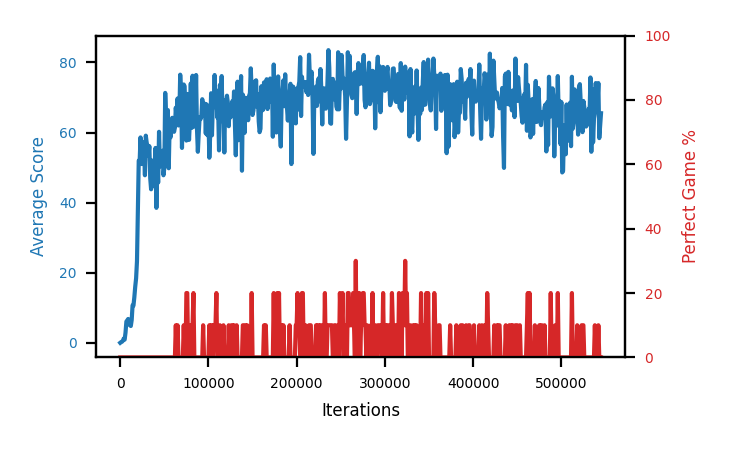

# b3a-epsfloor

Blue is average score (food eaten) on the left axis, red is perfect-game percentage on the right.

Latest eval: step 545000, avg score 65.5, perfect games 0%.

## Config

| setting | value |
|---|---|
| policy_name | b3a-epsfloor |
| learning_rate | 1e-05 |
| batch_size | 128 |
| discount | 0.99 |
| target_update_period | 8 |
| target_update_tau | 1.0 |
| gradient_clipping | none |
| n_step_update | 1 |
| initial_epsilon | 0.4 |
| min_epsilon | 0.001 |
| fc_layer_params | (50, 100, 50) |
| replay_buffer | cpprb prioritized, capacity 100000 |
| priority_exponent (alpha) | 0.6 |
| importance_sampling_beta | 0.4 -> 1.0 over 1000000 steps |
| initial_populate_steps | 1000 |
| initialize_with_schmid | False |
| eval | 10 episodes every 1000 steps |
| grid | 9x9, max possible score 95 |
| DEATH_REWARD | -5.0 |
| FOOD_REWARD | 1.0 |
| FOOD_DISTANCE_REWARD | 0.001 |
| eval_only | False |

## Evals

546 evals so far. Full series in [`b3a-epsfloor_evals.json`](b3a-epsfloor_evals.json).

| step | avg score | trailing avg | min score | max score | avg reward | perfect % | epsilon |
|---|---|---|---|---|---|---|---|
| 0 | 0.0 | 0.0 | 0 | 0/95 | -5.001 | 0 | 0.4 |
| 1000 | 0.2 | 0.2 | 0 | 1/95 | -4.849 | 0 | 0.4 |
| 2000 | 0.3 | 0.25 | 0 | 2/95 | -4.754 | 0 | 0.4 |
| ... | | | | | | | |
| 534000 | 54.5 | 65.3 | 19 | 80/95 | 49.088 | 0 | 0.001 |
| 535000 | 72.4 | 66.9 | 58 | 87/95 | 66.867 | 0 | 0.001 |
| 536000 | 57.2 | 64.98 | 30 | 76/95 | 51.849 | 0 | 0.001 |
| 537000 | 64.0 | 64.76 | 30 | 86/95 | 58.551 | 0 | 0.001 |
| 538000 | 65.6 | 62.74 | 41 | 95/95 | 70.533 | 10 | 0.001 |
| 539000 | 74.1 | 66.66 | 61 | 88/95 | 68.543 | 0 | 0.001 |
| 540000 | 66.5 | 65.48 | 30 | 93/95 | 61.085 | 0 | 0.001 |
| 541000 | 68.7 | 67.78 | 46 | 91/95 | 63.176 | 0 | 0.001 |
| 542000 | 74.1 | 69.8 | 31 | 95/95 | 79.005 | 10 | 0.001 |
| 543000 | 58.4 | 68.36 | 29 | 82/95 | 53.015 | 0 | 0.001 |
| 544000 | 62.1 | 65.96 | 7 | 90/95 | 56.687 | 0 | 0.001 |
| 545000 | 65.5 | 65.76 | 34 | 90/95 | 60.05 | 0 | 0.001 |
