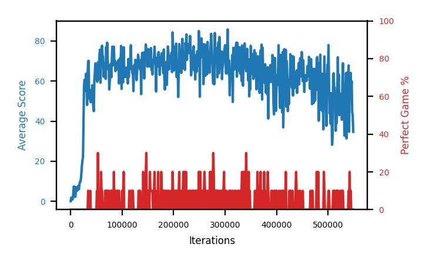

# b3b-epsfloor2

Blue is average score (food eaten) on the left axis, red is perfect-game percentage on the right.

Latest eval: step 549000, avg score 34.7, perfect games 0%.

## Config

| setting | value |
|---|---|
| policy_name | b3b-epsfloor2 |
| learning_rate | 1e-05 |
| batch_size | 128 |
| discount | 0.99 |
| target_update_period | 8 |
| target_update_tau | 1.0 |
| gradient_clipping | none |
| n_step_update | 1 |
| initial_epsilon | 0.4 |
| min_epsilon | 0.001 |
| fc_layer_params | (50, 100, 50) |
| replay_buffer | cpprb prioritized, capacity 100000 |
| priority_exponent (alpha) | 0.6 |
| importance_sampling_beta | 0.4 -> 1.0 over 1000000 steps |
| initial_populate_steps | 1000 |
| initialize_with_schmid | False |
| eval | 10 episodes every 1000 steps |
| grid | 9x9, max possible score 95 |
| DEATH_REWARD | -5.0 |
| FOOD_REWARD | 1.0 |
| FOOD_DISTANCE_REWARD | 0.001 |
| eval_only | False |

## Evals

550 evals so far. Full series in [`b3b-epsfloor2_evals.json`](b3b-epsfloor2_evals.json).

| step | avg score | trailing avg | min score | max score | avg reward | perfect % | epsilon |
|---|---|---|---|---|---|---|---|
| 0 | 0.1 | 0.1 | 0 | 1/95 | -4.902 | 0 | 0.4 |
| 1000 | 1.8 | 1.8 | 0 | 7/95 | -3.234 | 0 | 0.4 |
| 2000 | 0.9 | 1.35 | 0 | 3/95 | -4.116 | 0 | 0.4 |
| ... | | | | | | | |
| 538000 | 64.4 | 55.28 | 21 | 93/95 | 58.937 | 0 | 0.001 |
| 539000 | 54.8 | 55.6 | 2 | 89/95 | 49.42 | 0 | 0.001 |
| 540000 | 67.8 | 56.36 | 3 | 95/95 | 72.606 | 10 | 0.001 |
| 541000 | 34.7 | 57.02 | 2 | 82/95 | 29.455 | 0 | 0.001 |
| 542000 | 55.7 | 55.48 | 7 | 95/95 | 71.072 | 20 | 0.001 |
| 543000 | 60.2 | 54.64 | 2 | 92/95 | 54.639 | 0 | 0.001 |
| 544000 | 64.1 | 56.5 | 3 | 95/95 | 69.057 | 10 | 0.001 |
| 545000 | 55.6 | 54.06 | 3 | 86/95 | 50.186 | 0 | 0.001 |
| 546000 | 59.9 | 59.1 | 2 | 84/95 | 54.535 | 0 | 0.001 |
| 547000 | 44.5 | 56.86 | 2 | 88/95 | 39.235 | 0 | 0.001 |
| 548000 | 43.2 | 53.46 | 2 | 76/95 | 37.899 | 0 | 0.001 |
| 549000 | 34.7 | 47.58 | 3 | 91/95 | 29.439 | 0 | 0.001 |
