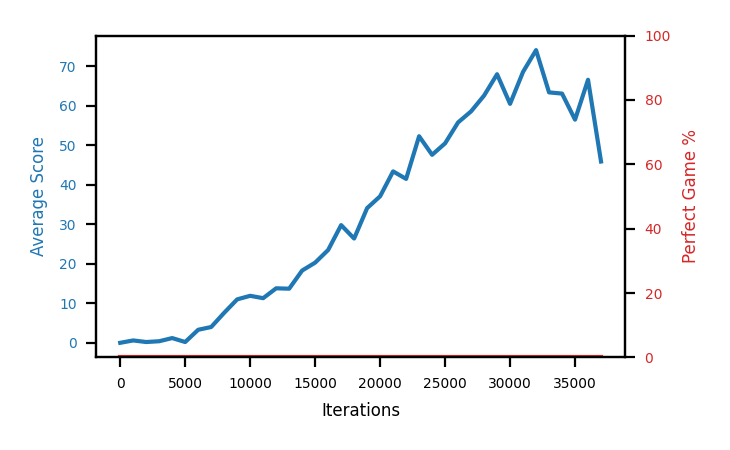

# b3c-buf500k

Blue is average score (food eaten) on the left axis, red is perfect-game percentage on the right.

Latest eval: step 37000, avg score 45.9, perfect games 0%.

## Config

| setting | value |
|---|---|
| policy_name | b3c-buf500k |
| learning_rate | 1e-05 |
| batch_size | 128 |
| discount | 0.99 |
| target_update_period | 8 |
| target_update_tau | 1.0 |
| gradient_clipping | none |
| n_step_update | 1 |
| initial_epsilon | 0.4 |
| min_epsilon | 0.0 |
| fc_layer_params | (50, 100, 50) |
| replay_buffer | cpprb prioritized, capacity 500000 |
| priority_exponent (alpha) | 0.6 |
| importance_sampling_beta | 0.4 -> 1.0 over 1000000 steps |
| initial_populate_steps | 1000 |
| initialize_with_schmid | False |
| eval | 10 episodes every 1000 steps |
| grid | 9x9, max possible score 95 |
| DEATH_REWARD | -5.0 |
| FOOD_REWARD | 1.0 |
| FOOD_DISTANCE_REWARD | 0.001 |
| eval_only | False |

## Evals

38 evals so far. Full series in [`b3c-buf500k_evals.json`](b3c-buf500k_evals.json).

| step | avg score | trailing avg | min score | max score | avg reward | perfect % | epsilon |
|---|---|---|---|---|---|---|---|
| 0 | 0.0 | 0.0 | 0 | 0/95 | -5.001 | 0 | 0.4 |
| 1000 | 0.6 | 0.6 | 0 | 3/95 | -4.451 | 0 | 0.4 |
| 2000 | 0.2 | 0.4 | 0 | 1/95 | -4.846 | 0 | 0.4 |
| ... | | | | | | | |
| 26000 | 55.8 | 49.54 | 36 | 75/95 | 50.765 | 0 | 0.01 |
| 27000 | 58.6 | 52.96 | 7 | 80/95 | 54.029 | 0 | 0.01 |
| 28000 | 62.6 | 55.02 | 37 | 87/95 | 57.975 | 0 | 0.01 |
| 29000 | 68.0 | 59.1 | 40 | 84/95 | 63.303 | 0 | 0.001 |
| 30000 | 60.5 | 61.1 | 18 | 75/95 | 55.058 | 0 | 0.001 |
| 31000 | 68.6 | 63.66 | 34 | 82/95 | 63.93 | 0 | 0.001 |
| 32000 | 74.1 | 66.76 | 54 | 87/95 | 69.242 | 0 | 0.001 |
| 33000 | 63.4 | 66.92 | 38 | 82/95 | 58.339 | 0 | 0.001 |
| 34000 | 63.1 | 65.94 | 50 | 76/95 | 58.083 | 0 | 0.001 |
| 35000 | 56.5 | 65.14 | 30 | 74/95 | 51.953 | 0 | 0.001 |
| 36000 | 66.6 | 64.74 | 16 | 86/95 | 62.4 | 0 | 0.001 |
| 37000 | 45.9 | 59.1 | 16 | 76/95 | 41.458 | 0 | 0.001 |
