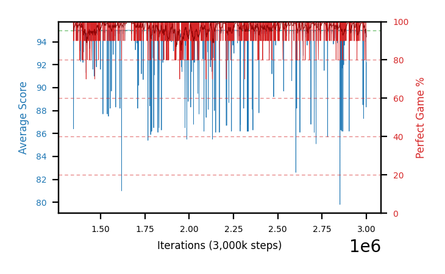

# b43b-lowlr-b29a

Blue is average score (food eaten) on the left axis, red is perfect-game percentage on the right.

Latest eval: step 3000000, avg score 92.2, perfect games 80%.

## Config

| setting | value |
|---|---|
| policy_name | b43b-lowlr-b29a |
| seed | 1 |
| zeroed_observations | none |
| learning_rate | 1e-06 |
| adam_epsilon | 1e-07 |
| perfect_game_reward | 100.0 |
| batch_size | 128 |
| discount | 0.9975 |
| target_update_period | 1000 |
| target_update_tau | 1.0 |
| gradient_clipping | none |
| n_step_update | 1 |
| initial_epsilon | 0.4 |
| min_epsilon | 0.002 |
| epsilon_schedule | bootstrap on avg_reward [2, 5, 10, 15, 20] then geometric to floor by 80% trailing-30 perfect |
| guided_fraction | 0.8 |
| forking | up to 4 live branches including the main line, fork p=0.5 at length >= 85, branch capped at 60 steps, one branch advanced per iteration |
| exploration_shield | 80% of refinement-phase episodes draw the epsilon move from non-fatal actions; greedy moves never shielded |
| fc_layer_params | (320,) |
| algo | ddqn, scalar head, Huber TD error |
| replay_buffer | cpprb prioritized, capacity 100000 |
| priority_exponent (alpha) | 0.6 |
| priority_signal | td_error |
| importance_sampling_beta | disabled |
| max_steps | 3000000 |
| initial_populate_steps | 1000 |
| eval | 10 episodes every 1000 steps |
| grid | 9x9, max possible score 95 |
| DEATH_REWARD | -5.0 |
| FOOD_REWARD | 1.0 |
| FOOD_DISTANCE_REWARD | 0.0 |
| CHASE_SAFE_SHAPING | c=0.1, potential-based on head/food/tail in one region, gated to snake length >= 75 |
| FREE_SPACE_SHAPING | off |
| eval_only | False |
| min_checkpoint_score | 40.0 |

## Evals

1654 evals so far. Full series in [`b43b-lowlr-b29a_evals.json`](b43b-lowlr-b29a_evals.json).

| step | avg score | trailing avg | min score | max score | avg reward | perfect % | epsilon |
|---|---|---|---|---|---|---|---|
| 1347000 | 95.0 | 95.0 | 95 | 95/95 | 193.954 | 100 | 0.002 |
| 1348000 | 86.4 | 86.4 | 9 | 95/95 | 175.411 | 90 | 0.002 |
| 1349000 | 95.0 | 90.7 | 95 | 95/95 | 193.957 | 100 | 0.002 |
| ... | | | | | | | |
| 2989000 | 95.0 | 95.0 | 95 | 95/95 | 193.959 | 100 | 0.002 |
| 2990000 | 95.0 | 95.0 | 95 | 95/95 | 193.948 | 100 | 0.002 |
| 2991000 | 94.6 | 94.92 | 93 | 95/95 | 173.66 | 80 | 0.002 |
| 2992000 | 94.0 | 94.72 | 88 | 95/95 | 173.052 | 80 | 0.002 |
| 2993000 | 95.0 | 94.72 | 95 | 95/95 | 193.956 | 100 | 0.002 |
| 2994000 | 95.0 | 94.72 | 95 | 95/95 | 193.957 | 100 | 0.002 |
| 2995000 | 95.0 | 94.72 | 95 | 95/95 | 193.951 | 100 | 0.002 |
| 2996000 | 95.0 | 94.8 | 95 | 95/95 | 193.957 | 100 | 0.002 |
| 2997000 | 95.0 | 95.0 | 95 | 95/95 | 193.951 | 100 | 0.002 |
| 2998000 | 95.0 | 95.0 | 95 | 95/95 | 193.956 | 100 | 0.002 |
| 2999000 | 88.3 | 93.66 | 31 | 95/95 | 167.355 | 80 | 0.002 |
| 3000000 | 92.2 | 93.1 | 72 | 95/95 | 171.245 | 80 | 0.002 |
