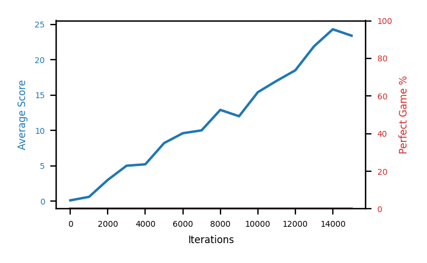

# b4a-uniform

Blue is average score (food eaten) on the left axis, red is perfect-game percentage on the right.

Latest eval: step 15000, avg score 23.4, perfect games 0%.

## Config

| setting | value |
|---|---|
| policy_name | b4a-uniform |
| learning_rate | 1e-05 |
| batch_size | 128 |
| discount | 0.99 |
| target_update_period | 8 |
| target_update_tau | 1.0 |
| gradient_clipping | none |
| n_step_update | 1 |
| initial_epsilon | 0.4 |
| min_epsilon | 0.0 |
| fc_layer_params | (50, 100, 50) |
| replay_buffer | cpprb prioritized, capacity 100000 |
| priority_exponent (alpha) | 0.0 |
| priority_signal | td_error |
| importance_sampling_beta | 0.4 -> 1.0 over 1000000 steps |
| initial_populate_steps | 1000 |
| initialize_with_schmid | False |
| eval | 10 episodes every 1000 steps |
| grid | 9x9, max possible score 95 |
| DEATH_REWARD | -5.0 |
| FOOD_REWARD | 1.0 |
| FOOD_DISTANCE_REWARD | 0.001 |
| eval_only | False |

## Evals

16 evals so far. Full series in [`b4a-uniform_evals.json`](b4a-uniform_evals.json).

| step | avg score | trailing avg | min score | max score | avg reward | perfect % | epsilon |
|---|---|---|---|---|---|---|---|
| 0 | 0.1 | 0.1 | 0 | 1/95 | -4.904 | 0 | 0.4 |
| 1000 | 0.6 | 0.6 | 0 | 3/95 | -0.867 | 0 | 0.4 |
| 2000 | 3.0 | 1.8 | 0 | 6/95 | -1.635 | 0 | 0.4 |
| ... | | | | | | | |
| 4000 | 5.2 | 3.45 | 2 | 9/95 | 0.189 | 0 | 0.4 |
| 5000 | 8.2 | 4.4 | 5 | 12/95 | 3.185 | 0 | 0.4 |
| 6000 | 9.6 | 6.2 | 2 | 17/95 | 4.585 | 0 | 0.4 |
| 7000 | 10.0 | 7.6 | 3 | 13/95 | 4.985 | 0 | 0.4 |
| 8000 | 12.9 | 9.18 | 7 | 20/95 | 7.877 | 0 | 0.2 |
| 9000 | 12.0 | 10.54 | 8 | 16/95 | 6.972 | 0 | 0.2 |
| 10000 | 15.4 | 11.98 | 5 | 26/95 | 10.371 | 0 | 0.1 |
| 11000 | 17.0 | 13.46 | 12 | 27/95 | 11.961 | 0 | 0.1 |
| 12000 | 18.5 | 15.16 | 6 | 29/95 | 13.462 | 0 | 0.1 |
| 13000 | 21.9 | 16.96 | 14 | 33/95 | 16.843 | 0 | 0.1 |
| 14000 | 24.3 | 19.42 | 12 | 38/95 | 19.23 | 0 | 0.1 |
| 15000 | 23.4 | 21.02 | 14 | 38/95 | 18.343 | 0 | 0.1 |
