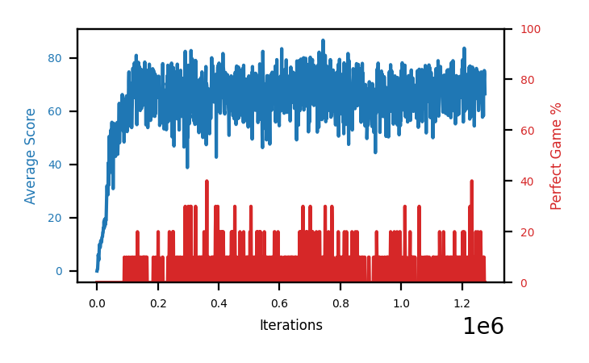

# b4b-unifbuf500k

Blue is average score (food eaten) on the left axis, red is perfect-game percentage on the right.

Latest eval: step 1275000, avg score 66.5, perfect games 0%.

## Config

| setting | value |
|---|---|
| policy_name | b4b-unifbuf500k |
| learning_rate | 1e-05 |
| batch_size | 128 |
| discount | 0.99 |
| target_update_period | 8 |
| target_update_tau | 1.0 |
| gradient_clipping | none |
| n_step_update | 1 |
| initial_epsilon | 0.4 |
| min_epsilon | 0.0 |
| fc_layer_params | (50, 100, 50) |
| replay_buffer | cpprb prioritized, capacity 500000 |
| priority_exponent (alpha) | 0.0 |
| priority_signal | td_error |
| importance_sampling_beta | 0.4 -> 1.0 over 1000000 steps |
| initial_populate_steps | 1000 |
| initialize_with_schmid | False |
| eval | 10 episodes every 1000 steps |
| grid | 9x9, max possible score 95 |
| DEATH_REWARD | -5.0 |
| FOOD_REWARD | 1.0 |
| FOOD_DISTANCE_REWARD | 0.001 |
| eval_only | False |

## Evals

1276 evals so far. Full series in [`b4b-unifbuf500k_evals.json`](b4b-unifbuf500k_evals.json).

| step | avg score | trailing avg | min score | max score | avg reward | perfect % | epsilon |
|---|---|---|---|---|---|---|---|
| 0 | 0.0 | 0.0 | 0 | 0/95 | -5.009 | 0 | 0.4 |
| 1000 | 0.6 | 0.6 | 0 | 2/95 | 0.043 | 0 | 0.4 |
| 2000 | 0.7 | 0.65 | 0 | 3/95 | 0.146 | 0 | 0.4 |
| ... | | | | | | | |
| 1264000 | 69.5 | 71.68 | 32 | 86/95 | 63.945 | 0 | 0.0 |
| 1265000 | 64.2 | 71.08 | 15 | 95/95 | 69.077 | 10 | 0.0 |
| 1266000 | 66.8 | 69.74 | 24 | 95/95 | 71.732 | 10 | 0.0 |
| 1267000 | 57.7 | 66.58 | 11 | 86/95 | 52.314 | 0 | 0.0 |
| 1268000 | 65.5 | 64.74 | 38 | 90/95 | 60.054 | 0 | 0.0 |
| 1269000 | 67.8 | 64.4 | 45 | 84/95 | 62.35 | 0 | 0.0 |
| 1270000 | 58.2 | 63.2 | 27 | 95/95 | 63.179 | 10 | 0.0 |
| 1271000 | 72.8 | 64.4 | 58 | 87/95 | 67.302 | 0 | 0.0 |
| 1272000 | 71.6 | 67.18 | 13 | 95/95 | 76.438 | 10 | 0.0 |
| 1273000 | 75.2 | 69.12 | 59 | 93/95 | 69.69 | 0 | 0.0 |
| 1274000 | 73.9 | 70.34 | 59 | 85/95 | 68.362 | 0 | 0.0 |
| 1275000 | 66.5 | 72.0 | 44 | 93/95 | 61.004 | 0 | 0.0 |
