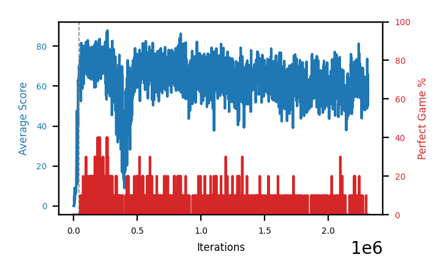

# b5c-schlongIS

Blue is average score (food eaten) on the left axis, red is perfect-game percentage on the right.

Latest eval: step 2312000, avg score 55.6, perfect games 0%.

Training was resumed at step 40000 (the dashed lines on the graph).

## Config

| setting | value |
|---|---|
| policy_name | b5c-schlongIS |
| learning_rate | 1e-05 |
| batch_size | 128 |
| discount | 0.99 |
| target_update_period | 8 |
| target_update_tau | 1.0 |
| gradient_clipping | none |
| n_step_update | 1 |
| initial_epsilon | 0.4 |
| min_epsilon | 0.0 |
| fc_layer_params | (50, 100, 50) |
| replay_buffer | cpprb prioritized, capacity 100000 |
| priority_exponent (alpha) | 0.8 |
| priority_signal | td_loss |
| importance_sampling_beta | 0.4 -> 1.0 over 1000000 steps |
| initial_populate_steps | 1000 |
| initialize_with_schmid | False |
| eval | 10 episodes every 1000 steps |
| grid | 9x9, max possible score 95 |
| DEATH_REWARD | -5.0 |
| FOOD_REWARD | 1.0 |
| FOOD_DISTANCE_REWARD | 0.001 |
| eval_only | False |

## Evals

2313 evals so far. Full series in [`b5c-schlongIS_evals.json`](b5c-schlongIS_evals.json).

| step | avg score | trailing avg | min score | max score | avg reward | perfect % | epsilon |
|---|---|---|---|---|---|---|---|
| 0 | 0.1 | 0.1 | 0 | 1/95 | -4.904 | 0 | 0.4 |
| 1000 | 0.0 | 0.0 | 0 | 1/95 | -5.005 | 0 | 0.4 |
| 2000 | 0.0 | 0.0 | 0 | 0/95 | -5.015 | 0 | 0.4 |
| ... | | | | | | | |
| 2301000 | 57.8 | 55.28 | 18 | 84/95 | 52.466 | 0 | 0.0 |
| 2302000 | 53.3 | 54.66 | 34 | 80/95 | 47.98 | 0 | 0.0 |
| 2303000 | 62.0 | 55.68 | 26 | 94/95 | 56.59 | 0 | 0.0 |
| 2304000 | 48.8 | 54.34 | 40 | 60/95 | 43.521 | 0 | 0.0 |
| 2305000 | 52.0 | 54.78 | 6 | 78/95 | 46.706 | 0 | 0.0 |
| 2306000 | 73.6 | 57.94 | 44 | 88/95 | 68.119 | 0 | 0.0 |
| 2307000 | 63.7 | 60.02 | 27 | 92/95 | 58.282 | 0 | 0.0 |
| 2308000 | 56.3 | 58.88 | 19 | 85/95 | 50.939 | 0 | 0.0 |
| 2309000 | 50.1 | 59.14 | 22 | 78/95 | 44.84 | 0 | 0.0 |
| 2310000 | 52.2 | 59.18 | 30 | 89/95 | 46.83 | 0 | 0.0 |
| 2311000 | 66.0 | 57.66 | 42 | 84/95 | 60.572 | 0 | 0.0 |
| 2312000 | 55.6 | 56.04 | 32 | 90/95 | 50.25 | 0 | 0.0 |
