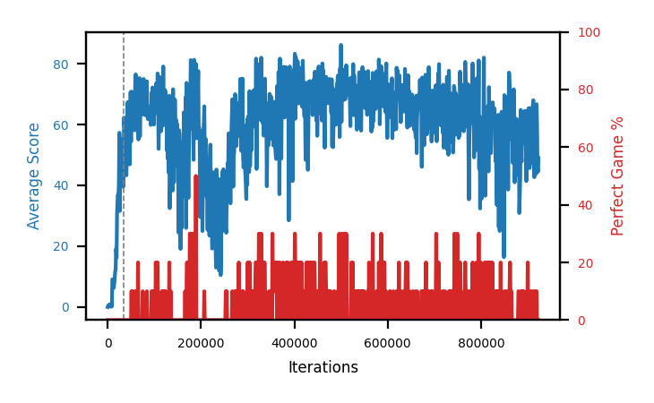

# b5d-schlongTDE

Blue is average score (food eaten) on the left axis, red is perfect-game percentage on the right.

Latest eval: step 923000, avg score 49.0, perfect games 0%.

Training was resumed at step 35000 (the dashed lines on the graph).

## Config

| setting | value |
|---|---|
| policy_name | b5d-schlongTDE |
| learning_rate | 1e-05 |
| batch_size | 128 |
| discount | 0.99 |
| target_update_period | 8 |
| target_update_tau | 1.0 |
| gradient_clipping | none |
| n_step_update | 1 |
| initial_epsilon | 0.4 |
| min_epsilon | 0.0 |
| fc_layer_params | (50, 100, 50) |
| replay_buffer | cpprb prioritized, capacity 100000 |
| priority_exponent (alpha) | 0.8 |
| priority_signal | td_error |
| importance_sampling_beta | disabled |
| initial_populate_steps | 1000 |
| initialize_with_schmid | False |
| eval | 10 episodes every 1000 steps |
| grid | 9x9, max possible score 95 |
| DEATH_REWARD | -5.0 |
| FOOD_REWARD | 1.0 |
| FOOD_DISTANCE_REWARD | 0.001 |
| eval_only | False |

## Evals

924 evals so far. Full series in [`b5d-schlongTDE_evals.json`](b5d-schlongTDE_evals.json).

| step | avg score | trailing avg | min score | max score | avg reward | perfect % | epsilon |
|---|---|---|---|---|---|---|---|
| 0 | 0.0 | 0.0 | 0 | 0/95 | -5.004 | 0 | 0.4 |
| 1000 | 0.5 | 0.5 | 0 | 1/95 | -0.054 | 0 | 0.4 |
| 2000 | 0.3 | 0.4 | 0 | 1/95 | -1.143 | 0 | 0.4 |
| ... | | | | | | | |
| 912000 | 68.0 | 57.36 | 18 | 95/95 | 72.82 | 10 | 0.0 |
| 913000 | 53.4 | 58.04 | 21 | 86/95 | 48.05 | 0 | 0.0 |
| 914000 | 42.7 | 55.6 | 5 | 86/95 | 37.331 | 0 | 0.0 |
| 915000 | 53.2 | 56.78 | 4 | 85/95 | 47.753 | 0 | 0.0 |
| 916000 | 62.8 | 56.02 | 5 | 95/95 | 67.69 | 10 | 0.0 |
| 917000 | 50.4 | 52.5 | 13 | 86/95 | 45.021 | 0 | 0.0 |
| 918000 | 43.8 | 50.58 | 1 | 93/95 | 38.436 | 0 | 0.0 |
| 919000 | 66.7 | 55.38 | 41 | 95/95 | 71.525 | 10 | 0.0 |
| 920000 | 59.6 | 56.66 | 21 | 89/95 | 54.111 | 0 | 0.0 |
| 921000 | 45.7 | 53.24 | 1 | 86/95 | 40.361 | 0 | 0.0 |
| 922000 | 44.5 | 52.06 | 1 | 88/95 | 39.157 | 0 | 0.0 |
| 923000 | 49.0 | 53.1 | 4 | 93/95 | 43.613 | 0 | 0.0 |
