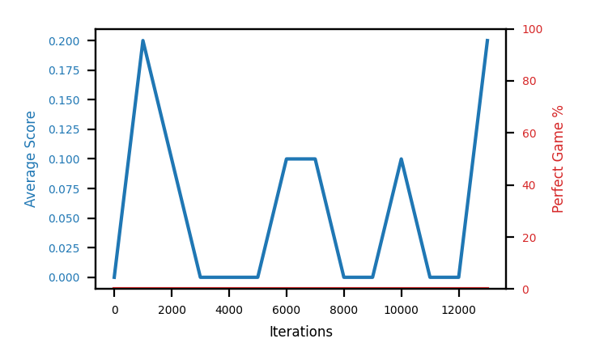

# b6b-alpha06

Blue is average score (food eaten) on the left axis, red is perfect-game percentage on the right.

Latest eval: step 13000, avg score 0.2, perfect games 0%.

## Config

| setting | value |
|---|---|
| policy_name | b6b-alpha06 |
| learning_rate | 1e-05 |
| batch_size | 128 |
| discount | 0.99 |
| target_update_period | 8 |
| target_update_tau | 1.0 |
| gradient_clipping | none |
| n_step_update | 1 |
| initial_epsilon | 0.4 |
| min_epsilon | 0.0 |
| fc_layer_params | (50, 100, 50) |
| replay_buffer | cpprb prioritized, capacity 100000 |
| priority_exponent (alpha) | 0.6 |
| priority_signal | td_loss |
| importance_sampling_beta | disabled |
| initial_populate_steps | 1000 |
| initialize_with_schmid | False |
| eval | 10 episodes every 1000 steps |
| grid | 9x9, max possible score 95 |
| DEATH_REWARD | -5.0 |
| FOOD_REWARD | 1.0 |
| FOOD_DISTANCE_REWARD | 0.001 |
| eval_only | False |

## Evals

14 evals so far. Full series in [`b6b-alpha06_evals.json`](b6b-alpha06_evals.json).

| step | avg score | trailing avg | min score | max score | avg reward | perfect % | epsilon |
|---|---|---|---|---|---|---|---|
| 0 | 0.0 | 0.0 | 0 | 0/95 | -5.001 | 0 | 0.4 |
| 1000 | 0.2 | 0.2 | 0 | 1/95 | -4.808 | 0 | 0.4 |
| 2000 | 0.1 | 0.15 | 0 | 1/95 | -4.902 | 0 | 0.4 |
| 3000 | 0.0 | 0.1 | 0 | 0/95 | -5.001 | 0 | 0.4 |
| 4000 | 0.0 | 0.08 | 0 | 0/95 | -5.008 | 0 | 0.4 |
| 5000 | 0.0 | 0.06 | 0 | 0/95 | -5.006 | 0 | 0.4 |
| 6000 | 0.1 | 0.04 | 0 | 1/95 | -4.904 | 0 | 0.4 |
| 7000 | 0.1 | 0.04 | 0 | 1/95 | -4.903 | 0 | 0.4 |
| 8000 | 0.0 | 0.04 | 0 | 0/95 | -5.005 | 0 | 0.4 |
| 9000 | 0.0 | 0.04 | 0 | 0/95 | -5.05 | 0 | 0.4 |
| 10000 | 0.1 | 0.06 | 0 | 1/95 | -4.923 | 0 | 0.4 |
| 11000 | 0.0 | 0.04 | 0 | 0/95 | -4.584 | 0 | 0.4 |
| 12000 | 0.0 | 0.02 | 0 | 0/95 | -4.598 | 0 | 0.4 |
| 13000 | 0.2 | 0.06 | 0 | 1/95 | -2.152 | 0 | 0.4 |
