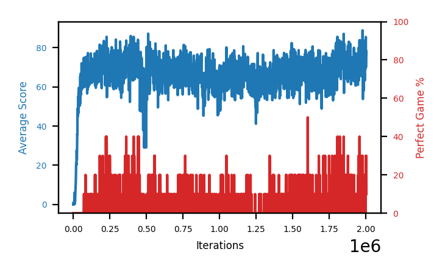

# b7a-a06seed2

Blue is average score (food eaten) on the left axis, red is perfect-game percentage on the right.

Latest eval: step 2004000, avg score 76.7, perfect games 10%.

## Config

| setting | value |
|---|---|
| policy_name | b7a-a06seed2 |
| learning_rate | 1e-05 |
| batch_size | 128 |
| discount | 0.99 |
| target_update_period | 8 |
| target_update_tau | 1.0 |
| gradient_clipping | none |
| n_step_update | 1 |
| initial_epsilon | 0.4 |
| min_epsilon | 0.0 |
| fc_layer_params | (50, 100, 50) |
| replay_buffer | cpprb prioritized, capacity 100000 |
| priority_exponent (alpha) | 0.6 |
| priority_signal | td_loss |
| importance_sampling_beta | disabled |
| initial_populate_steps | 1000 |
| initialize_with_schmid | False |
| eval | 10 episodes every 1000 steps |
| grid | 9x9, max possible score 95 |
| DEATH_REWARD | -5.0 |
| FOOD_REWARD | 1.0 |
| FOOD_DISTANCE_REWARD | 0.001 |
| eval_only | False |

## Evals

2005 evals so far. Full series in [`b7a-a06seed2_evals.json`](b7a-a06seed2_evals.json).

| step | avg score | trailing avg | min score | max score | avg reward | perfect % | epsilon |
|---|---|---|---|---|---|---|---|
| 0 | 0.0 | 0.0 | 0 | 0/95 | -5.002 | 0 | 0.4 |
| 1000 | 0.0 | 0.0 | 0 | 0/95 | -5.005 | 0 | 0.4 |
| 2000 | 1.1 | 0.55 | 0 | 4/95 | 0.543 | 0 | 0.4 |
| ... | | | | | | | |
| 1993000 | 63.2 | 71.28 | 13 | 90/95 | 57.722 | 0 | 0.0 |
| 1994000 | 83.7 | 73.46 | 58 | 95/95 | 98.908 | 20 | 0.0 |
| 1995000 | 77.6 | 74.74 | 52 | 93/95 | 72.018 | 0 | 0.0 |
| 1996000 | 75.2 | 74.62 | 32 | 95/95 | 90.502 | 20 | 0.0 |
| 1997000 | 75.5 | 75.04 | 38 | 95/95 | 80.269 | 10 | 0.0 |
| 1998000 | 75.8 | 77.56 | 41 | 95/95 | 91.002 | 20 | 0.0 |
| 1999000 | 69.3 | 74.68 | 32 | 90/95 | 63.843 | 0 | 0.0 |
| 2000000 | 85.4 | 76.24 | 68 | 95/95 | 111.055 | 30 | 0.0 |
| 2001000 | 70.0 | 75.2 | 43 | 95/95 | 85.162 | 20 | 0.0 |
| 2002000 | 76.9 | 75.48 | 62 | 95/95 | 92.199 | 20 | 0.0 |
| 2003000 | 78.4 | 76.0 | 34 | 95/95 | 104.056 | 30 | 0.0 |
| 2004000 | 76.7 | 77.48 | 65 | 95/95 | 81.539 | 10 | 0.0 |
