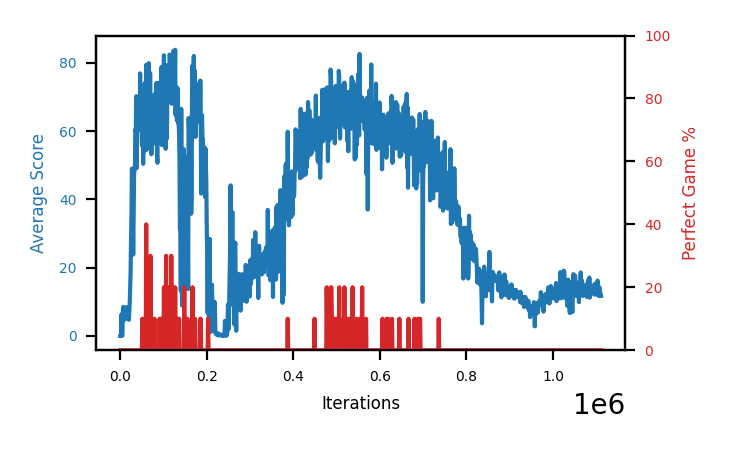

# b7b-a06seed3

Blue is average score (food eaten) on the left axis, red is perfect-game percentage on the right.

Latest eval: step 1111000, avg score 11.7, perfect games 0%.

## Config

| setting | value |
|---|---|
| policy_name | b7b-a06seed3 |
| learning_rate | 1e-05 |
| batch_size | 128 |
| discount | 0.99 |
| target_update_period | 8 |
| target_update_tau | 1.0 |
| gradient_clipping | none |
| n_step_update | 1 |
| initial_epsilon | 0.4 |
| min_epsilon | 0.0 |
| fc_layer_params | (50, 100, 50) |
| replay_buffer | cpprb prioritized, capacity 100000 |
| priority_exponent (alpha) | 0.6 |
| priority_signal | td_loss |
| importance_sampling_beta | disabled |
| initial_populate_steps | 1000 |
| initialize_with_schmid | False |
| eval | 10 episodes every 1000 steps |
| grid | 9x9, max possible score 95 |
| DEATH_REWARD | -5.0 |
| FOOD_REWARD | 1.0 |
| FOOD_DISTANCE_REWARD | 0.001 |
| eval_only | False |

## Evals

1112 evals so far. Full series in [`b7b-a06seed3_evals.json`](b7b-a06seed3_evals.json).

| step | avg score | trailing avg | min score | max score | avg reward | perfect % | epsilon |
|---|---|---|---|---|---|---|---|
| 0 | 0.0 | 0.0 | 0 | 0/95 | -5.005 | 0 | 0.4 |
| 1000 | 0.0 | 0.0 | 0 | 0/95 | -5.004 | 0 | 0.4 |
| 2000 | 0.0 | 0.0 | 0 | 0/95 | -5.005 | 0 | 0.4 |
| ... | | | | | | | |
| 1100000 | 13.5 | 14.16 | 6 | 20/95 | 8.48 | 0 | 0.0 |
| 1101000 | 13.0 | 13.72 | 5 | 21/95 | 7.98 | 0 | 0.0 |
| 1102000 | 12.0 | 13.26 | 7 | 18/95 | 6.984 | 0 | 0.0 |
| 1103000 | 16.2 | 13.6 | 11 | 22/95 | 11.177 | 0 | 0.0 |
| 1104000 | 12.7 | 13.48 | 6 | 21/95 | 7.684 | 0 | 0.0 |
| 1105000 | 12.9 | 13.36 | 9 | 20/95 | 7.874 | 0 | 0.0 |
| 1106000 | 11.7 | 13.1 | 2 | 20/95 | 6.68 | 0 | 0.0 |
| 1107000 | 14.3 | 13.56 | 9 | 22/95 | 9.281 | 0 | 0.0 |
| 1108000 | 12.9 | 12.9 | 6 | 20/95 | 7.88 | 0 | 0.0 |
| 1109000 | 12.0 | 12.76 | 7 | 20/95 | 6.984 | 0 | 0.0 |
| 1110000 | 12.4 | 12.66 | 8 | 18/95 | 7.38 | 0 | 0.0 |
| 1111000 | 11.7 | 12.66 | 4 | 16/95 | 6.683 | 0 | 0.0 |
