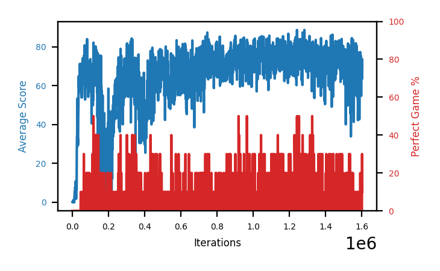

# b7d-discount995

Blue is average score (food eaten) on the left axis, red is perfect-game percentage on the right.

Latest eval: step 1603000, avg score 70.9, perfect games 10%.

## Config

| setting | value |
|---|---|
| policy_name | b7d-discount995 |
| learning_rate | 1e-05 |
| batch_size | 128 |
| discount | 0.995 |
| target_update_period | 8 |
| target_update_tau | 1.0 |
| gradient_clipping | none |
| n_step_update | 1 |
| initial_epsilon | 0.4 |
| min_epsilon | 0.0 |
| fc_layer_params | (50, 100, 50) |
| replay_buffer | cpprb prioritized, capacity 100000 |
| priority_exponent (alpha) | 0.6 |
| priority_signal | td_loss |
| importance_sampling_beta | disabled |
| initial_populate_steps | 1000 |
| initialize_with_schmid | False |
| eval | 10 episodes every 1000 steps |
| grid | 9x9, max possible score 95 |
| DEATH_REWARD | -5.0 |
| FOOD_REWARD | 1.0 |
| FOOD_DISTANCE_REWARD | 0.001 |
| eval_only | False |

## Evals

1604 evals so far. Full series in [`b7d-discount995_evals.json`](b7d-discount995_evals.json).

| step | avg score | trailing avg | min score | max score | avg reward | perfect % | epsilon |
|---|---|---|---|---|---|---|---|
| 0 | 0.1 | 0.1 | 0 | 1/95 | -4.902 | 0 | 0.4 |
| 1000 | 0.0 | 0.0 | 0 | 1/95 | -3.698 | 0 | 0.4 |
| 2000 | 0.1 | 0.05 | 0 | 1/95 | -4.49 | 0 | 0.4 |
| ... | | | | | | | |
| 1592000 | 77.3 | 66.68 | 60 | 95/95 | 92.398 | 20 | 0.0 |
| 1593000 | 75.0 | 69.06 | 60 | 95/95 | 79.711 | 10 | 0.0 |
| 1594000 | 72.0 | 70.74 | 42 | 92/95 | 66.348 | 0 | 0.0 |
| 1595000 | 75.5 | 71.7 | 36 | 94/95 | 69.783 | 0 | 0.0 |
| 1596000 | 74.1 | 74.78 | 43 | 95/95 | 78.83 | 10 | 0.0 |
| 1597000 | 54.8 | 70.28 | 5 | 88/95 | 49.33 | 0 | 0.0 |
| 1598000 | 67.6 | 68.8 | 43 | 94/95 | 61.95 | 0 | 0.0 |
| 1599000 | 67.3 | 67.86 | 49 | 87/95 | 61.795 | 0 | 0.0 |
| 1600000 | 70.0 | 66.76 | 45 | 90/95 | 64.361 | 0 | 0.0 |
| 1601000 | 63.4 | 64.62 | 1 | 90/95 | 57.82 | 0 | 0.0 |
| 1602000 | 73.7 | 68.4 | 35 | 95/95 | 99.303 | 30 | 0.0 |
| 1603000 | 70.9 | 69.06 | 44 | 95/95 | 75.699 | 10 | 0.0 |
