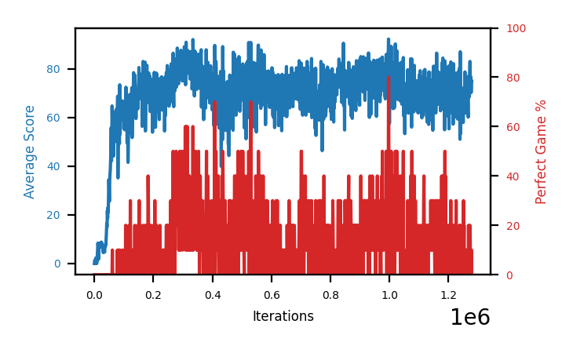

# b7e-disc995seed2

Blue is average score (food eaten) on the left axis, red is perfect-game percentage on the right.

Latest eval: step 1279000, avg score 75.0, perfect games 0%.

## Config

| setting | value |
|---|---|
| policy_name | b7e-disc995seed2 |
| learning_rate | 1e-05 |
| batch_size | 128 |
| discount | 0.995 |
| target_update_period | 8 |
| target_update_tau | 1.0 |
| gradient_clipping | none |
| n_step_update | 1 |
| initial_epsilon | 0.4 |
| min_epsilon | 0.0 |
| fc_layer_params | (50, 100, 50) |
| replay_buffer | cpprb prioritized, capacity 100000 |
| priority_exponent (alpha) | 0.6 |
| priority_signal | td_loss |
| importance_sampling_beta | disabled |
| initial_populate_steps | 1000 |
| initialize_with_schmid | False |
| eval | 10 episodes every 1000 steps |
| grid | 9x9, max possible score 95 |
| DEATH_REWARD | -5.0 |
| FOOD_REWARD | 1.0 |
| FOOD_DISTANCE_REWARD | 0.001 |
| eval_only | False |

## Evals

1280 evals so far. Full series in [`b7e-disc995seed2_evals.json`](b7e-disc995seed2_evals.json).

| step | avg score | trailing avg | min score | max score | avg reward | perfect % | epsilon |
|---|---|---|---|---|---|---|---|
| 0 | 0.0 | 0.0 | 0 | 0/95 | -5.004 | 0 | 0.4 |
| 1000 | 1.2 | 1.2 | 0 | 4/95 | -3.812 | 0 | 0.4 |
| 2000 | 1.3 | 1.25 | 0 | 7/95 | -3.711 | 0 | 0.4 |
| ... | | | | | | | |
| 1268000 | 77.0 | 69.42 | 42 | 95/95 | 92.186 | 20 | 0.0 |
| 1269000 | 77.1 | 69.54 | 55 | 95/95 | 81.844 | 10 | 0.0 |
| 1270000 | 71.2 | 69.56 | 53 | 95/95 | 75.965 | 10 | 0.0 |
| 1271000 | 68.6 | 70.82 | 56 | 88/95 | 63.104 | 0 | 0.0 |
| 1272000 | 78.2 | 74.42 | 59 | 95/95 | 82.989 | 10 | 0.0 |
| 1273000 | 83.1 | 75.64 | 61 | 95/95 | 98.193 | 20 | 0.0 |
| 1274000 | 74.7 | 75.16 | 48 | 95/95 | 79.525 | 10 | 0.0 |
| 1275000 | 72.1 | 75.34 | 17 | 95/95 | 76.832 | 10 | 0.0 |
| 1276000 | 76.7 | 76.96 | 51 | 95/95 | 81.377 | 10 | 0.0 |
| 1277000 | 70.3 | 75.38 | 41 | 90/95 | 64.695 | 0 | 0.0 |
| 1278000 | 74.2 | 73.6 | 28 | 95/95 | 79.016 | 10 | 0.0 |
| 1279000 | 75.0 | 73.66 | 37 | 93/95 | 69.345 | 0 | 0.0 |
