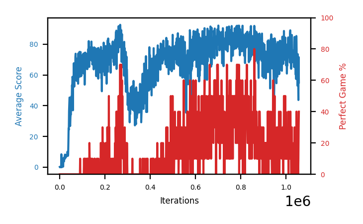

# b7f-disc995seed3

Blue is average score (food eaten) on the left axis, red is perfect-game percentage on the right.

Latest eval: step 1057000, avg score 55.1, perfect games 40%.

## Config

| setting | value |
|---|---|
| policy_name | b7f-disc995seed3 |
| learning_rate | 1e-05 |
| batch_size | 128 |
| discount | 0.995 |
| target_update_period | 8 |
| target_update_tau | 1.0 |
| gradient_clipping | none |
| n_step_update | 1 |
| initial_epsilon | 0.4 |
| min_epsilon | 0.0 |
| fc_layer_params | (50, 100, 50) |
| replay_buffer | cpprb prioritized, capacity 100000 |
| priority_exponent (alpha) | 0.6 |
| priority_signal | td_loss |
| importance_sampling_beta | disabled |
| initial_populate_steps | 1000 |
| initialize_with_schmid | False |
| eval | 10 episodes every 1000 steps |
| grid | 9x9, max possible score 95 |
| DEATH_REWARD | -5.0 |
| FOOD_REWARD | 1.0 |
| FOOD_DISTANCE_REWARD | 0.001 |
| eval_only | False |

## Evals

1058 evals so far. Full series in [`b7f-disc995seed3_evals.json`](b7f-disc995seed3_evals.json).

| step | avg score | trailing avg | min score | max score | avg reward | perfect % | epsilon |
|---|---|---|---|---|---|---|---|
| 0 | 0.2 | 0.2 | 0 | 1/95 | -4.804 | 0 | 0.4 |
| 1000 | 0.3 | 0.3 | 0 | 2/95 | -3.818 | 0 | 0.4 |
| 2000 | 0.1 | 0.2 | 0 | 1/95 | -4.905 | 0 | 0.4 |
| ... | | | | | | | |
| 1046000 | 85.3 | 68.4 | 56 | 95/95 | 121.119 | 40 | 0.0 |
| 1047000 | 76.9 | 69.96 | 11 | 95/95 | 112.799 | 40 | 0.0 |
| 1048000 | 64.9 | 70.92 | 17 | 92/95 | 59.357 | 0 | 0.0 |
| 1049000 | 72.1 | 71.3 | 58 | 95/95 | 76.743 | 10 | 0.0 |
| 1050000 | 60.4 | 71.92 | 2 | 95/95 | 65.1 | 10 | 0.0 |
| 1051000 | 53.0 | 65.46 | 1 | 95/95 | 68.176 | 20 | 0.0 |
| 1052000 | 73.5 | 64.78 | 3 | 95/95 | 88.462 | 20 | 0.0 |
| 1053000 | 59.0 | 63.6 | 5 | 87/95 | 53.344 | 0 | 0.0 |
| 1054000 | 56.0 | 60.38 | 1 | 87/95 | 50.445 | 0 | 0.0 |
| 1055000 | 43.7 | 57.04 | 2 | 95/95 | 48.568 | 10 | 0.0 |
| 1056000 | 71.6 | 60.76 | 2 | 95/95 | 97.009 | 30 | 0.0 |
| 1057000 | 55.1 | 57.08 | 3 | 95/95 | 91.159 | 40 | 0.0 |
