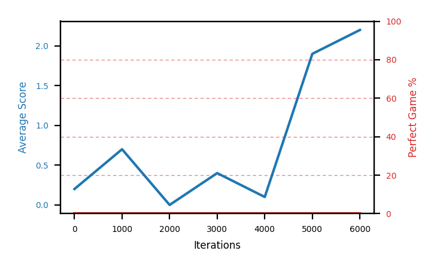

# b8a-disc999

Blue is average score (food eaten) on the left axis, red is perfect-game percentage on the right.

Latest eval: step 6000, avg score 2.2, perfect games 0%.

## Config

| setting | value |
|---|---|
| policy_name | b8a-disc999 |
| learning_rate | 1e-05 |
| batch_size | 128 |
| discount | 0.999 |
| target_update_period | 8 |
| target_update_tau | 1.0 |
| gradient_clipping | none |
| n_step_update | 1 |
| initial_epsilon | 0.4 |
| min_epsilon | 0.0 |
| fc_layer_params | (50, 100, 50) |
| replay_buffer | cpprb prioritized, capacity 100000 |
| priority_exponent (alpha) | 0.6 |
| priority_signal | td_loss |
| importance_sampling_beta | disabled |
| initial_populate_steps | 1000 |
| initialize_with_schmid | False |
| eval | 10 episodes every 1000 steps |
| grid | 9x9, max possible score 95 |
| DEATH_REWARD | -5.0 |
| FOOD_REWARD | 1.0 |
| FOOD_DISTANCE_REWARD | 0.001 |
| eval_only | False |
| perfect_game_wait_ms | 500 |

## Evals

7 evals so far. Full series in [`b8a-disc999_evals.json`](b8a-disc999_evals.json).

| step | avg score | trailing avg | min score | max score | avg reward | perfect % | epsilon |
|---|---|---|---|---|---|---|---|
| 0 | 0.2 | 0.2 | 0 | 1/95 | -4.805 | 0 | 0.4 |
| 1000 | 0.7 | 0.7 | 0 | 3/95 | -4.324 | 0 | 0.4 |
| 2000 | 0.0 | 0.35 | 0 | 0/95 | -5.007 | 0 | 0.4 |
| 3000 | 0.4 | 0.37 | 0 | 2/95 | -4.623 | 0 | 0.4 |
| 4000 | 0.1 | 0.3 | 0 | 1/95 | -4.906 | 0 | 0.4 |
| 5000 | 1.9 | 0.62 | 0 | 4/95 | -3.139 | 0 | 0.4 |
| 6000 | 2.2 | 0.92 | 1 | 3/95 | 1.201 | 0 | 0.4 |
