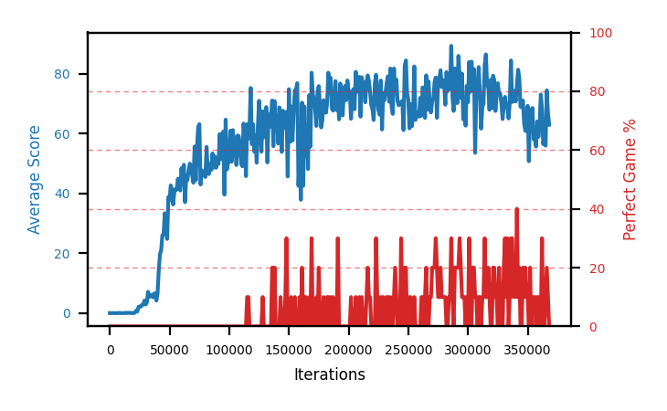

# b8c-disc9975

Blue is average score (food eaten) on the left axis, red is perfect-game percentage on the right.

Latest eval: step 368000, avg score 63.0, perfect games 0%.

## Config

| setting | value |
|---|---|
| policy_name | b8c-disc9975 |
| learning_rate | 1e-05 |
| batch_size | 128 |
| discount | 0.9975 |
| target_update_period | 8 |
| target_update_tau | 1.0 |
| gradient_clipping | none |
| n_step_update | 1 |
| initial_epsilon | 0.4 |
| min_epsilon | 0.0 |
| fc_layer_params | (50, 100, 50) |
| replay_buffer | cpprb prioritized, capacity 100000 |
| priority_exponent (alpha) | 0.6 |
| priority_signal | td_loss |
| importance_sampling_beta | disabled |
| initial_populate_steps | 1000 |
| initialize_with_schmid | False |
| eval | 10 episodes every 1000 steps |
| grid | 9x9, max possible score 95 |
| DEATH_REWARD | -5.0 |
| FOOD_REWARD | 1.0 |
| FOOD_DISTANCE_REWARD | 0.001 |
| eval_only | False |
| perfect_game_wait_ms | 500 |

## Evals

369 evals so far. Full series in [`b8c-disc9975_evals.json`](b8c-disc9975_evals.json).

| step | avg score | trailing avg | min score | max score | avg reward | perfect % | epsilon |
|---|---|---|---|---|---|---|---|
| 0 | 0.0 | 0.0 | 0 | 0/95 | -5.004 | 0 | 0.4 |
| 1000 | 0.0 | 0.0 | 0 | 0/95 | -5.002 | 0 | 0.4 |
| 2000 | 0.0 | 0.0 | 0 | 0/95 | -4.599 | 0 | 0.4 |
| ... | | | | | | | |
| 357000 | 55.7 | 60.82 | 12 | 87/95 | 50.305 | 0 | 0.0 |
| 358000 | 64.1 | 61.18 | 17 | 95/95 | 69.021 | 10 | 0.0 |
| 359000 | 58.9 | 59.24 | 16 | 95/95 | 63.839 | 10 | 0.0 |
| 360000 | 63.2 | 60.26 | 18 | 87/95 | 57.717 | 0 | 0.0 |
| 361000 | 73.1 | 63.0 | 62 | 88/95 | 67.485 | 0 | 0.0 |
| 362000 | 68.6 | 65.58 | 5 | 95/95 | 94.154 | 30 | 0.0 |
| 363000 | 56.5 | 64.06 | 18 | 86/95 | 51.102 | 0 | 0.0 |
| 364000 | 58.9 | 64.06 | 15 | 87/95 | 53.507 | 0 | 0.0 |
| 365000 | 56.0 | 62.62 | 20 | 95/95 | 61.044 | 10 | 0.0 |
| 366000 | 74.5 | 62.9 | 32 | 95/95 | 89.699 | 20 | 0.0 |
| 367000 | 66.9 | 62.56 | 36 | 95/95 | 71.781 | 10 | 0.0 |
| 368000 | 63.0 | 63.86 | 30 | 87/95 | 57.549 | 0 | 0.0 |
