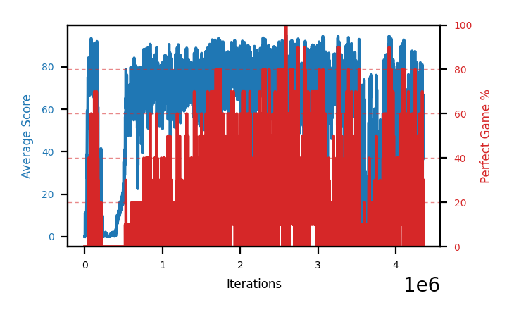

# b8d-disc995clip

Blue is average score (food eaten) on the left axis, red is perfect-game percentage on the right.

Latest eval: step 4352000, avg score 66.7, perfect games 30%.

## Config

| setting | value |
|---|---|
| policy_name | b8d-disc995clip |
| learning_rate | 1e-05 |
| batch_size | 128 |
| discount | 0.995 |
| target_update_period | 8 |
| target_update_tau | 1.0 |
| gradient_clipping | 10.0 |
| n_step_update | 1 |
| initial_epsilon | 0.4 |
| min_epsilon | 0.0 |
| fc_layer_params | (50, 100, 50) |
| replay_buffer | cpprb prioritized, capacity 100000 |
| priority_exponent (alpha) | 0.6 |
| priority_signal | td_loss |
| importance_sampling_beta | disabled |
| initial_populate_steps | 1000 |
| initialize_with_schmid | False |
| eval | 10 episodes every 1000 steps |
| grid | 9x9, max possible score 95 |
| DEATH_REWARD | -5.0 |
| FOOD_REWARD | 1.0 |
| FOOD_DISTANCE_REWARD | 0.001 |
| eval_only | False |
| perfect_game_wait_ms | 500 |

## Evals

4353 evals so far. Full series in [`b8d-disc995clip_evals.json`](b8d-disc995clip_evals.json).

| step | avg score | trailing avg | min score | max score | avg reward | perfect % | epsilon |
|---|---|---|---|---|---|---|---|
| 0 | 0.0 | 0.0 | 0 | 0/95 | -5.001 | 0 | 0.4 |
| 1000 | 0.5 | 0.5 | 0 | 2/95 | -3.652 | 0 | 0.4 |
| 2000 | 0.1 | 0.3 | 0 | 1/95 | -4.93 | 0 | 0.4 |
| ... | | | | | | | |
| 4341000 | 74.5 | 73.08 | 17 | 95/95 | 99.783 | 30 | 0.0 |
| 4342000 | 19.8 | 64.06 | 3 | 82/95 | 14.434 | 0 | 0.0 |
| 4343000 | 51.9 | 60.08 | 5 | 95/95 | 56.43 | 10 | 0.0 |
| 4344000 | 51.4 | 55.72 | 4 | 95/95 | 56.041 | 10 | 0.0 |
| 4345000 | 61.1 | 51.74 | 12 | 90/95 | 55.058 | 0 | 0.0 |
| 4346000 | 36.3 | 44.1 | 1 | 95/95 | 40.894 | 10 | 0.0 |
| 4347000 | 36.8 | 47.5 | 7 | 95/95 | 41.238 | 10 | 0.0 |
| 4348000 | 55.8 | 48.28 | 6 | 95/95 | 60.02 | 10 | 0.0 |
| 4349000 | 62.9 | 50.58 | 12 | 93/95 | 56.138 | 0 | 0.0 |
| 4350000 | 48.1 | 47.98 | 12 | 95/95 | 52.045 | 10 | 0.0 |
| 4351000 | 37.3 | 48.18 | 9 | 91/95 | 31.1 | 0 | 0.0 |
| 4352000 | 66.7 | 54.16 | 20 | 95/95 | 91.136 | 30 | 0.0 |
