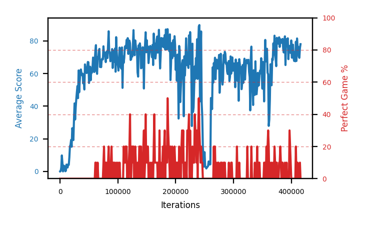

# b8e-clipseed2

Blue is average score (food eaten) on the left axis, red is perfect-game percentage on the right.

Latest eval: step 416000, avg score 78.0, perfect games 0%.

## Config

| setting | value |
|---|---|
| policy_name | b8e-clipseed2 |
| learning_rate | 1e-05 |
| batch_size | 128 |
| discount | 0.995 |
| target_update_period | 8 |
| target_update_tau | 1.0 |
| gradient_clipping | 10.0 |
| n_step_update | 1 |
| initial_epsilon | 0.4 |
| min_epsilon | 0.0 |
| fc_layer_params | (50, 100, 50) |
| replay_buffer | cpprb prioritized, capacity 100000 |
| priority_exponent (alpha) | 0.6 |
| priority_signal | td_loss |
| importance_sampling_beta | disabled |
| initial_populate_steps | 1000 |
| initialize_with_schmid | False |
| eval | 10 episodes every 1000 steps |
| grid | 9x9, max possible score 95 |
| DEATH_REWARD | -5.0 |
| FOOD_REWARD | 1.0 |
| FOOD_DISTANCE_REWARD | 0.001 |
| eval_only | False |
| perfect_game_wait_ms | 500 |

## Evals

417 evals so far. Full series in [`b8e-clipseed2_evals.json`](b8e-clipseed2_evals.json).

| step | avg score | trailing avg | min score | max score | avg reward | perfect % | epsilon |
|---|---|---|---|---|---|---|---|
| 0 | 0.0 | 0.0 | 0 | 0/95 | -5.001 | 0 | 0.4 |
| 1000 | 0.2 | 0.2 | 0 | 1/95 | -4.839 | 0 | 0.4 |
| 2000 | 2.4 | 1.3 | 0 | 8/95 | -2.67 | 0 | 0.4 |
| ... | | | | | | | |
| 405000 | 67.7 | 71.02 | 20 | 88/95 | 61.514 | 0 | 0.0 |
| 406000 | 73.2 | 71.72 | 54 | 88/95 | 67.001 | 0 | 0.0 |
| 407000 | 67.5 | 71.12 | 15 | 85/95 | 61.271 | 0 | 0.0 |
| 408000 | 79.5 | 71.48 | 68 | 95/95 | 93.941 | 20 | 0.0 |
| 409000 | 67.7 | 71.12 | 30 | 93/95 | 61.575 | 0 | 0.0 |
| 410000 | 81.5 | 73.88 | 69 | 93/95 | 75.112 | 0 | 0.0 |
| 411000 | 76.1 | 74.46 | 53 | 95/95 | 80.204 | 10 | 0.0 |
| 412000 | 76.4 | 76.24 | 56 | 91/95 | 70.02 | 0 | 0.0 |
| 413000 | 70.4 | 74.42 | 44 | 91/95 | 64.119 | 0 | 0.0 |
| 414000 | 69.6 | 74.8 | 32 | 86/95 | 63.359 | 0 | 0.0 |
| 415000 | 75.6 | 73.62 | 25 | 95/95 | 79.522 | 10 | 0.0 |
| 416000 | 78.0 | 74.0 | 61 | 93/95 | 71.646 | 0 | 0.0 |
