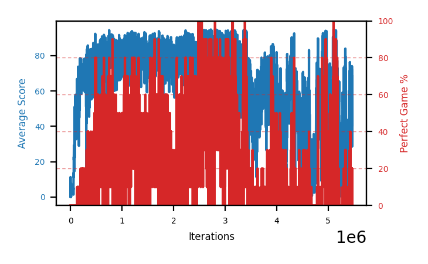

# b8f-disc9975seed2

Blue is average score (food eaten) on the left axis, red is perfect-game percentage on the right.

Latest eval: step 5471000, avg score 40.7, perfect games 0%.

## Config

| setting | value |
|---|---|
| policy_name | b8f-disc9975seed2 |
| learning_rate | 1e-05 |
| batch_size | 128 |
| discount | 0.9975 |
| target_update_period | 8 |
| target_update_tau | 1.0 |
| gradient_clipping | none |
| n_step_update | 1 |
| initial_epsilon | 0.4 |
| min_epsilon | 0.0 |
| fc_layer_params | (50, 100, 50) |
| replay_buffer | cpprb prioritized, capacity 100000 |
| priority_exponent (alpha) | 0.6 |
| priority_signal | td_loss |
| importance_sampling_beta | disabled |
| initial_populate_steps | 1000 |
| initialize_with_schmid | False |
| eval | 10 episodes every 1000 steps |
| grid | 9x9, max possible score 95 |
| DEATH_REWARD | -5.0 |
| FOOD_REWARD | 1.0 |
| FOOD_DISTANCE_REWARD | 0.001 |
| eval_only | False |
| perfect_game_wait_ms | 500 |

## Evals

5472 evals so far. Full series in [`b8f-disc9975seed2_evals.json`](b8f-disc9975seed2_evals.json).

| step | avg score | trailing avg | min score | max score | avg reward | perfect % | epsilon |
|---|---|---|---|---|---|---|---|
| 0 | 0.3 | 0.3 | 0 | 1/95 | -4.703 | 0 | 0.4 |
| 1000 | 11.3 | 11.3 | 0 | 17/95 | 6.262 | 0 | 0.2 |
| 2000 | 0.1 | 5.7 | 0 | 1/95 | -4.906 | 0 | 0.2 |
| ... | | | | | | | |
| 5460000 | 45.8 | 50.92 | 9 | 84/95 | 40.33 | 0 | 0.0 |
| 5461000 | 58.3 | 55.74 | 3 | 90/95 | 52.685 | 0 | 0.0 |
| 5462000 | 74.1 | 58.64 | 52 | 95/95 | 78.632 | 10 | 0.0 |
| 5463000 | 71.8 | 64.48 | 44 | 82/95 | 65.892 | 0 | 0.0 |
| 5464000 | 63.6 | 62.72 | 7 | 88/95 | 57.935 | 0 | 0.0 |
| 5465000 | 40.1 | 61.58 | 1 | 95/95 | 55.534 | 20 | 0.0 |
| 5466000 | 28.6 | 55.64 | 2 | 95/95 | 33.728 | 10 | 0.0 |
| 5467000 | 65.5 | 53.92 | 12 | 95/95 | 80.628 | 20 | 0.0 |
| 5468000 | 66.7 | 52.9 | 56 | 79/95 | 60.935 | 0 | 0.0 |
| 5469000 | 68.5 | 53.88 | 32 | 83/95 | 62.668 | 0 | 0.0 |
| 5470000 | 56.4 | 57.14 | 14 | 87/95 | 50.826 | 0 | 0.0 |
| 5471000 | 40.7 | 59.56 | 15 | 87/95 | 35.136 | 0 | 0.0 |
