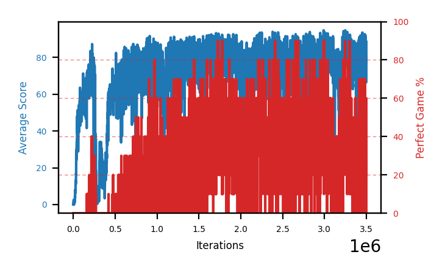

# b9a-disc9975a

Blue is average score (food eaten) on the left axis, red is perfect-game percentage on the right.

Latest eval: step 3501000, avg score 80.7, perfect games 20%.

## Config

| setting | value |
|---|---|
| policy_name | b9a-disc9975a |
| learning_rate | 1e-05 |
| batch_size | 128 |
| discount | 0.9975 |
| target_update_period | 8 |
| target_update_tau | 1.0 |
| gradient_clipping | none |
| n_step_update | 1 |
| initial_epsilon | 0.4 |
| min_epsilon | 0.0 |
| fc_layer_params | (50, 100, 50) |
| replay_buffer | cpprb prioritized, capacity 100000 |
| priority_exponent (alpha) | 0.6 |
| priority_signal | td_loss |
| importance_sampling_beta | disabled |
| initial_populate_steps | 1000 |
| eval | 10 episodes every 1000 steps |
| grid | 9x9, max possible score 95 |
| DEATH_REWARD | -5.0 |
| FOOD_REWARD | 1.0 |
| FOOD_DISTANCE_REWARD | 0.001 |
| eval_only | False |
| min_checkpoint_score | 40.0 |

## Evals

3502 evals so far. Full series in [`b9a-disc9975a_evals.json`](b9a-disc9975a_evals.json).

| step | avg score | trailing avg | min score | max score | avg reward | perfect % | epsilon |
|---|---|---|---|---|---|---|---|
| 0 | 0.0 | 0.0 | 0 | 0/95 | -5.0 | 0 | 0.4 |
| 1000 | 0.1 | 0.1 | 0 | 1/95 | -4.903 | 0 | 0.4 |
| 2000 | 0.5 | 0.3 | 0 | 2/95 | -4.55 | 0 | 0.4 |
| ... | | | | | | | |
| 3490000 | 92.0 | 79.48 | 80 | 95/95 | 148.655 | 60 | 0.0 |
| 3491000 | 90.4 | 80.4 | 75 | 95/95 | 147.004 | 60 | 0.0 |
| 3492000 | 85.2 | 84.22 | 58 | 95/95 | 121.133 | 40 | 0.0 |
| 3493000 | 86.0 | 84.64 | 66 | 95/95 | 132.329 | 50 | 0.0 |
| 3494000 | 83.3 | 87.38 | 60 | 95/95 | 98.409 | 20 | 0.0 |
| 3495000 | 88.6 | 86.7 | 76 | 95/95 | 113.933 | 30 | 0.0 |
| 3496000 | 75.4 | 83.7 | 49 | 95/95 | 80.101 | 10 | 0.0 |
| 3497000 | 66.4 | 79.94 | 39 | 92/95 | 60.848 | 0 | 0.0 |
| 3498000 | 73.2 | 77.38 | 33 | 95/95 | 77.965 | 10 | 0.0 |
| 3499000 | 88.9 | 78.5 | 67 | 95/95 | 124.756 | 40 | 0.0 |
| 3500000 | 73.2 | 75.42 | 5 | 95/95 | 129.953 | 60 | 0.0 |
| 3501000 | 80.7 | 76.48 | 7 | 95/95 | 95.673 | 20 | 0.0 |
