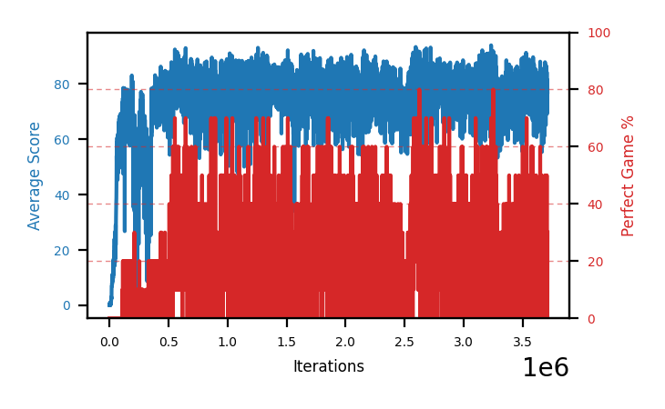

# b9c-disc995a

Blue is average score (food eaten) on the left axis, red is perfect-game percentage on the right.

Latest eval: step 3712000, avg score 77.1, perfect games 30%.

## Config

| setting | value |
|---|---|
| policy_name | b9c-disc995a |
| learning_rate | 1e-05 |
| batch_size | 128 |
| discount | 0.995 |
| target_update_period | 8 |
| target_update_tau | 1.0 |
| gradient_clipping | none |
| n_step_update | 1 |
| initial_epsilon | 0.4 |
| min_epsilon | 0.0 |
| fc_layer_params | (50, 100, 50) |
| replay_buffer | cpprb prioritized, capacity 100000 |
| priority_exponent (alpha) | 0.6 |
| priority_signal | td_loss |
| importance_sampling_beta | disabled |
| initial_populate_steps | 1000 |
| eval | 10 episodes every 1000 steps |
| grid | 9x9, max possible score 95 |
| DEATH_REWARD | -5.0 |
| FOOD_REWARD | 1.0 |
| FOOD_DISTANCE_REWARD | 0.001 |
| eval_only | False |
| min_checkpoint_score | 40.0 |

## Evals

3713 evals so far. Full series in [`b9c-disc995a_evals.json`](b9c-disc995a_evals.json).

| step | avg score | trailing avg | min score | max score | avg reward | perfect % | epsilon |
|---|---|---|---|---|---|---|---|
| 0 | 0.0 | 0.0 | 0 | 0/95 | -5.001 | 0 | 0.4 |
| 1000 | 0.0 | 0.0 | 0 | 0/95 | -5.023 | 0 | 0.4 |
| 2000 | 0.2 | 0.1 | 0 | 1/95 | -3.022 | 0 | 0.4 |
| ... | | | | | | | |
| 3701000 | 81.6 | 77.4 | 6 | 95/95 | 117.667 | 40 | 0.0 |
| 3702000 | 83.0 | 80.98 | 64 | 95/95 | 98.202 | 20 | 0.0 |
| 3703000 | 73.6 | 80.36 | 4 | 95/95 | 88.944 | 20 | 0.0 |
| 3704000 | 76.0 | 80.18 | 4 | 95/95 | 101.782 | 30 | 0.0 |
| 3705000 | 79.1 | 78.66 | 4 | 95/95 | 104.732 | 30 | 0.0 |
| 3706000 | 84.3 | 79.2 | 50 | 95/95 | 130.782 | 50 | 0.0 |
| 3707000 | 75.2 | 77.64 | 44 | 91/95 | 69.715 | 0 | 0.0 |
| 3708000 | 69.2 | 76.76 | 7 | 95/95 | 84.543 | 20 | 0.0 |
| 3709000 | 77.9 | 77.14 | 45 | 95/95 | 82.77 | 10 | 0.0 |
| 3710000 | 81.5 | 77.62 | 49 | 95/95 | 107.169 | 30 | 0.0 |
| 3711000 | 78.5 | 76.46 | 62 | 93/95 | 72.941 | 0 | 0.0 |
| 3712000 | 77.1 | 76.84 | 6 | 95/95 | 102.893 | 30 | 0.0 |
