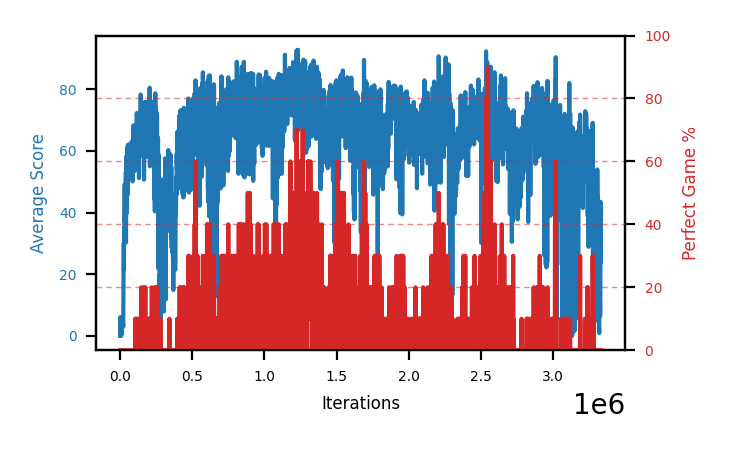

# b9d-disc995b

Blue is average score (food eaten) on the left axis, red is perfect-game percentage on the right.

Latest eval: step 3333000, avg score 41.4, perfect games 0%.

## Config

| setting | value |
|---|---|
| policy_name | b9d-disc995b |
| learning_rate | 1e-05 |
| batch_size | 128 |
| discount | 0.995 |
| target_update_period | 8 |
| target_update_tau | 1.0 |
| gradient_clipping | none |
| n_step_update | 1 |
| initial_epsilon | 0.4 |
| min_epsilon | 0.0 |
| fc_layer_params | (50, 100, 50) |
| replay_buffer | cpprb prioritized, capacity 100000 |
| priority_exponent (alpha) | 0.6 |
| priority_signal | td_loss |
| importance_sampling_beta | disabled |
| initial_populate_steps | 1000 |
| eval | 10 episodes every 1000 steps |
| grid | 9x9, max possible score 95 |
| DEATH_REWARD | -5.0 |
| FOOD_REWARD | 1.0 |
| FOOD_DISTANCE_REWARD | 0.001 |
| eval_only | False |
| min_checkpoint_score | 40.0 |

## Evals

3334 evals so far. Full series in [`b9d-disc995b_evals.json`](b9d-disc995b_evals.json).

| step | avg score | trailing avg | min score | max score | avg reward | perfect % | epsilon |
|---|---|---|---|---|---|---|---|
| 0 | 0.0 | 0.0 | 0 | 0/95 | -5.001 | 0 | 0.4 |
| 1000 | 6.1 | 6.1 | 0 | 12/95 | 1.084 | 0 | 0.4 |
| 2000 | 0.2 | 3.15 | 0 | 1/95 | -4.806 | 0 | 0.4 |
| ... | | | | | | | |
| 3322000 | 42.2 | 10.3 | 2 | 77/95 | 36.099 | 0 | 0.0 |
| 3323000 | 32.0 | 15.84 | 11 | 74/95 | 25.814 | 0 | 0.0 |
| 3324000 | 31.5 | 21.74 | 0 | 80/95 | 25.445 | 0 | 0.0 |
| 3325000 | 9.6 | 23.24 | 1 | 18/95 | 4.299 | 0 | 0.0 |
| 3326000 | 11.0 | 25.26 | 0 | 76/95 | 5.758 | 0 | 0.0 |
| 3327000 | 6.5 | 18.12 | 0 | 18/95 | 1.297 | 0 | 0.0 |
| 3328000 | 11.3 | 13.98 | 0 | 63/95 | 5.92 | 0 | 0.0 |
| 3329000 | 30.6 | 13.8 | 7 | 68/95 | 24.622 | 0 | 0.0 |
| 3330000 | 43.5 | 20.58 | 0 | 77/95 | 37.535 | 0 | 0.0 |
| 3331000 | 23.8 | 23.14 | 0 | 76/95 | 18.083 | 0 | 0.0 |
| 3332000 | 29.7 | 27.78 | 1 | 81/95 | 23.843 | 0 | 0.0 |
| 3333000 | 41.4 | 33.8 | 1 | 74/95 | 34.498 | 0 | 0.0 |
