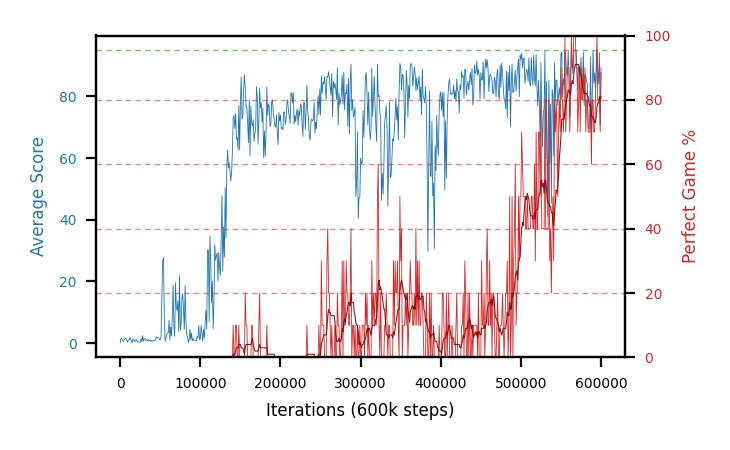

# c51pilot-lr1e5seed1

Blue is average score (food eaten) on the left axis, red is perfect-game percentage on the right.

Latest eval: step 600000, avg score 87.8, perfect games 90%.

## Config

| setting | value |
|---|---|
| policy_name | c51pilot-lr1e5seed1 |
| seed | 1 |
| zeroed_observations | none |
| learning_rate | 1e-05 |
| batch_size | 128 |
| discount | 0.9975 |
| target_update_period | 1000 |
| target_update_tau | 1.0 |
| gradient_clipping | none |
| n_step_update | 1 |
| initial_epsilon | 0.4 |
| min_epsilon | 0.002 |
| epsilon_schedule | bootstrap on avg_reward [2, 5, 10, 15, 20] then geometric to floor by 80% trailing-30 perfect |
| guided_fraction | 0.8 |
| forking | up to 4 live branches including the main line, fork p=0.5 at length >= 85, branch capped at 60 steps, one branch advanced per iteration |
| exploration_shield | 80% of refinement-phase episodes draw the epsilon move from non-fatal actions; greedy moves never shielded |
| fc_layer_params | (200, 100, 100) |
| algo | c51 (distributional), 51 atoms over [-5.0, 120.0] at 2.500 spacing, cross-entropy loss, double (online argmax) target selection, standard init |
| replay_buffer | cpprb prioritized, capacity 100000 |
| priority_exponent (alpha) | 0.6 |
| priority_signal | kl (SNEK_PRIORITY_SIGNAL=td_error; a distributional agent has no TD error) |
| importance_sampling_beta | disabled |
| max_steps | 600000 |
| initial_populate_steps | 1000 |
| eval | 10 episodes every 1000 steps |
| grid | 9x9, max possible score 95 |
| DEATH_REWARD | -5.0 |
| FOOD_REWARD | 1.0 |
| FOOD_DISTANCE_REWARD | 0.0 |
| CHASE_SAFE_SHAPING | off |
| eval_only | False |
| min_checkpoint_score | 40.0 |
| c51_support_note | support [-5.0, 120.0] is below the derived maximum return 194.0, so a return above 120.0 would be clipped. Measured max is 105.0 (14% headroom); spacing 2.500. This is a judgement, not an error. |

## Evals

601 evals so far. Full series in [`c51pilot-lr1e5seed1_evals.json`](c51pilot-lr1e5seed1_evals.json).

| step | avg score | trailing avg | min score | max score | avg reward | perfect % | epsilon |
|---|---|---|---|---|---|---|---|
| 0 | 0.1 | 0.1 | 0 | 1/95 | -4.9 | 0 | 0.4 |
| 1000 | 1.6 | 1.6 | 0 | 4/95 | 1.1 | 0 | 0.4 |
| 2000 | 1.3 | 1.45 | 0 | 4/95 | 0.8 | 0 | 0.4 |
| ... | | | | | | | |
| 589000 | 79.2 | 76.5 | 13 | 95/95 | 157.4 | 80 | 0.002 |
| 590000 | 94.6 | 81.56 | 93 | 95/95 | 173.7 | 80 | 0.002 |
| 591000 | 84.3 | 83.42 | 40 | 95/95 | 152.55 | 70 | 0.002 |
| 592000 | 87.6 | 82.36 | 47 | 95/95 | 155.85 | 70 | 0.002 |
| 593000 | 82.8 | 85.7 | 25 | 95/95 | 161.0 | 80 | 0.002 |
| 594000 | 87.6 | 87.38 | 21 | 95/95 | 176.2 | 90 | 0.002 |
| 595000 | 95.0 | 87.46 | 95 | 95/95 | 194.0 | 100 | 0.002 |
| 596000 | 88.7 | 88.34 | 34 | 95/95 | 167.35 | 80 | 0.002 |
| 597000 | 84.0 | 87.62 | 27 | 95/95 | 162.2 | 80 | 0.002 |
| 598000 | 94.2 | 89.9 | 89 | 95/95 | 172.85 | 80 | 0.002 |
| 599000 | 70.7 | 86.52 | 11 | 95/95 | 139.85 | 70 | 0.002 |
| 600000 | 87.8 | 85.08 | 23 | 95/95 | 176.4 | 90 | 0.002 |
