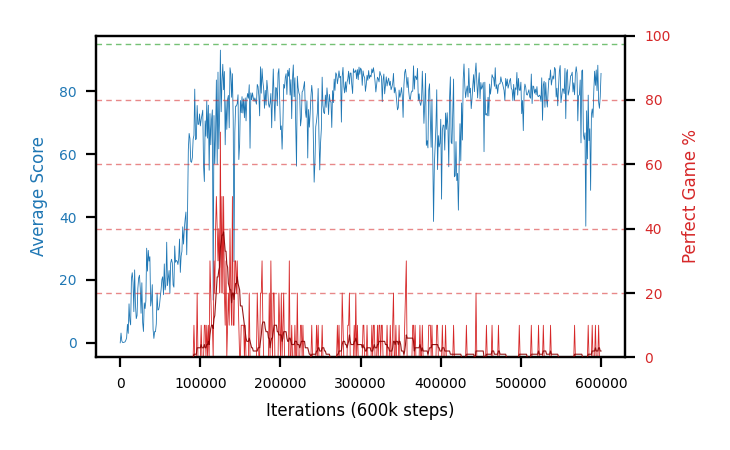

# c51pilot-lr1e5seed2

Blue is average score (food eaten) on the left axis, red is perfect-game percentage on the right.

Latest eval: step 600000, avg score 85.7, perfect games 0%.

## Config

| setting | value |
|---|---|
| policy_name | c51pilot-lr1e5seed2 |
| seed | 2 |
| zeroed_observations | none |
| learning_rate | 1e-05 |
| batch_size | 128 |
| discount | 0.9975 |
| target_update_period | 1000 |
| target_update_tau | 1.0 |
| gradient_clipping | none |
| n_step_update | 1 |
| initial_epsilon | 0.4 |
| min_epsilon | 0.002 |
| epsilon_schedule | bootstrap on avg_reward [2, 5, 10, 15, 20] then geometric to floor by 80% trailing-30 perfect |
| guided_fraction | 0.8 |
| forking | up to 4 live branches including the main line, fork p=0.5 at length >= 85, branch capped at 60 steps, one branch advanced per iteration |
| exploration_shield | 80% of refinement-phase episodes draw the epsilon move from non-fatal actions; greedy moves never shielded |
| fc_layer_params | (200, 100, 100) |
| algo | c51 (distributional), 51 atoms over [-5.0, 120.0] at 2.500 spacing, cross-entropy loss, double (online argmax) target selection, standard init |
| replay_buffer | cpprb prioritized, capacity 100000 |
| priority_exponent (alpha) | 0.6 |
| priority_signal | kl (SNEK_PRIORITY_SIGNAL=td_error; a distributional agent has no TD error) |
| importance_sampling_beta | disabled |
| max_steps | 600000 |
| initial_populate_steps | 1000 |
| eval | 10 episodes every 1000 steps |
| grid | 9x9, max possible score 95 |
| DEATH_REWARD | -5.0 |
| FOOD_REWARD | 1.0 |
| FOOD_DISTANCE_REWARD | 0.0 |
| CHASE_SAFE_SHAPING | off |
| eval_only | False |
| min_checkpoint_score | 40.0 |
| c51_support_note | support [-5.0, 120.0] is below the derived maximum return 194.0, so a return above 120.0 would be clipped. Measured max is 105.0 (14% headroom); spacing 2.500. This is a judgement, not an error. |

## Evals

601 evals so far. Full series in [`c51pilot-lr1e5seed2_evals.json`](c51pilot-lr1e5seed2_evals.json).

| step | avg score | trailing avg | min score | max score | avg reward | perfect % | epsilon |
|---|---|---|---|---|---|---|---|
| 0 | 0.0 | 0.0 | 0 | 0/95 | -5.0 | 0 | 0.4 |
| 1000 | 3.1 | 3.1 | 0 | 9/95 | -0.1 | 0 | 0.4 |
| 2000 | 0.6 | 1.85 | 0 | 2/95 | 0.1 | 0 | 0.4 |
| ... | | | | | | | |
| 589000 | 74.4 | 65.58 | 4 | 95/95 | 81.6 | 10 | 0.0122 |
| 590000 | 71.7 | 67.06 | 10 | 89/95 | 69.4 | 0 | 0.0122 |
| 591000 | 80.3 | 69.5 | 15 | 91/95 | 79.35 | 0 | 0.0122 |
| 592000 | 86.4 | 77.08 | 80 | 91/95 | 84.55 | 0 | 0.0122 |
| 593000 | 81.9 | 78.94 | 27 | 95/95 | 89.1 | 10 | 0.0121 |
| 594000 | 86.8 | 81.42 | 78 | 92/95 | 83.6 | 0 | 0.0121 |
| 595000 | 80.2 | 83.12 | 65 | 89/95 | 76.55 | 0 | 0.0121 |
| 596000 | 88.3 | 84.72 | 81 | 92/95 | 86.9 | 0 | 0.0121 |
| 597000 | 76.5 | 82.74 | 28 | 95/95 | 85.05 | 10 | 0.0121 |
| 598000 | 74.6 | 81.28 | 9 | 91/95 | 70.95 | 0 | 0.0121 |
| 599000 | 78.3 | 79.58 | 7 | 91/95 | 75.1 | 0 | 0.0121 |
| 600000 | 85.7 | 80.68 | 72 | 93/95 | 82.95 | 0 | 0.0121 |
