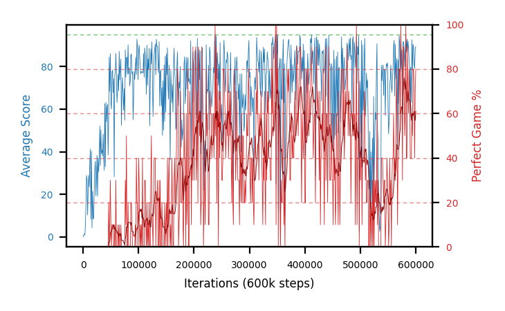

# c51pilotB-lr1e4seed2

Blue is average score (food eaten) on the left axis, red is perfect-game percentage on the right.

Latest eval: step 600000, avg score 89.4, perfect games 80%.

## Config

| setting | value |
|---|---|
| policy_name | c51pilotB-lr1e4seed2 |
| seed | 2 |
| zeroed_observations | none |
| learning_rate | 0.0001 |
| batch_size | 128 |
| discount | 0.9975 |
| target_update_period | 1000 |
| target_update_tau | 1.0 |
| gradient_clipping | none |
| n_step_update | 1 |
| initial_epsilon | 0.4 |
| min_epsilon | 0.002 |
| epsilon_schedule | bootstrap on avg_reward [2, 5, 10, 15, 20] then geometric to floor by 80% trailing-30 perfect |
| guided_fraction | 0.8 |
| forking | up to 4 live branches including the main line, fork p=0.5 at length >= 85, branch capped at 60 steps, one branch advanced per iteration |
| exploration_shield | 80% of refinement-phase episodes draw the epsilon move from non-fatal actions; greedy moves never shielded |
| fc_layer_params | (200, 100, 100) |
| algo | c51 (distributional), 51 atoms over [-5.0, 120.0] at 2.500 spacing, cross-entropy loss, double (online argmax) target selection, standard init |
| replay_buffer | cpprb prioritized, capacity 100000 |
| priority_exponent (alpha) | 0.6 |
| priority_signal | kl (SNEK_PRIORITY_SIGNAL=td_error; a distributional agent has no TD error) |
| importance_sampling_beta | disabled |
| max_steps | 600000 |
| initial_populate_steps | 1000 |
| eval | 10 episodes every 1000 steps |
| grid | 9x9, max possible score 95 |
| DEATH_REWARD | -5.0 |
| FOOD_REWARD | 1.0 |
| FOOD_DISTANCE_REWARD | 0.0 |
| CHASE_SAFE_SHAPING | off |
| eval_only | False |
| min_checkpoint_score | 40.0 |
| c51_support_note | support [-5.0, 120.0] is below the derived maximum return 194.0, so a return above 120.0 would be clipped. Measured max is 105.0 (14% headroom); spacing 2.500. This is a judgement, not an error. |

## Evals

601 evals so far. Full series in [`c51pilotB-lr1e4seed2_evals.json`](c51pilotB-lr1e4seed2_evals.json).

| step | avg score | trailing avg | min score | max score | avg reward | perfect % | epsilon |
|---|---|---|---|---|---|---|---|
| 0 | 0.0 | 0.0 | 0 | 0/95 | -5.0 | 0 | 0.4 |
| 1000 | 0.9 | 0.9 | 0 | 2/95 | 0.4 | 0 | 0.4 |
| 2000 | 1.4 | 1.15 | 0 | 4/95 | 0.9 | 0 | 0.4 |
| ... | | | | | | | |
| 589000 | 80.0 | 86.24 | 4 | 95/95 | 149.15 | 70 | 0.003 |
| 590000 | 56.4 | 80.06 | 2 | 95/95 | 93.9 | 40 | 0.0031 |
| 591000 | 79.7 | 77.58 | 1 | 95/95 | 118.1 | 40 | 0.003 |
| 592000 | 63.2 | 72.52 | 23 | 95/95 | 101.15 | 40 | 0.003 |
| 593000 | 92.6 | 74.38 | 83 | 95/95 | 150.45 | 60 | 0.003 |
| 594000 | 78.5 | 74.08 | 30 | 95/95 | 125.95 | 50 | 0.003 |
| 595000 | 90.5 | 80.9 | 52 | 95/95 | 169.15 | 80 | 0.003 |
| 596000 | 89.4 | 82.84 | 64 | 95/95 | 168.05 | 80 | 0.0029 |
| 597000 | 81.1 | 86.42 | 5 | 95/95 | 149.35 | 70 | 0.0028 |
| 598000 | 79.1 | 83.72 | 15 | 95/95 | 117.05 | 40 | 0.0028 |
| 599000 | 88.3 | 85.68 | 44 | 95/95 | 156.55 | 70 | 0.0027 |
| 600000 | 89.4 | 85.46 | 65 | 95/95 | 167.6 | 80 | 0.0027 |
