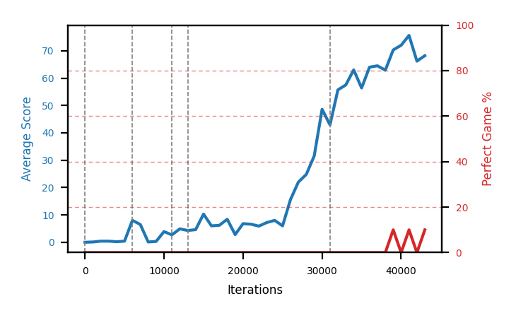

# smoke

Blue is average score (food eaten) on the left axis, red is perfect-game percentage on the right.

Latest eval: step 43000, avg score 68.2, perfect games 10%.

Training was resumed at step 0, 6000, 11000, 13000, 31000 (the dashed lines on the graph).

## Config

| setting | value |
|---|---|
| policy_name | smoke |
| learning_rate | 1e-05 |
| batch_size | 128 |
| discount | 0.99 |
| target_update_period | 8 |
| target_update_tau | 1.0 |
| gradient_clipping | none |
| n_step_update | 1 |
| initial_epsilon | 0.4 |
| min_epsilon | 0.0 |
| fc_layer_params | (50, 100, 50) |
| replay_buffer | cpprb prioritized, capacity 100000 |
| priority_exponent (alpha) | 0.6 |
| priority_signal | td_error |
| importance_sampling_beta | 0.4 -> 1.0 over 1000000 steps |
| initial_populate_steps | 1000 |
| eval | 10 episodes every 1000 steps |
| grid | 9x9, max possible score 95 |
| DEATH_REWARD | -5.0 |
| FOOD_REWARD | 1.0 |
| FOOD_DISTANCE_REWARD | 0.001 |
| eval_only | False |
| perfect_game_wait_ms | 500 |
| min_checkpoint_score | 40.0 |

## Evals

44 evals so far. Full series in [`smoke_evals.json`](smoke_evals.json).

| step | avg score | trailing avg | min score | max score | avg reward | perfect % | epsilon |
|---|---|---|---|---|---|---|---|
| 0 | 0.0 | 0.0 | 0 | 0/95 | -5.001 | 0 | 0.4 |
| 1000 | 0.1 | 0.1 | 0 | 1/95 | -4.908 | 0 | 0.4 |
| 2000 | 0.4 | 0.25 | 0 | 1/95 | -4.607 | 0 | 0.4 |
| ... | | | | | | | |
| 32000 | 55.7 | 55.7 | 0 | 77/95 | 52.753 | 0 | 0.01 |
| 33000 | 57.5 | 56.6 | 19 | 80/95 | 55.274 | 0 | 0.01 |
| 34000 | 63.0 | 58.73 | 11 | 77/95 | 60.394 | 0 | 0.001 |
| 35000 | 56.4 | 58.15 | 19 | 87/95 | 53.051 | 0 | 0.001 |
| 36000 | 64.0 | 59.32 | 49 | 82/95 | 59.7 | 0 | 0.001 |
| 37000 | 64.5 | 61.08 | 35 | 91/95 | 61.161 | 0 | 0.001 |
| 38000 | 62.9 | 62.16 | 23 | 83/95 | 58.225 | 0 | 0.001 |
| 39000 | 70.3 | 63.62 | 42 | 95/95 | 76.711 | 10 | 0.001 |
| 40000 | 72.0 | 66.74 | 61 | 87/95 | 68.064 | 0 | 0.001 |
| 41000 | 75.6 | 69.06 | 51 | 95/95 | 81.642 | 10 | 0.001 |
| 42000 | 66.2 | 69.4 | 41 | 80/95 | 61.83 | 0 | 0.001 |
| 43000 | 68.2 | 70.46 | 44 | 95/95 | 74.669 | 10 | 0.001 |
