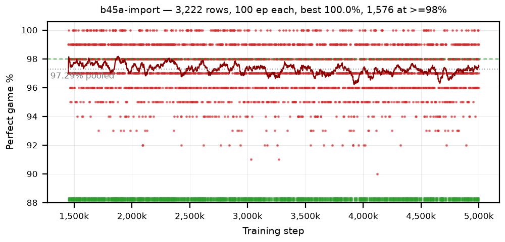
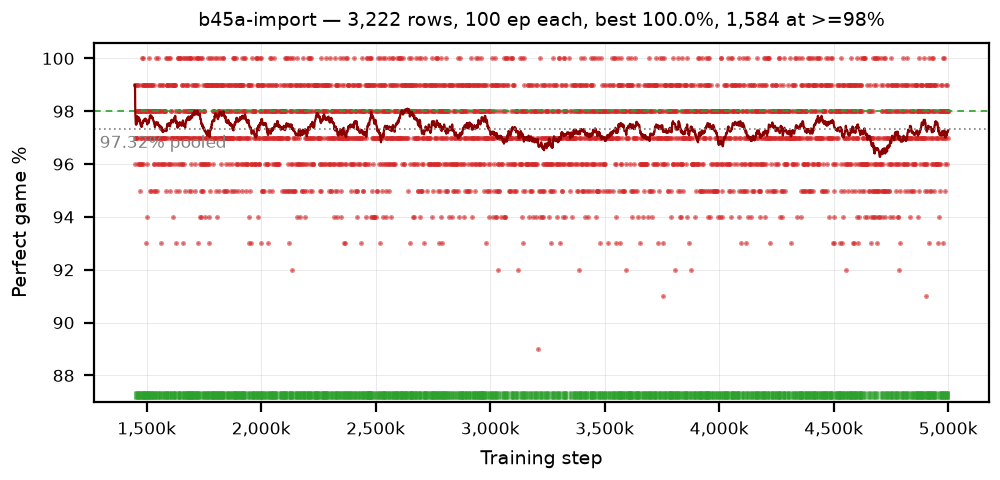

# Charts — one graph per arm

*No arms yet.* snek3 has no learning code — `dqn/` is phase 3, so nothing has a stage-A curve.

## Imported policies

Not arms — snek2 checkpoints converted to torch and measured by snek3, so these charts describe
**snek3's environment and measurement** rather than snek3 as a learner. See
[`results.md`](results.md).

### b45a-import — the phase-2 A/B, every checkpoint of snek2's `b45a-lowlr8-b29b`

3,222 rows · 100 ep each · pooled 97.29% · 1,576 rows ≥98% · widest ≥98% run 9

The arm's real shape only exists as the trailing mean: a single 100-episode row is quantised to whole
percent and carries 1.6 pp of noise, which is why the points form bands. Read the dark line — `b45a`
peaks near 98% between 1.8M and 2.4M and sags to ~96.5% near 3.9M. The green rug marks which
checkpoints cleared 98%.



The second seed reproduces the **shape** — high through ~2.6M, lower after ~3.0M — and not the
individual dips, which is exactly right: a 40-row trailing mean has 0.26 pp of noise, so a ±0.5 pp
wiggle is two standard deviations and should not repeat. This pass is also how the 100/100-count
discrepancy was settled ([`findings.md`](findings.md)).



## Arms

Every arm gets a `### <policy> — <what it changes>` section with a stats line, a short reading, and
its image. **Images are linked straight from `../runs/`** — there is no copy step and no separate
chart directory to keep in sync. That duplication is what snek2 needed a `refresh_charts.sh` and a
completeness-check snippet for, and it still drifted to 12 undocumented arms.

```markdown
### b1a-example — what this arm changes

step 2.00M · peak trailing 88.4 · best30 41.2% · sef 0.31 · best 500-ep 97.8% · ≥98%/500 x 0

One or two sentences: what the curve does, and what it means for the hypothesis.


```

**Refresh this file in the same pass as any doc edit or progress update**, whether or not the arms
have finished — a running batch with no chart entry is a bug, not a "wait until it closes" state.

`../charts/` holds only the one-off diagnostic figures a finding refers to, never per-arm charts.
