# Charts — one graph per arm

**Batches p2 and p3 closed 2026-08-30** — eight seeds each, stage B complete on both, charts below.
**Batch b2 closed 2026-08-29.** A live desktop arm's `runs/` files must still never be committed from
here: the box rewrites those paths every eval and a committed copy aborts its next ff-merge. p2's
charts came across the `results` branch at close-out, which is what that branch is for.

## Watching them live

**One window per box, opened by the trainings themselves**, showing every arm running there. Nothing
launches it; the first arm to start opens it and the last one to finish takes it away — and a panel
stays for the rest of the wave once it appears, so a batch with one arm left still shows all four. To
put it back
after closing it: `PYTHONPATH=. python -m tools.chart_window`. Killing it, closing it and relaunching
it are all free — no training reads it, waits on it, or reopens it ([`findings.md`](findings.md) on why
it took three attempts to get there).

## Batch p3 — `fc (200,100)`, 4 epochs, seeds 1-8

Closed 2026-08-30. Pooled **12.8%** of stage-B rows in the >=98%/500 record region; best rows
99.4-99.8. Stage-A progress chart then stage-B pass, per arm. Numbers and the p2 comparison —
including why the two batches are **not** a clean network-shape test — in [`results.md`](results.md).


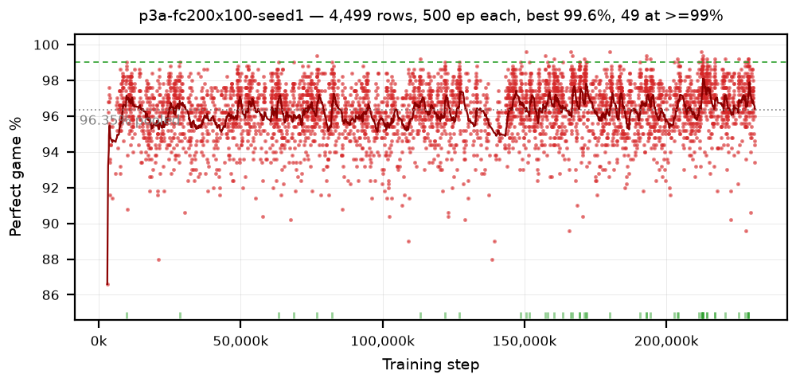


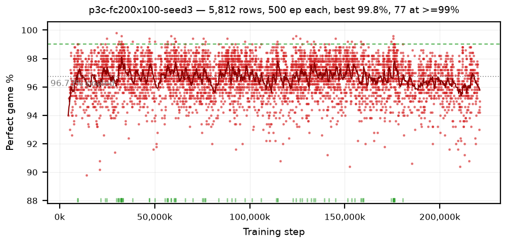


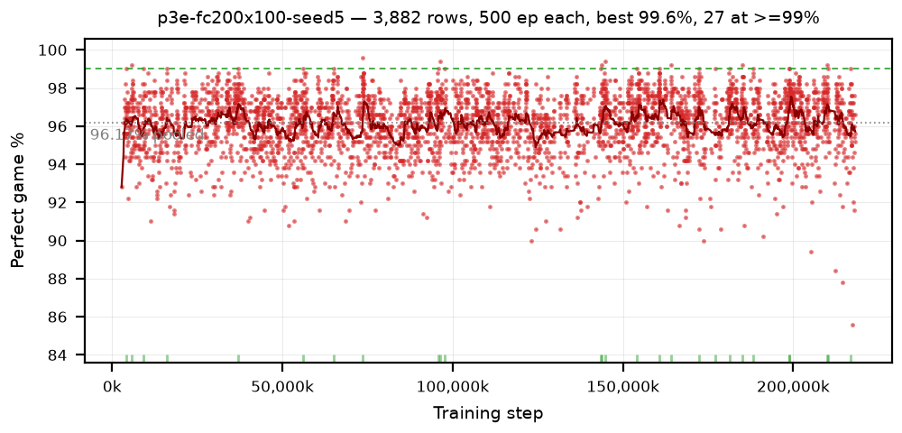

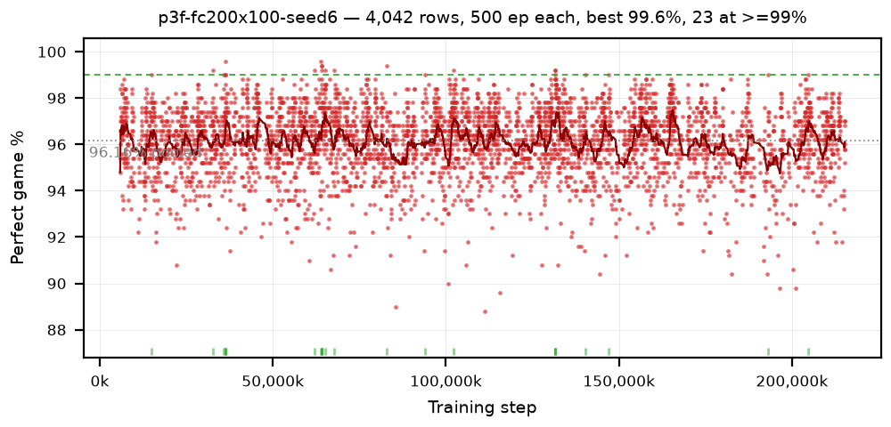
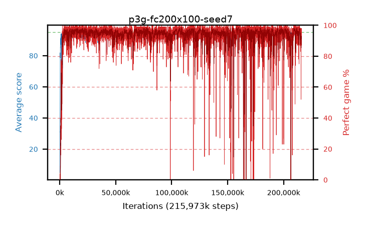

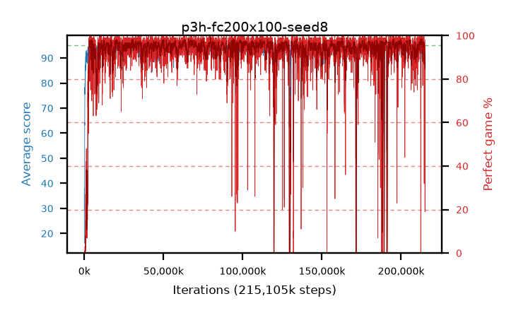
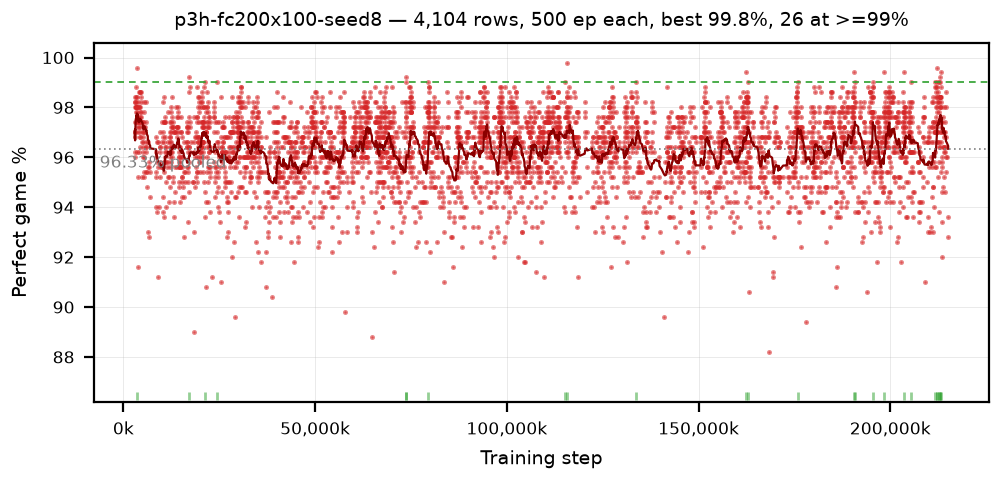

## Batch p2 — `fc (320,)`, 8 epochs, seeds 1-8

Closed 2026-08-30. Pooled **9.6%** in the record region, and the single best row in either
batch — **100.0%/500** at p2b/184M.

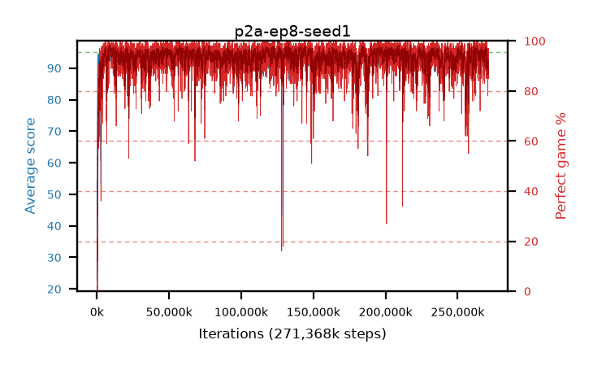
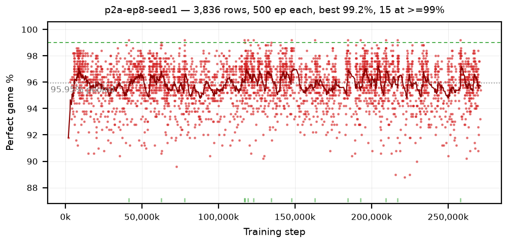
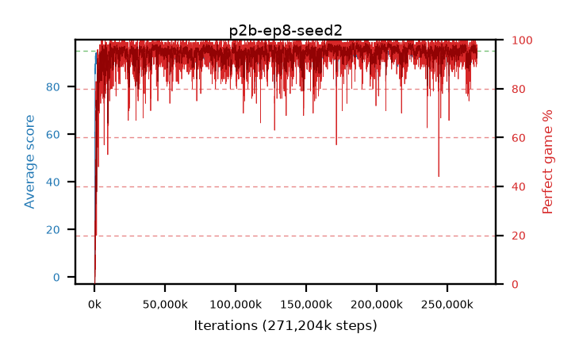


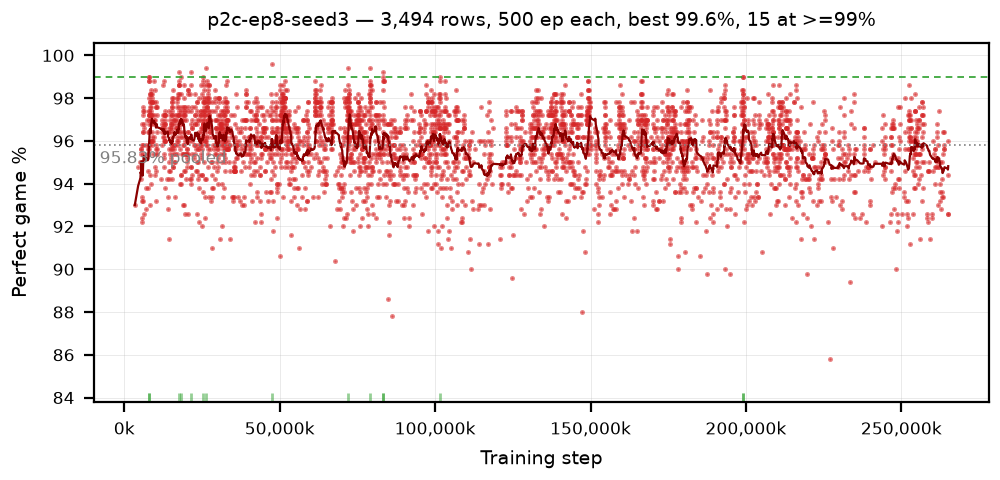

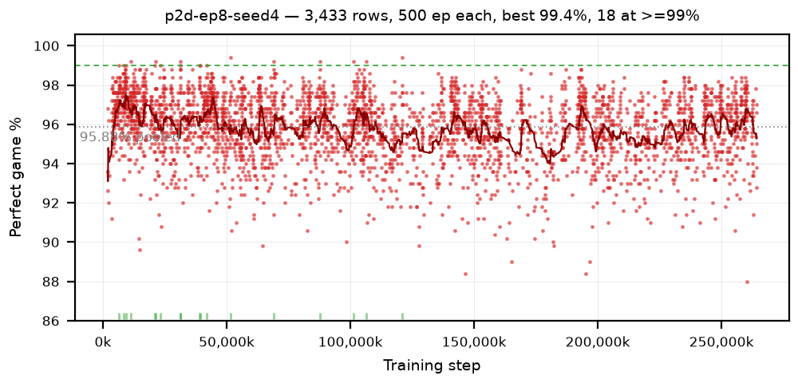
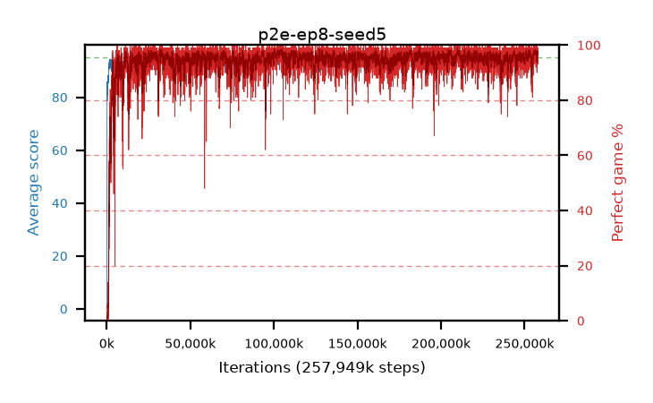
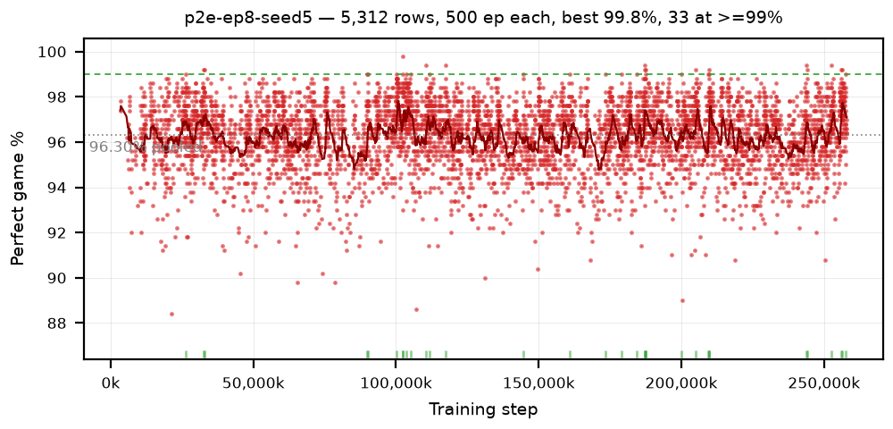


## Imported policies

Not arms — snek2 checkpoints converted to torch and measured by snek3, so these charts describe
**snek3's environment and measurement** rather than snek3 as a learner. See
[`results.md`](results.md).

### b45a-import — the phase-2 A/B, every checkpoint of snek2's `b45a-lowlr8-b29b`

3,222 rows · 100 ep each · pooled 97.29% · 1,576 rows ≥98% · widest ≥98% run 9

The arm's real shape only exists as the trailing mean: a single 100-episode row is quantised to whole
percent and carries 1.6 pp of noise, which is why the points form bands. Read the dark line — `b45a`
peaks near 98% between 1.8M and 2.4M and sags to ~96.5% near 3.9M. The green rug marks which
checkpoints cleared 98%.


The second seed reproduces the **shape** — high through ~2.6M, lower after ~3.0M — and not the
individual dips, which is exactly right: a 40-row trailing mean has 0.26 pp of noise, so a ±0.5 pp
wiggle is two standard deviations and should not repeat. This pass is also how the 100/100-count
discrepancy was settled ([`findings.md`](findings.md)).


## Arms

Every arm gets a `### <policy> — <what it changes>` section with a stats line, a short reading, and
its image. **Images are linked straight from `../runs/`** — there is no copy step and no separate
chart directory to keep in sync. That duplication is what snek2 needed a `refresh_charts.sh` and a
completeness-check snippet for, and it still drifted to 12 undocumented arms.

```markdown
### b1a-example — what this arm changes

step 2.00M · peak trailing 88.4 · best30 41.2% · sef 0.31 · best 500-ep 97.8% · ≥98%/500 x 0

One or two sentences: what the curve does, and what it means for the hypothesis.


```

### p0 — the PPO tuning sweep, 15 arms, one knob each

**Read these as a set, and read them at 10M rather than at 3M.** Every arm is seed 1 on b2's reward
function, one knob off a reference of lr 3e-4 / γ 0.99 / λ 0.98 / entropy 0.01 / fc 320 / 128x128
rollout / 4 epochs / minibatch 256. Nine of the fifteen finished inside **0.8 pp** of each other, so
the curves matter more than the ranking: what to look at is *where each one turns up*, not which one
ends highest.

**The two the batch exists for.** `p0a` is the reference and `p0g`/`p0e` are the two that were 6th and
7th at 3M and 1st and 2nd at 10M — put those three side by side and the cap-inversion finding is
visible as a shape rather than a table
([`findings.md`](findings.md)).

step 10.01M · best30 96.4 - 97.2 across nine arms · sd30 1.8 - 3.2 · best stage B **98.6% / 500**,
re-measured **96.6% / 3,000**

The laptop half — λ, entropy and the learning-rate bracket:


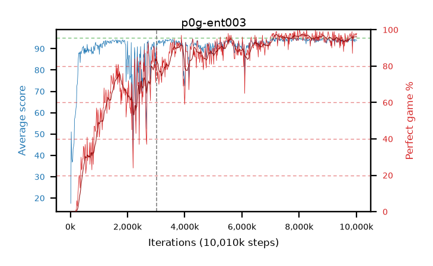


And the three arms that stopped at the 3M cap, kept because they are what the inversion is measured
against — the learning-rate extremes and γ 0.9975:


**The desktop half's eight charts — the four fc shapes, γ 0.995, and the three update-shape knobs —
arrive on the `results` branch at close-out**, and this section gets their `![]` lines in the same
pass. They are the half that found the one axis that moved: `p0q-ep8` at 97.2 and `p0r-mb1024` at
89.7 are the two ends of it.

### ppo-smoke — the phase-6b PPO gate arm, untuned defaults

Not a batch arm, and not seed-matched to anything: it exists to show `ppo/` learns. Read it against
b1 at a *matched transition count* (b1's step x 6), not against b1's endpoint.

step 508k transitions · trailing score 62.5 · avg score 79.55/500 eps · perfect 1.2%/500 · ev 0.90 ·
entropy 1.086 → 0.27 · clip fraction 0.03

Score climbs monotonically to ~80 and then flattens while the perfect rate sits near 1% — the shape
[`../plans/ppo.md`](../plans/ppo.md) §8 predicted for a short GAE horizon against a win ~950 moves
away, though at this budget it is equally just an untuned learning rate. `clip_fraction` 0.03 says the
update is not being constrained, so the rate is the first thing p0 moves.


### b1 — the DDQN baseline at every default, seeds 1-4

The batch changes nothing but `SNEK_SEED`, so these four curves are this codebase's noise floor as
much as they are a result. Read them together.

step 3.00M · trailing score 92.3-94.2 · peak best30 42.1 / 58.3 / 56.7 / **81.9%** · ≥95/100: **0**

**Every one of the four is still climbing at its cap, and that is the finding.** b1a goes ~20% at
500k to ~40% at 3M; b1d goes 0% to ~80% with its highest band in the final 500k. Neither plateaued,
so 3M steps measures how fast this config climbs and not what it converges to. The seed spread of
**39.8 pp** at this horizon is four times what n=4 can resolve.

The early spike and crash all four share is a separate, real feature of the task rather than a port
artefact: snek2's `b13d-shieldseed4` scored 91.2 with **80% perfect at step 20,000** and finished a
3.5M-step arm at 70%. Early competence here is cheap and unstable.

The weakest and the strongest seed, which between them are the whole story — the same config, the
same cap, 42.1% against 81.9%:


The middle two sit between them and add nothing a reader needs:


**Refresh this file in the same pass as any doc edit or progress update**, whether or not the arms
have finished — a running batch with no chart entry is a bug, not a "wait until it closes" state.

`../charts/` holds only the one-off diagnostic figures a finding refers to, never per-arm charts.
