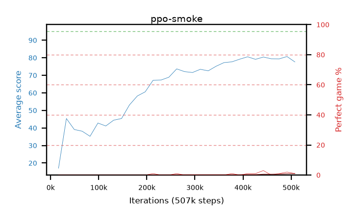

# Results — every arm

The canonical arm table. One row per arm, filled in when the arm stops and its stage-B measurement
lands. Config, final numbers, verdict.

**Newest batch first.** A batch closes at the top of this file, under the intro and above the
batch before it, so the newest numbers are the ones you land on. The reference sections —
`Imported policies` and `Reading this table` — stay at the bottom.

**The best single policy is not in this file.** An arm's row here is a *selected* maximum over
hundreds of checkpoints; a record needs a fresh measurement at depth, and those live in
[`../hallOfFame/HOF.md`](../hallOfFame/HOF.md) — two entries as of 2026-09-01, confirmed on 30,000
episodes at a seed no selection pass used, the better of them **98.96%** and the first snek3 policy to
beat the snek2 champion at matched depth.

**‡ The PPO batches were renamed on 2026-08-31: `p0`-`p3` became `b3`-`b6`** — one prefix for
every batch in both eras, because a second one had already cost the desktop's batch grouping a day.
The map is a `+3` offset holding the old order: `p0`->`b3`, `p1`->`b4`, `p2`->`b5`, `p3`->`b6`, so
the b-series is not chronological — b5 and b6 ran before b4. Renamed here, in `runs/` and in
`savedPolicies/`. **Two places still hold the old names and are meant to:** the `results` branch,
whose published artifacts are history, and the daemon's ledger, whose keys are the job ids those
waves actually ran under. Looking for an arm's desktop artifacts, search the old name.

<!-- progress_update: batch b11 -->
## Batch b11 — the `learning_rate` sweep, 8 values x 4 seeds, 50M, closed 2026-09-04

Closed on the desktop; every arm has its stage-B measurement. One knob off the reference cell (`b9bw-lam99-seed1, b9bx-lam99-seed2, b9by-lam99-seed3, b9bz-lam99-seed4`, marked in the table). Numbers by `tools/progress_update.py`.

| learning_rate | rows | ≥98%/500 | per-seed share | ≥99 (`hof5000` cands) | best row | best30 (mean, range) | sef | drawdown < 50% | < 80% | stage-A ≥98% |
|---|---:|---:|---|---:|---:|---|---:|---:|---:|---:|
| 4e-5 | 1,411 | 2.2% | 3.4 1.9 2.8 1.3 | 0 | 98.6 | 97.17 (97.0-97.6) | 73.4 | 0.83% | 14.28% | 5.8% |
| 1e-4 | 4,496 | 24.8% | 17.5 13.0 43.7 17.6 | 135 | 100.0 | 98.17 (97.8-98.6) | 85.1 | 1.41% | 9.49% | 24.8% |
| 1.5e-4 | 4,836 | 20.8% | 15.1 19.0 21.8 26.5 | 81 | 99.8 | 98.22 (98.0-98.4) | 87.4 | 0.53% | 7.34% | 25.9% |
| 2.5e-4 | 4,964 | 30.9% | 34.8 27.8 28.8 32.0 | 210 | 100.0 | 98.45 (98.2-98.7) | 89.4 | 0.71% | 6.29% | 27.9% |
| **3e-4** (reference) | 5,173 | 27.3% | 27.2 24.1 31.4 26.0 | 138 | 100.0 | 98.33 (98.3-98.4) | 90.6 | 0.77% | 6.43% | 28.9% |
| 5e-4 | 4,636 | 21.6% | 20.5 23.2 21.7 21.0 | 96 | 99.8 | 98.15 (98.0-98.4) | 91.5 | 0.59% | 5.41% | 24.6% |
| 8e-4 | 4,031 | 16.3% | 13.3 7.7 26.6 14.8 | 73 | 99.6 | 98.08 (97.8-98.2) | 90.2 | 0.45% | 4.56% | 20.6% |
| 1e-3 | 3,653 | 15.8% | 8.9 9.4 24.6 16.1 | 61 | 99.6 | 97.70 (97.1-98.2) | 92.2 | 0.25% | 4.91% | 18.6% |
| 2e-3 | 2,298 | 6.7% | 8.1 3.6 7.4 6.7 | 5 | 99.4 | 96.62 (95.9-97.2) | 88.1 | 1.68% | 9.97% | 10.2% |

<!-- reading -->
**Verdict: the learning rate is a plateau from 1e-4 to 5e-4 and a cliff on both sides; the base stays at
3e-4.** Density 21-31% and best30 98.15-98.45 across the five middle cells, with per-seed spread inside a cell
(13-44% at 1e-4) wider than the differences between cells. 2.5e-4 is the best cell (30.9%, 210 ≥99 rows,
two 100/500 rows) but n=4 cannot separate it from the reference's 27.3%. Cell by cell: **4e-5** slow onset
as predicted, still climbing at 50M, zero ≥99 rows. **1e-4** falsified its prediction of "zero ≥98 rows" with
24.8% and 135 candidates, though it does spend more evals below 80% (9.5% vs 6.4%). **1.5e-4, 2.5e-4, 5e-4**
within noise of the base. **8e-4 and 1e-3** were predicted to collapse visibly and are instead the two most
stable cells (4.6-4.9% below 80%, `sef` 90-92) with a lower ceiling (16% density, best30 97.7-98.1).
**2e-3** locates the cliff: 6.7%, best30 96.6, drawdown 1.68%. `sef` rises monotonically with lr (73 → 92)
while density peaks in the middle — the two metrics rank the sweep differently, as b7 found. Not settled:
whether 2.5e-4 is a real 3-pp gain; it goes into the γ × λ corner grid as a second lr value.
<!-- /reading -->

### Every arm

| arm | learning_rate | rows | ≥98%/500 | ≥99 | best row | best30 @step | sef | drawdown < 50% |
|---|---:|---:|---:|---:|---:|---|---:|---:|
| `b11aa-lr4e5-seed1` | 4e-5 | 264 | 3.4% | 0 | 98.6 | 97.0 @49.6M | 65.2 | 5.26% |
| `b11ab-lr4e5-seed2` | 4e-5 | 419 | 1.9% | 0 | 98.4 | 97.6 @48.1M | 78.9 | 0.11% |
| `b11ac-lr4e5-seed3` | 4e-5 | 351 | 2.8% | 0 | 98.6 | 97.1 @47.3M | 74.1 | 1.26% |
| `b11ad-lr4e5-seed4` | 4e-5 | 377 | 1.3% | 0 | 98.4 | 97.0 @42.5M | 75.5 | 0.41% |
| `b11ae-lr1e4-seed1` | 1e-4 | 989 | 17.5% | 12 | 99.2 | 98.2 @38.2M | 81.9 | 2.3% |
| `b11af-lr1e4-seed2` | 1e-4 | 953 | 13.0% | 4 | 99.0 | 97.8 @46.6M | 87.3 | 0.52% |
| `b11ag-lr1e4-seed3` | 1e-4 | 1419 | 43.7% | 106 | 100.0 | 98.6 @22.0M | 87.7 | 0.45% |
| `b11ah-lr1e4-seed4` | 1e-4 | 1135 | 17.6% | 13 | 99.2 | 98.1 @36.7M | 83.4 | 2.54% |
| `b11ai-lr1.5e4-seed1` | 1.5e-4 | 1143 | 15.1% | 11 | 99.4 | 98.0 @39.2M | 83.4 | 0.48% |
| `b11aj-lr1.5e4-seed2` | 1.5e-4 | 1180 | 19.0% | 15 | 99.6 | 98.1 @26.7M | 90.2 | 0.41% |
| `b11ak-lr1.5e4-seed3` | 1.5e-4 | 1186 | 21.8% | 25 | 99.8 | 98.4 @42.0M | 88.3 | 0.59% |
| `b11al-lr1.5e4-seed4` | 1.5e-4 | 1327 | 26.5% | 30 | 99.6 | 98.4 @31.4M | 87.7 | 1.77% |
| `b11am-lr2.5e4-seed1` | 2.5e-4 | 1265 | 34.8% | 81 | 99.8 | 98.7 @48.1M | 88.4 | 0.78% |
| `b11an-lr2.5e4-seed2` | 2.5e-4 | 1336 | 27.8% | 45 | 100.0 | 98.6 @19.2M | 87.9 | 0.63% |
| `b11ao-lr2.5e4-seed3` | 2.5e-4 | 1067 | 28.8% | 39 | 99.8 | 98.3 @33.0M | 90.8 | 0.98% |
| `b11ap-lr2.5e4-seed4` | 2.5e-4 | 1296 | 32.0% | 45 | 100.0 | 98.2 @12.5M | 90.5 | 0.1% |
| `b11aq-lr5e4-seed1` | 5e-4 | 1154 | 20.5% | 18 | 99.2 | 98.0 @39.9M | 91.8 | 0.68% |
| `b11ar-lr5e4-seed2` | 5e-4 | 1139 | 23.2% | 23 | 99.6 | 98.1 @22.4M | 91.5 | 0.74% |
| `b11as-lr5e4-seed3` | 5e-4 | 1141 | 21.7% | 31 | 99.8 | 98.1 @48.6M | 92.2 | 0.51% |
| `b11at-lr5e4-seed4` | 5e-4 | 1202 | 21.0% | 24 | 99.4 | 98.4 @27.6M | 90.4 | 0.34% |
| `b11au-lr8e4-seed1` | 8e-4 | 1012 | 13.3% | 18 | 99.4 | 98.1 @24.4M | 87.5 | 0.27% |
| `b11av-lr8e4-seed2` | 8e-4 | 805 | 7.7% | 0 | 98.8 | 97.8 @27.9M | 91.5 | 1.29% |
| `b11aw-lr8e4-seed3` | 8e-4 | 1138 | 26.6% | 41 | 99.6 | 98.2 @9.0M | 87.7 | 0.36% |
| `b11ax-lr8e4-seed4` | 8e-4 | 1076 | 14.8% | 14 | 99.4 | 98.2 @48.5M | 94.3 | 0.54% |
| `b11ay-lr1e3-seed1` | 1e-3 | 754 | 8.9% | 4 | 99.0 | 97.6 @13.2M | 90.4 | 0.95% |
| `b11az-lr1e3-seed2` | 1e-3 | 709 | 9.4% | 3 | 99.4 | 97.1 @25.7M | 92.0 | 0.27% |
| `b11ba-lr1e3-seed3` | 1e-3 | 1088 | 24.6% | 34 | 99.6 | 97.9 @14.5M | 91.8 | 0.21% |
| `b11bb-lr1e3-seed4` | 1e-3 | 1102 | 16.1% | 20 | 99.6 | 98.2 @7.9M | 94.5 | 0.23% |
| `b11bc-lr2e3-seed1` | 2e-3 | 683 | 8.1% | 3 | 99.4 | 97.1 @28.5M | 85.7 | 2.04% |
| `b11bd-lr2e3-seed2` | 2e-3 | 442 | 3.6% | 2 | 99.0 | 95.9 @9.5M | 87.5 | 2.48% |
| `b11be-lr2e3-seed3` | 2e-3 | 528 | 7.4% | 0 | 98.8 | 96.3 @14.4M | 87.2 | 1.31% |
| `b11bf-lr2e3-seed4` | 2e-3 | 645 | 6.7% | 0 | 98.8 | 97.2 @43.5M | 91.9 | 0.7% |

<!-- /progress_update: batch b11 -->

## Batch b10 — the discount γ sweep, 16 values x 4 seeds, closed 2026-09-03

**One knob off b7's winning cell, and again the default sat mid-ramp.** 64 arms at 50M transitions on the
desktop, eight waves of two γ values, `auto_stage_b` measuring each wave before the next trained,
2026-09-02 ~16:50 → 2026-09-03 16:08. Everything but `discount` is b7's reference — `fc (320,)`, 4
epochs, lr 3e-4, **λ 0.98**, entropy 0.01, clip 0.2, 128x128 rollout, minibatch 256, b2's reward — so
**`b7aa`-`b7ad` are the γ 0.99 row.** `SNEK_DISCOUNT` also sets the shaping discount, so the dense reward
moves with γ, correctly. Drawdown is the median share of post-competence stage-A evals (onset = first
eval ≥80% perfect) below the threshold, as for b8 and b9.

| γ | value horizon 1/(1−γ) | rows | ≥98%/500 | per-seed share | ≥99 (`hof5000` cands) | best row | best30 (4 seeds) | sef | drawdown < 50% | < 80% |
|---:|---:|---:|---:|---|---:|---:|---|---:|---:|---:|
| 0.70 | 3.3 | 0 | – | never screened | 0 | – | 2.7 5.2 5.1 2.8 | 0.0 | never competent | |
| 0.80 | 5 | 0 | – | never screened | 0 | – | 49.7 24.4 41.8 45.2 | 0.0 | never competent | |
| 0.85 | 6.7 | 0 | – | never screened | 0 | – | 67.2 64.1 66.6 68.0 | 0.0 | 54.4% (2 of 4 reached 80%) | 99.7% |
| 0.90 | 10 | 0 | – | never screened | 0 | – | 81.6 75.8 79.4 81.4 | 3.6 | 38.7% | 95.5% |
| 0.91 | 11.1 | 0 | – | never screened | 0 | – | 85.5 79.9 77.5 84.7 | 5.8 | 26.5% | 92.6% |
| 0.92 | 12.5 | 0 | – | never screened | 0 | – | 85.1 86.6 84.2 83.1 | 12.1 | 18.4% | 85.3% |
| 0.93 | 14.3 | 0 | – | never screened | 0 | – | 86.9 88.5 87.1 87.7 | 21.0 | 13.9% | 74.0% |
| 0.94 | 16.7 | 11 | 0.0% | 0 0 0 0 | 0 | 93.2 | 90.4 89.0 90.2 89.8 | 34.5 | 4.85% | 56.8% |
| 0.95 | 20 | 95 | 0.0% | 0 0 0 0 | 0 | 97.8 | 93.6 91.6 93.2 93.0 | 51.5 | 3.35% | 44.7% |
| 0.96 | 25 | 319 | 0.9% | 4.3 0 0 0 | 0 | 98.4 | 95.6 93.4 94.9 94.7 | 63.9 | 2.60% | 30.0% |
| 0.97 | 33 | 756 | 3.6% | 0.8 5.1 2.0 7.1 | 2 | 99.4 | 96.4 94.7 95.4 95.6 | 75.6 | 0.28% | 19.8% |
| 0.98 | 50 | 2,540 | 10.4% | 6.0 14.1 8.1 13.1 | 20 | 99.6 | 97.5 97.1 97.3 97.3 | 86.5 | 0.14% | 8.3% |
| 0.99 (b7) | 100 | 4,003 | 17.3% | 18.5 19.0 16.5 15.1 | 50 | 99.6 | 97.8 97.8 97.7 97.7 | 90.9 | 0.29% | 6.2% |
| 0.995 | 200 | 5,027 | 19.6% | 19.0 17.8 20.5 20.7 | 85 | **100.0** | 98.1 97.7 98.5 98.1 | 92.5 | 0.78% | **4.5%** |
| **0.9975** | 400 | 5,844 | 25.6% | 24.3 29.0 20.3 28.5 | 164 | 99.8 | **98.6 98.4 98.7 98.7** | **92.6** | 1.30% | 4.7% |
| **0.999** | 1,000 | **6,614** | **30.7%** | 21.7 22.9 39.2 35.4 | **277** | 99.8 | 98.5 98.2 98.7 98.6 | 91.7 | 1.55% | 4.9% |
| 1.00 | ∞ | 1,535 | 38.6% | 36.4 45.8 39.4 33.9 | 178 | **100.0** | 98.4 97.3 98.7 98.3 | **39.2** | **44.4%** | 63.6% |

**Density is zero through γ 0.93, appears at 0.96 and climbs monotonically to 30.7% at γ 0.999; γ 1.00
collapses.** 28 arms across the seven lowest values did not produce one screened checkpoint. From 0.96
up every step adds density and the base at 0.99 is mid-ramp; drawdown climbs from 0.29% at 0.99 to 1.55%
at 0.999. γ 1.00's deployed policy spends 44% of its post-competence evals below 50% perfect while its
surviving checkpoints are the densest in the batch. `sef` ranks the top backwards, fourth batch running.
Reading in [`findings.md`](findings.md), charts in [`charts.md`](charts.md). **No `hof5000` pass yet** —
726 candidates at ≥99/500, most at γ 0.999 (277) and 1.00 (178).

### Every arm

`rows` is the stage-B checkpoint count, `≥99` the `hof5000` candidates at the current cut, `best30 @step`
the peak 30-eval trailing perfect rate and where it landed. γ ≤ 0.93 arms screened zero checkpoints.

| arm | γ | rows | ≥98%/500 | ≥99 | best row | best30 @step | sef | drawdown < 50% |
|---|---:|---:|---:|---:|---:|---|---:|---:|
| `b10aa-g70-seed1` | 0.7 | 0 | 0.0% | 0 | 0.0 | 2.7 @1.0M | 0.0 | – |
| `b10ab-g70-seed2` | 0.7 | 0 | 0.0% | 0 | 0.0 | 5.2 @3.5M | 0.0 | – |
| `b10ac-g70-seed3` | 0.7 | 0 | 0.0% | 0 | 0.0 | 5.1 @2.1M | 0.0 | – |
| `b10ad-g70-seed4` | 0.7 | 0 | 0.0% | 0 | 0.0 | 2.8 @0.9M | 0.0 | – |
| `b10ae-g80-seed1` | 0.8 | 0 | 0.0% | 0 | 0.0 | 49.7 @14.3M | 0.0 | – |
| `b10af-g80-seed2` | 0.8 | 0 | 0.0% | 0 | 0.0 | 24.4 @14.8M | 0.0 | – |
| `b10ag-g80-seed3` | 0.8 | 0 | 0.0% | 0 | 0.0 | 41.8 @17.5M | 0.0 | – |
| `b10ah-g80-seed4` | 0.8 | 0 | 0.0% | 0 | 0.0 | 45.2 @36.2M | 0.0 | – |
| `b10ai-g85-seed1` | 0.85 | 0 | 0.0% | 0 | 0.0 | 67.2 @22.6M | 0.0 | – |
| `b10aj-g85-seed2` | 0.85 | 0 | 0.0% | 0 | 0.0 | 64.1 @40.4M | 0.0 | 62.8% |
| `b10ak-g85-seed3` | 0.85 | 0 | 0.0% | 0 | 0.0 | 66.6 @34.4M | 0.0 | – |
| `b10al-g85-seed4` | 0.85 | 0 | 0.0% | 0 | 0.0 | 68.0 @38.3M | 0.1 | 46.0% |
| `b10am-g90-seed1` | 0.9 | 0 | 0.0% | 0 | 0.0 | 81.6 @26.3M | 3.9 | 37.8% |
| `b10an-g90-seed2` | 0.9 | 0 | 0.0% | 0 | 0.0 | 75.8 @49.6M | 2.4 | 39.5% |
| `b10ao-g90-seed3` | 0.9 | 0 | 0.0% | 0 | 0.0 | 79.4 @26.4M | 2.1 | 40.9% |
| `b10ap-g90-seed4` | 0.9 | 0 | 0.0% | 0 | 0.0 | 81.4 @41.2M | 6.1 | 30.1% |
| `b10aq-g91-seed1` | 0.91 | 0 | 0.0% | 0 | 0.0 | 85.5 @30.4M | 9.4 | 15.8% |
| `b10ar-g91-seed2` | 0.91 | 0 | 0.0% | 0 | 0.0 | 79.9 @49.9M | 2.5 | 44.7% |
| `b10as-g91-seed3` | 0.91 | 0 | 0.0% | 0 | 0.0 | 77.5 @37.1M | 4.1 | 28.1% |
| `b10at-g91-seed4` | 0.91 | 0 | 0.0% | 0 | 0.0 | 84.7 @32.7M | 7.3 | 25.0% |
| `b10au-g92-seed1` | 0.92 | 0 | 0.0% | 0 | 0.0 | 85.1 @24.5M | 15.4 | 15.9% |
| `b10av-g92-seed2` | 0.92 | 0 | 0.0% | 0 | 0.0 | 86.6 @38.4M | 10.8 | 21.4% |
| `b10aw-g92-seed3` | 0.92 | 0 | 0.0% | 0 | 0.0 | 84.2 @38.9M | 9.4 | 20.9% |
| `b10ax-g92-seed4` | 0.92 | 0 | 0.0% | 0 | 0.0 | 83.1 @34.6M | 12.9 | 15.0% |
| `b10ay-g93-seed1` | 0.93 | 0 | 0.0% | 0 | 0.0 | 87.7 @17.1M | 22.5 | 9.4% |
| `b10az-g93-seed2` | 0.93 | 0 | 0.0% | 0 | 0.0 | 86.9 @48.3M | 16.1 | 18.3% |
| `b10ba-g93-seed3` | 0.93 | 0 | 0.0% | 0 | 0.0 | 88.5 @24.1M | 26.7 | 10.0% |
| `b10bb-g93-seed4` | 0.93 | 0 | 0.0% | 0 | 0.0 | 87.1 @49.7M | 18.7 | 17.8% |
| `b10bc-g94-seed1` | 0.94 | 2 | 0.0% | 0 | 90.8 | 90.2 @26.0M | 37.7 | 3.1% |
| `b10bd-g94-seed2` | 0.94 | 4 | 0.0% | 0 | 93.2 | 89.0 @32.0M | 33.3 | 6.4% |
| `b10be-g94-seed3` | 0.94 | 2 | 0.0% | 0 | 91.6 | 89.8 @46.1M | 40.9 | 3.3% |
| `b10bf-g94-seed4` | 0.94 | 3 | 0.0% | 0 | 91.0 | 90.4 @33.1M | 26.3 | 13.7% |
| `b10bg-g95-seed1` | 0.95 | 30 | 0.0% | 0 | 95.8 | 93.6 @15.2M | 57.1 | 2.5% |
| `b10bh-g95-seed2` | 0.95 | 23 | 0.0% | 0 | 97.8 | 92.7 @43.2M | 49.4 | 3.7% |
| `b10bi-g95-seed3` | 0.95 | 15 | 0.0% | 0 | 95.6 | 91.6 @39.2M | 46.7 | 9.1% |
| `b10bj-g95-seed4` | 0.95 | 27 | 0.0% | 0 | 95.2 | 93.5 @33.9M | 53.0 | 3.0% |
| `b10bk-g96-seed1` | 0.96 | 70 | 4.3% | 0 | 98.4 | 95.0 @21.6M | 63.4 | 3.2% |
| `b10bl-g96-seed2` | 0.96 | 154 | 0.0% | 0 | 97.6 | 95.6 @35.8M | 68.8 | 2.0% |
| `b10bm-g96-seed3` | 0.96 | 41 | 0.0% | 0 | 97.0 | 94.6 @21.4M | 56.3 | 3.5% |
| `b10bn-g96-seed4` | 0.96 | 54 | 0.0% | 0 | 96.4 | 93.4 @29.5M | 67.1 | 1.1% |
| `b10bo-g97-seed1` | 0.97 | 123 | 0.8% | 0 | 98.0 | 94.8 @46.7M | 75.0 | 0.4% |
| `b10bp-g97-seed2` | 0.97 | 294 | 5.1% | 2 | 99.4 | 96.4 @11.9M | 77.0 | 0.4% |
| `b10bq-g97-seed3` | 0.97 | 254 | 2.0% | 0 | 98.4 | 96.2 @48.4M | 79.3 | 0.1% |
| `b10br-g97-seed4` | 0.97 | 85 | 7.1% | 0 | 98.8 | 94.7 @45.2M | 71.0 | 0.2% |
| `b10bs-g98-seed1` | 0.98 | 580 | 6.0% | 1 | 99.2 | 97.1 @28.1M | 89.6 | 0.0% |
| `b10bt-g98-seed2` | 0.98 | 653 | 14.1% | 8 | 99.6 | 97.5 @23.9M | 84.7 | 0.7% |
| `b10bu-g98-seed3` | 0.98 | 664 | 8.1% | 3 | 99.4 | 97.4 @23.7M | 87.3 | 0.0% |
| `b10bv-g98-seed4` | 0.98 | 643 | 13.1% | 8 | 99.4 | 97.2 @37.0M | 84.4 | 0.2% |
| `b10bw-g995-seed1` | 0.995 | 1,234 | 19.0% | 18 | 100.0 | 97.7 @49.4M | 91.7 | 1.0% |
| `b10bx-g995-seed2` | 0.995 | 1,195 | 17.8% | 20 | 99.6 | 97.9 @36.8M | 92.8 | 0.5% |
| `b10by-g995-seed3` | 0.995 | 1,329 | 20.5% | 22 | 99.6 | 98.5 @39.5M | 94.0 | 0.1% |
| `b10bz-g995-seed4` | 0.995 | 1,269 | 20.7% | 25 | 99.6 | 98.3 @45.2M | 91.5 | 1.5% |
| `b10ca-g9975-seed1` | 0.9975 | 1,454 | 24.3% | 49 | 99.8 | 98.6 @33.7M | 91.5 | 1.3% |
| `b10cb-g9975-seed2` | 0.9975 | 1,461 | 29.0% | 44 | 99.8 | 98.7 @40.8M | 92.5 | 0.9% |
| `b10cc-g9975-seed3` | 0.9975 | 1,440 | 20.3% | 26 | 99.6 | 98.4 @40.4M | 93.7 | 1.4% |
| `b10cd-g9975-seed4` | 0.9975 | 1,489 | 28.5% | 45 | 99.8 | 98.7 @36.9M | 92.6 | 1.3% |
| `b10ce-g999-seed1` | 0.999 | 1,494 | 21.7% | 17 | 99.4 | 98.2 @21.8M | 90.7 | 2.5% |
| `b10cf-g999-seed2` | 0.999 | 1,459 | 22.9% | 34 | 99.4 | 98.6 @47.8M | 91.1 | 1.7% |
| `b10cg-g999-seed3` | 0.999 | 1,924 | 39.2% | 133 | 99.8 | 98.7 @48.9M | 91.8 | 1.2% |
| `b10ch-g999-seed4` | 0.999 | 1,737 | 35.4% | 93 | 99.6 | 98.7 @35.4M | 93.3 | 1.4% |
| `b10ci-g100-seed1` | 1.00 | 129 | 36.4% | 15 | 99.4 | 97.3 @49.9M | 18.8 | 68.9% |
| `b10cj-g100-seed2` | 1.00 | 511 | 45.8% | 73 | 99.8 | 98.7 @42.5M | 44.2 | 37.7% |
| `b10ck-g100-seed3` | 1.00 | 142 | 39.4% | 12 | 100.0 | 98.4 @30.7M | 25.6 | 51.0% |
| `b10cl-g100-seed4` | 1.00 | 753 | 33.9% | 78 | 99.8 | 98.3 @34.9M | 68.1 | 16.7% |

## Batch b9 — the GAE λ sweep, 16 values x 4 seeds, closed 2026-09-02

**One knob off b7's winning cell, and the default was not the top.** 64 arms at 50M transitions on the
desktop, eight waves of two λ values, `auto_stage_b` measuring each wave before the next trained,
2026-09-01 ~21:50 → 2026-09-02 16:48. Everything but `ppo_gae_lambda` is b7's reference — `fc (320,)`,
4 epochs, lr 3e-4, γ 0.99, entropy 0.01, clip 0.2, 128x128 rollout, minibatch 256, b2's reward — so
**`b7aa`-`b7ad` are the λ 0.98 row.** Drawdown is the median share of post-competence stage-A evals
(onset = first eval ≥80% perfect) below the threshold, as defined for b8.

| λ | GAE horizon | rows | ≥98%/500 | per-seed share | ≥98.5 | best row | best30 (4 seeds) | sef | drawdown < 50% | < 80% |
|---:|---:|---:|---:|---|---:|---:|---|---:|---:|---:|
| 0.00 | 1.0 | 8 | 0.0% | 0 0 0 0 | 0 | 94.0 | 88.7 85.1 90.8 88.5 | 24.1 | 11.29% | 68.6% |
| 0.50 | 2.0 | 392 | 0.0% | 0 0 0 0 | 0 | 96.6 | 94.2 94.2 94.9 93.7 | 81.8 | 0.05% | 11.1% |
| 0.80 | 4.8 | 1,133 | 0.8% | 0.4 1.7 0.4 0.7 | 3 | 98.6 | 96.6 95.6 96.1 96.2 | 85.9 | 0.02% | 9.3% |
| 0.85 | 6.3 | 1,279 | 0.8% | 0.3 1.1 1.7 0.0 | 1 | 98.8 | 95.2 96.3 96.1 96.0 | 87.3 | 0.00% | 8.8% |
| 0.90 | 9.2 | 2,130 | 3.9% | 3.7 5.3 5.1 1.1 | 16 | 99.2 | 96.5 97.1 96.9 96.5 | 89.4 | 0.07% | 6.5% |
| 0.91 | 10.1 | 2,168 | 4.3% | 2.3 7.8 3.6 3.7 | 14 | 99.2 | 96.5 97.4 96.9 96.7 | 89.4 | 0.02% | 6.7% |
| 0.92 | 11.2 | 2,363 | 4.8% | 2.0 6.9 3.8 5.7 | 18 | 99.2 | 96.5 97.6 96.8 96.8 | 89.6 | 0.02% | 6.1% |
| 0.93 | 12.6 | 2,545 | 5.4% | 4.1 9.9 3.3 4.2 | 22 | 99.2 | 96.9 97.5 97.1 97.2 | 90.6 | 0.02% | 4.9% |
| 0.94 | 14.4 | 2,359 | 4.6% | 4.5 5.6 2.8 5.2 | 21 | 99.2 | 97.0 96.6 96.7 96.9 | 90.8 | 0.00% | 5.6% |
| 0.95 | 16.8 | 2,665 | 5.3% | 3.7 9.0 4.6 3.4 | 23 | 99.6 | 97.1 97.0 96.9 96.9 | 92.3 | 0.02% | 3.9% |
| 0.96 | 20.2 | 2,882 | 8.3% | 4.6 12.7 8.1 7.0 | 67 | 99.6 | 96.8 97.8 97.2 97.4 | 92.0 | 0.03% | 5.0% |
| 0.97 | 25.2 | 3,613 | 11.7% | 9.0 17.4 9.2 10.8 | 130 | 99.6 | 98.1 98.0 97.6 97.8 | **93.0** | 0.03% | **4.1%** |
| 0.98 (b7) | 33.6 | 4,003 | 17.3% | 18.5 19.0 16.5 15.1 | 174 | 99.6 | 97.8 97.8 97.7 97.7 | 90.9 | 0.29% | 6.2% |
| **0.99** | 50.3 | 5,173 | **27.3%** | 27.2 24.1 31.4 26.0 | 451 | **100.0** | 98.3 98.3 98.4 98.3 | 90.6 | 0.77% | 6.4% |
| 0.995 | 66.9 | 4,998 | 27.3% | 24.8 27.4 34.3 22.3 | 496 | 99.8 | 98.2 98.5 98.8 98.1 | 89.1 | 1.03% | 7.7% |
| 0.999 | 91.0 | 4,897 | 25.6% | 27.8 17.4 24.2 31.3 | 453 | **100.0** | 98.5 98.2 98.1 **99.0** | 87.9 | 1.26% | 8.1% |
| **1.00** | 100 | 5,364 | **29.5%** | 25.2 32.7 29.6 30.8 | **574** | 99.8 | 98.4 98.5 98.4 98.3 | 88.4 | 2.10% | 8.7% |

**Record density climbs monotonically to λ 0.99 and plateaus to 1.00; drawdown climbs with it.**
17.3% at 0.98 → 27.3% at 0.99 is complete seed separation (Mann-Whitney p=0.029, the 4-vs-4 floor),
and the four groups from 0.99 up are indistinguishable at four seeds. Three rows scored 100/500 —
`b9ch-lam999-seed4` at 47,235,072 and 47,316,992 and `b9bw-lam99-seed1` at 48,414,720 — the first in
this project. `sef` peaks at λ 0.97 and falls thereafter, ranking the sweep backwards for the third
time; the stage-A ≥98% share (20.4 → 28.9 → 30.5% at 0.98, 0.99, 1.00) tracks density. Reading in
[`findings.md`](findings.md), charts in [`charts.md`](charts.md). The `hof5000` pass, at the new ≥99/500
cut, is below the arm table.

### Every arm

`rows` is the stage-B checkpoint count, `≥98.5` the count at that 500-episode score, `best30 @step` the peak
30-eval trailing perfect rate and where it landed. `b9ab-lam0-seed2` screened zero checkpoints.

| arm | λ | rows | ≥98%/500 | ≥98.5 | best row | best30 @step | sef | drawdown < 50% |
|---|---:|---:|---:|---:|---:|---|---:|---:|
| `b9aa-lam0-seed1` | 0.00 | 1 | 0.0% | 0 | 89.6 | 88.7 @35.7M | 27.1 | 2.0% |
| `b9ab-lam0-seed2` | 0.00 | 0 | 0.0% | 0 | 0.0 | 85.1 @28.9M | 11.4 | 27.9% |
| `b9ac-lam0-seed3` | 0.00 | 5 | 0.0% | 0 | 94.0 | 90.8 @35.5M | 28.1 | 10.9% |
| `b9ad-lam0-seed4` | 0.00 | 2 | 0.0% | 0 | 93.2 | 88.5 @29.0M | 29.9 | 11.7% |
| `b9ae-lam50-seed1` | 0.50 | 101 | 0.0% | 0 | 96.4 | 94.2 @18.5M | 82.7 | 0.1% |
| `b9af-lam50-seed2` | 0.50 | 110 | 0.0% | 0 | 96.6 | 94.2 @14.0M | 78.1 | 0.1% |
| `b9ag-lam50-seed3` | 0.50 | 73 | 0.0% | 0 | 96.4 | 93.7 @38.6M | 83.7 | 0.0% |
| `b9ah-lam50-seed4` | 0.50 | 108 | 0.0% | 0 | 96.6 | 94.9 @27.1M | 82.9 | 0.0% |
| `b9ai-lam80-seed1` | 0.8 | 276 | 0.4% | 0 | 98.0 | 95.7 @9.9M | 87.1 | 0.1% |
| `b9aj-lam80-seed2` | 0.8 | 291 | 1.7% | 2 | 98.6 | 96.6 @34.2M | 83.7 | 0.0% |
| `b9ak-lam80-seed3` | 0.8 | 275 | 0.4% | 0 | 98.0 | 96.6 @47.3M | 86.0 | 0.0% |
| `b9al-lam80-seed4` | 0.8 | 291 | 0.7% | 1 | 98.6 | 95.6 @34.2M | 86.8 | 0.0% |
| `b9am-lam85-seed1` | 0.85 | 305 | 0.3% | 0 | 98.4 | 95.2 @32.2M | 86.0 | 0.0% |
| `b9an-lam85-seed2` | 0.85 | 371 | 1.1% | 0 | 98.4 | 96.2 @7.1M | 88.3 | 0.0% |
| `b9ao-lam85-seed3` | 0.85 | 300 | 1.7% | 1 | 98.8 | 96.3 @22.4M | 85.6 | 0.0% |
| `b9ap-lam85-seed4` | 0.85 | 303 | 0.0% | 0 | 97.4 | 95.9 @38.7M | 89.4 | 0.0% |
| `b9aq-lam90-seed1` | 0.9 | 562 | 3.7% | 1 | 98.6 | 96.6 @11.4M | 89.8 | 0.0% |
| `b9ar-lam90-seed2` | 0.9 | 605 | 5.3% | 7 | 98.8 | 97.1 @26.6M | 89.0 | 0.1% |
| `b9as-lam90-seed3` | 0.9 | 510 | 5.1% | 8 | 99.2 | 96.8 @14.5M | 88.8 | 0.1% |
| `b9at-lam90-seed4` | 0.9 | 453 | 1.1% | 0 | 98.4 | 96.5 @10.5M | 90.0 | 0.0% |
| `b9au-lam91-seed1` | 0.91 | 440 | 2.3% | 1 | 98.6 | 96.5 @13.4M | 89.2 | 0.0% |
| `b9av-lam91-seed2` | 0.91 | 500 | 7.8% | 7 | 99.2 | 97.4 @8.6M | 87.5 | 0.0% |
| `b9aw-lam91-seed3` | 0.91 | 555 | 3.6% | 2 | 98.8 | 96.7 @10.5M | 89.8 | 0.0% |
| `b9ax-lam91-seed4` | 0.91 | 673 | 3.7% | 4 | 99.0 | 96.9 @25.2M | 91.1 | 0.0% |
| `b9ay-lam92-seed1` | 0.92 | 492 | 2.0% | 0 | 98.4 | 96.5 @45.8M | 90.0 | 0.0% |
| `b9az-lam92-seed2` | 0.92 | 670 | 6.9% | 8 | 99.2 | 96.9 @15.0M | 89.3 | 0.0% |
| `b9ba-lam92-seed3` | 0.92 | 574 | 3.8% | 3 | 99.0 | 96.7 @22.9M | 91.2 | 0.0% |
| `b9bb-lam92-seed4` | 0.92 | 627 | 5.7% | 7 | 99.0 | 97.6 @48.5M | 88.0 | 0.0% |
| `b9bc-lam93-seed1` | 0.93 | 641 | 4.1% | 4 | 99.0 | 97.3 @9.6M | 91.3 | 0.1% |
| `b9bd-lam93-seed2` | 0.93 | 659 | 9.9% | 17 | 99.2 | 97.5 @9.4M | 89.7 | 0.0% |
| `b9be-lam93-seed3` | 0.93 | 599 | 3.3% | 1 | 98.6 | 96.9 @15.2M | 91.2 | 0.0% |
| `b9bf-lam93-seed4` | 0.93 | 646 | 4.2% | 0 | 98.4 | 97.0 @14.7M | 90.1 | 0.0% |
| `b9bg-lam94-seed1` | 0.94 | 629 | 4.5% | 4 | 99.2 | 97.0 @11.3M | 92.7 | 0.0% |
| `b9bh-lam94-seed2` | 0.94 | 569 | 5.6% | 7 | 98.8 | 96.6 @19.8M | 89.1 | 0.0% |
| `b9bi-lam94-seed3` | 0.94 | 505 | 2.8% | 1 | 98.6 | 96.7 @24.5M | 91.8 | 0.0% |
| `b9bj-lam94-seed4` | 0.94 | 656 | 5.2% | 9 | 99.2 | 96.9 @21.2M | 89.8 | 0.0% |
| `b9bk-lam95-seed1` | 0.95 | 619 | 3.7% | 2 | 98.8 | 97.1 @31.2M | 93.7 | 0.0% |
| `b9bl-lam95-seed2` | 0.95 | 732 | 9.0% | 15 | 99.6 | 97.0 @14.6M | 89.6 | 0.3% |
| `b9bm-lam95-seed3` | 0.95 | 669 | 4.6% | 6 | 99.2 | 96.9 @13.7M | 92.1 | 0.0% |
| `b9bn-lam95-seed4` | 0.95 | 645 | 3.4% | 0 | 98.4 | 96.9 @11.2M | 93.8 | 0.0% |
| `b9bo-lam96-seed1` | 0.96 | 615 | 4.6% | 5 | 99.6 | 96.8 @12.9M | 91.8 | 0.0% |
| `b9bp-lam96-seed2` | 0.96 | 790 | 12.7% | 29 | 99.2 | 97.8 @12.7M | 91.7 | 0.0% |
| `b9bq-lam96-seed3` | 0.96 | 695 | 8.1% | 17 | 99.2 | 97.2 @17.7M | 92.0 | 0.0% |
| `b9br-lam96-seed4` | 0.96 | 782 | 7.0% | 16 | 99.4 | 97.4 @19.0M | 92.3 | 0.0% |
| `b9bs-lam97-seed1` | 0.97 | 848 | 9.0% | 22 | 99.4 | 98.1 @14.1M | 92.4 | 0.4% |
| `b9bt-lam97-seed2` | 0.97 | 908 | 17.4% | 50 | 99.4 | 98.0 @28.8M | 91.5 | 0.0% |
| `b9bu-lam97-seed3` | 0.97 | 869 | 9.2% | 27 | 99.6 | 97.6 @34.6M | 94.0 | 0.0% |
| `b9bv-lam97-seed4` | 0.97 | 988 | 10.8% | 31 | 99.6 | 97.8 @30.2M | 94.0 | 0.0% |
| `b9bw-lam99-seed1` | 0.99 | 1,342 | 27.2% | 115 | 100.0 | 98.3 @44.8M | 91.4 | 0.5% |
| `b9bx-lam99-seed2` | 0.99 | 1,163 | 24.1% | 80 | 99.2 | 98.3 @43.5M | 91.9 | 0.3% |
| `b9by-lam99-seed3` | 0.99 | 1,339 | 31.4% | 146 | 99.6 | 98.4 @46.3M | 88.8 | 1.0% |
| `b9bz-lam99-seed4` | 0.99 | 1,329 | 26.0% | 110 | 99.6 | 98.3 @47.8M | 90.4 | 1.2% |
| `b9ca-lam995-seed1` | 0.995 | 1,214 | 24.8% | 101 | 99.6 | 98.2 @18.1M | 86.8 | 1.2% |
| `b9cb-lam995-seed2` | 0.995 | 1,227 | 27.4% | 131 | 99.8 | 98.5 @18.6M | 87.5 | 1.3% |
| `b9cc-lam995-seed3` | 0.995 | 1,308 | 34.3% | 175 | 99.6 | 98.8 @40.4M | 89.7 | 0.8% |
| `b9cd-lam995-seed4` | 0.995 | 1,249 | 22.3% | 89 | 99.8 | 98.1 @41.8M | 92.4 | 0.2% |
| `b9ce-lam999-seed1` | 0.999 | 1,261 | 27.8% | 127 | 99.6 | 98.5 @26.2M | 87.5 | 1.5% |
| `b9cf-lam999-seed2` | 0.999 | 1,003 | 17.4% | 48 | 99.4 | 98.2 @41.6M | 88.4 | 1.3% |
| `b9cg-lam999-seed3` | 0.999 | 1,375 | 24.2% | 104 | 99.8 | 98.1 @25.8M | 89.3 | 1.2% |
| `b9ch-lam999-seed4` | 0.999 | 1,258 | 31.3% | 174 | 100.0 | 99.0 @47.5M | 86.5 | 1.2% |
| `b9ci-lam100-seed1` | 1.00 | 1,333 | 25.2% | 101 | 99.6 | 98.4 @49.8M | 88.3 | 3.2% |
| `b9cj-lam100-seed2` | 1.00 | 1,293 | 32.7% | 161 | 99.8 | 98.5 @42.7M | 87.8 | 2.1% |
| `b9ck-lam100-seed3` | 1.00 | 1,453 | 29.6% | 171 | 99.6 | 98.4 @24.8M | 89.3 | 1.3% |
| `b9cl-lam100-seed4` | 1.00 | 1,285 | 30.8% | 141 | 99.6 | 98.3 @33.6M | 88.2 | 2.1% |

### b9 at 30,000 episodes — the desktop `hof30k` pass, 2026-09-03: a new record

Every b9 checkpoint at **≥99 /5,000** — 33 from 9 arms — re-measured at **30,000 episodes on seed 7**,
the seed no selecting pass used, so each row is a confirmed rate. 16 shards on the desktop, 10:21 →
~10:55, exit 0, 990k episodes. **18 of the 33 beat `b5h`'s 98.96, the standing record; the drop from
5,000 was −0.14 pp on average**, against −0.24 for `b5h` and −1.45 for snek2's entries.

| checkpoint | λ | /30,000 | 95% CI | /5,000 |
|---|---:|---:|---|---:|
| **`b9ch-lam999-seed4` @47251456** | 0.999 | **99.30** | [99.2, 99.4] | 99.4 |
| `b9ch-lam999-seed4` @47267840, @47235072, @47218688, @47611904 | 0.999 | 99.20 | [99.1, 99.3] | 99.0-99.3 |
| `b9cl-lam100-seed4` @19316736, @19251200 | 1.00 | 99.10 | [99.0, 99.2] | 99.0-99.2 |
| `b9cc-lam995-seed3` @18350080, @17350656, @17334272 | 0.995 | 99.10 | [99.0, 99.2] | 99.1 |
| `b9ch-lam999-seed4` @47284224, @47349760 | 0.999 | 99.10 | [98.9, 99.2] | 99.0-99.3 |
| 6 more rows | 0.995-1.00 | 99.00 | | 99.0-99.2 |
| 15 more rows | 0.99-1.00 | 98.40-98.90 | | 99.0-99.2 |

**`b9ch-lam999-seed4` @47251456 is promoted** — [`../hallOfFame/HOF.md`](../hallOfFame/HOF.md) — the
first entry above 99% at depth. Its four neighbours at 99.20 make it a region rather than a pixel. Six
arms of the λ ≥ 0.99 plateau hold a checkpoint above the old record; one is promoted, per the rule.

### b9 at 5,000 episodes — the laptop `hof5000` pass, 2026-09-02

Every b9 checkpoint at **≥99%** on its 500-episode close-out (the cut was raised from 98.5 the same day),
re-measured at 5,000 episodes: **727 rows from 36 arms, 3.64M episodes, 76.5 min on the laptop, 8
shards, exit 0.** Merged rows equal the ≥99/500 count on every arm. Groups below λ 0.90 had no
candidate; b7's `fc 320` pass (λ 0.98, 174 rows at the old 98.5 cut) is the reference row:

| λ | rows | mean | ≥98 | ≥98.73 | ≥99 | best | 500 → 5,000 |
|---:|---:|---:|---:|---:|---:|---:|---:|
| 0.90-0.95 | 20 | 97.68 | 35.0% | 1 | 0 | 98.90 | −1.44 |
| 0.96 | 17 | 97.91 | 52.9% | 0 | 0 | 98.60 | −1.21 |
| 0.97 | 36 | 97.92 | 55.6% | 0 | 0 | 98.60 | −1.21 |
| 0.98 (b7, cut 98.5) | 174 | 97.86 | 43.1% | 2 | 0 | 98.90 | −0.94 |
| **0.99** | 138 | 98.21 | **80.4%** | 10 | 3 | 99.10 | −0.93 |
| 0.995 | 153 | 98.24 | 76.5% | 18 | 7 | 99.20 | −0.94 |
| **0.999** | 176 | **98.27** | 72.7% | **31** | **16** | **99.40** | −0.90 |
| 1.00 | 187 | 98.23 | 72.2% | 17 | 7 | 99.20 | −0.93 |
| **pooled** | **727** | **98.20** | **72.5%** | **77** | **33** | **99.40** | **−0.96** |

**The plateau holds at depth, and this is the first batch with a real hall-of-fame candidate.** b7's
whole pass produced 6 rows at or above the snek2 champion's 98.73; b9's four plateau groups produce
**76**, and 33 rows are at ≥99 where b7 and b8 had none. The 500 → 5,000 regression is the usual
−0.9 pp, so the 500-episode numbers were not flattering these arms more than earlier batches.

**`b9ch-lam999-seed4` is the candidate.** Its checkpoints at 47.25M, 47.27M and 47.35M measure
**99.40 [99.1, 99.5]**, 99.30 and 99.30 at 5,000, and the arm's 27 measured neighbours within ±1M
average **98.70** — against 99.20 own and 98.54 basin for `b5h @9027584`, the current record at
98.96 /30,000. The three 100/500 rows came back 99.2, 98.6 and 98.4, which is what a selected high
does. Promotion is [`hof-promote`](../skills/hof-promote/SKILL.md): a fresh 30,000-episode
measurement at seed 7, not yet run.

## Batch b8 — the stability knobs, 4 knobs x 4 seeds, closed 2026-09-01

Sixteen arms at 100M transitions on the desktop, holding b4's config fixed (`fc (200,100)`, 8 epochs,
b2's reward) so exactly one knob moves per group, with **b4 itself as the control**. Every comparison
truncates b4 to b8's 100M cap, because 65% of b4's record rows land after it.

| group | arms | drawdown < 50% | ≥98%/500 | best row | best30 | sef |
|---|---|---:|---:|---:|---:|---:|
| `target_KL` 0.02 | `b8i`-`b8l` | 5.9% | **6.0%** | 99.6 | 97.03 (96.4-97.3) | 84.7 |
| entropy 0.01 → 0.001 | `b8e`-`b8h` | 3.5% | 5.0% | 99.6 | 97.15 (96.8-98.0) | 87.0 |
| entropy 0.003 | `b8a`-`b8d` | 3.7% | 4.3% | 99.6 | 97.20 (96.7-97.4) | 86.9 |
| λ 0.95 | `b8m`-`b8p` | **2.2%** | 2.3% | 99.2 | 96.40 (96.0-96.9) | **89.8** |
| **b4 control @100M** | `b4a`-`b4h` | 8.4% | 5.7% | 99.4 | 97.41 (97.0-97.9) | 85.8 |

**Every knob cut the drawdown; none beat the control on record density.** Drawdown is the median share
of post-competence stage-A evals below 50% perfect — b4's defining pathology, 8.4% at this cap — and
all four treatments land between 2.2% and 5.9%. But the pre-registered ≥98%/500 density moves the other
way: only `target_KL` clears the control at all, and λ 0.95, the best arm on stability, is less than
half the control. **b8 fixed the thing it was aimed at and it did not help.**

`sef` ranks the groups backwards here too (λ 0.95 top on `sef`, bottom on density), which is the
[`findings.md`](findings.md) result about `strong_eval_fraction` reproducing on a second batch.

**Both never-exercised knobs were confirmed live**, which is what the pre-queue smoke tests were for:
`target_KL` 0.02 stopped the epoch loop on 1.9-3.3% of recorded updates per arm with `epochs_run`
median still 8, and the anneal ran 0.0100 → 0.0010 and completed exactly at the cap. Contrast b4,
where `epochs_run` was 8 in all 97,656 recorded updates.

### b8 at 5,000 episodes — the laptop `hof5000` pass, 2026-09-01

Every b8 checkpoint at ≥98.5% on its 500-episode close-out, re-measured at 5,000 episodes:
**135 rows, 675k episodes, 3.0 + 9.9 min on the laptop in two waves, exit 0.** Merged rows equal the
≥98.5%/500 count and the shard sum on all sixteen arms.

| group | rows | mean | ≥98 | ≥98.73 | best | 500 → 5,000 |
|---|---:|---:|---:|---:|---:|---:|
| `target_KL` 0.02 | 54 | 97.63 | 29.6% | **1** | **98.80** | −1.08 |
| entropy anneal | 44 | 97.56 | 34.1% | 0 | 98.50 | −1.19 |
| entropy 0.003 | 23 | 97.77 | 26.1% | 0 | 98.70 | −1.08 |
| λ 0.95 | 14 | 97.44 | 14.3% | 0 | 98.10 | −1.33 |
| **pooled** | **135** | **97.61** | **29.6%** | **1** | **98.80** | **−1.15** |

**b8 has no hall-of-fame candidate.** One row of 135 clears the snek2 champion's 98.73%, against 29
for b5 and 20 for b6, and nothing reaches 99%. `b8o-lam95-seed3` is the extreme case: its single
candidate scored 98.6 at 500 episodes and **96.90** at 5,000, a −1.70 pp fall.

## Batch b7 — the fc-layout sweep, 8 layouts x 4 seeds, closed 2026-09-01

**The network-shape test this file had been calling for since b3, and it went to the single layer.**
32 arms, 50M transitions each (3,052 rollouts of 16,384), four waves of two layouts, every wave a
comparison that stands alone. Everything but `fc_layers` at PPO's reference — 4 epochs, lr 3e-4,
γ 0.99, λ 0.98, entropy 0.01, 128x128 rollout, minibatch 256, b2's reward — seeds 1-4 pinned to the
seed in each arm name. Desktop, 2026-09-01 00:01 -> ~11:14, with `auto_stage_b` measuring each wave
before the next trained. **`fc (320,)` wins on the ≥98%/500 density, and every seed of it beats every
seed of five of the seven other layouts.**

| layout | wave | rows | ≥98%/500 | per-seed share | best30 (4 seeds) | sef | best row |
|---|---:|---:|---:|---|---|---:|---:|
| `fc (320,)` | 1 | 4,003 | **17.3%** | 18.5 19.0 16.5 15.1 | 97.8 97.8 97.7 97.7 | 90.9 | 99.6% |
| `fc (200,100)` | 1 | 3,799 | **11.8%** | 11.2 12.3 10.6 13.3 | 97.3 97.8 97.7 98.2 | 94.7 | 99.8% |
| `fc (100,200,100)` | 4 | 3,220 | **11.6%** | 9.9 15.5 6.1 14.8 | 97.4 97.9 97.0 97.9 | 93.3 | 99.4% |
| `fc (100,100)` | 3 | 4,010 | **11.3%** | 4.6 16.8 13.7 10.0 | 97.2 98.1 97.8 98.0 | 94.2 | 99.8% |
| `fc (200,100,50)` | 4 | 3,630 | **10.8%** | 10.3 8.9 12.8 11.2 | 97.8 97.8 98.2 98.0 | 94.4 | 99.6% |
| `fc (160,160)` | 3 | 3,469 | **8.3%** | 7.0 7.2 8.6 10.4 | 96.9 97.4 98.1 97.5 | 94.9 | 99.8% |
| `fc (300,100)` | 2 | 3,144 | **6.8%** | 6.6 4.9 6.8 9.0 | 97.3 96.9 97.2 97.9 | 95.0 | 99.4% |
| `fc (400,200)` | 2 | 2,731 | **5.1%** | 3.7 8.3 5.4 2.9 | 96.8 97.3 97.2 96.8 | 94.8 | 99.2% |

`vs fc 320` is an exact two-sided Mann-Whitney on the four per-seed shares. 0.029 is the floor at
4-vs-4 and means complete separation. Full reading, including what the sweep does **not** settle, in
[`findings.md`](findings.md); the charts are in [`charts.md`](charts.md).

**Read the `sef` column against the density column.** They rank the layouts *backwards* — `fc 320`
is last on `strong_eval_fraction` and first on record density, `fc (300,100)` the reverse. That is a
protocol finding rather than a b7 one: the 80% threshold `strong_eval_fraction` uses sits far below
the region a champion hunt cares about, and the stage-A ≥98% rate (r=+0.80) or `best_perfect30`
(+0.71) is the screen to use instead. [`findings.md`](findings.md) has the numbers.

### b7 at 5,000 episodes — the laptop `hof5000` pass, 2026-09-01

Every b7 checkpoint at ≥98.5% on its 500-episode close-out, re-measured at 5,000 episodes:
**766 rows, 3.83M episodes, 84.5 min on the laptop, exit 0.** Merged rows equal the ≥98.5%/500 count
and the shard sum on all thirty-two arms.

| layout | rows | mean | ≥98 | ≥98.73 | best | 500 → 5,000 |
|---|---:|---:|---:|---:|---:|---:|
| `fc (320,)` | 174 | **97.86** | **43.1%** | **2** | 98.90 | −0.94 |
| `fc (100,100)` | 127 | 97.81 | 41.7% | 1 | **99.20** | −1.03 |
| `fc (100,200,100)` | 103 | 97.80 | 40.8% | 1 | 98.80 | −0.99 |
| `fc (200,100,50)` | 92 | 97.75 | 35.9% | 1 | 98.90 | −1.04 |
| `fc (200,100)` | 109 | 97.71 | 34.9% | 0 | 98.70 | −1.13 |
| `fc (160,160)` | 65 | 97.66 | 27.7% | 1 | 98.90 | −1.20 |
| `fc (300,100)` | 65 | 97.54 | 30.8% | 0 | 98.40 | −1.25 |
| `fc (400,200)` | 31 | 97.47 | 9.7% | 0 | 98.50 | −1.27 |
| **pooled** | **766** | **97.75** | **36.8%** | **6** | **99.20** | **−1.05** |

**`fc (320,)`'s stage-B win survives at depth, but as volume rather than quality.** It keeps the top
pooled mean and the most champion-level rows, and `fc (400,200)` stays last on both — yet the whole
mean spread is **0.39 pp** (97.47 to 97.86) against a candidate-count spread of 31 to 174. Layout
buys more shots, not better ones.

**One inversion worth noting: `fc (100,100)` was mid-pack at stage B (11.3%) and comes second here**,
owning the only ≥99% row in all 766. That row — `b7av-fc100x100-seed2` @4.1M, 99.20% — does not
survive its own basin: neighbours within ±1M average **98.19** and within ±3M **98.13**, so it is a
selected high on an ~98.2 policy, and no b7 checkpoint threatens `b5h`'s confirmed 98.96%.

### b7's arms

| arm | best30 | trailing | sef | rows | ≥98%/500 | density | best row |
|---|---:|---:|---:|---:|---:|---:|---:|
| `b7aa-fc320-seed1` | 97.8 | 94.27 | 94.0 | 1,169 | 216 | 18.5% | 99.6% |
| `b7ab-fc320-seed2` | 97.8 | 94.29 | 87.8 | 879 | 167 | 19.0% | 99.4% |
| `b7ac-fc320-seed3` | 97.7 | 94.33 | 90.0 | 991 | 164 | 16.5% | 99.4% |
| `b7ad-fc320-seed4` | 97.7 | 94.00 | 91.7 | 964 | 146 | 15.1% | 99.6% |
| `b7ae-fc200x100-seed1` | 97.3 | 93.81 | 94.5 | 910 | 102 | 11.2% | 99.4% |
| `b7af-fc200x100-seed2` | 97.8 | 93.53 | 93.7 | 847 | 104 | 12.3% | 99.8% |
| `b7ag-fc200x100-seed3` | 97.7 | 93.31 | 95.1 | 1,017 | 108 | 10.6% | 99.4% |
| `b7ah-fc200x100-seed4` | 98.2 | 94.09 | 95.4 | 1,025 | 136 | 13.3% | 99.8% |
| `b7ai-fc300x100-seed1` | 97.3 | 94.13 | 95.7 | 726 | 48 | 6.6% | 99.2% |
| `b7aj-fc300x100-seed2` | 96.9 | 94.12 | 95.1 | 710 | 35 | 4.9% | 99.2% |
| `b7ak-fc300x100-seed3` | 97.2 | 93.41 | 94.1 | 822 | 56 | 6.8% | 99.2% |
| `b7al-fc300x100-seed4` | 97.9 | 93.85 | 95.0 | 886 | 80 | 9.0% | 99.4% |
| `b7am-fc400x200-seed1` | 96.8 | 93.68 | 95.5 | 641 | 24 | 3.7% | 99.2% |
| `b7an-fc400x200-seed2` | 97.3 | 93.75 | 95.3 | 695 | 58 | 8.3% | 99.2% |
| `b7ao-fc400x200-seed3` | 97.2 | 94.25 | 93.1 | 851 | 46 | 5.4% | 99.0% |
| `b7ap-fc400x200-seed4` | 96.8 | 94.01 | 95.2 | 544 | 16 | 2.9% | 98.8% |
| `b7aq-fc160x160-seed1` | 96.9 | 93.72 | 95.7 | 932 | 65 | 7.0% | 99.2% |
| `b7ar-fc160x160-seed2` | 97.4 | 93.60 | 94.2 | 746 | 54 | 7.2% | 99.2% |
| `b7as-fc160x160-seed3` | 98.1 | 93.78 | 94.6 | 893 | 77 | 8.6% | 99.4% |
| `b7at-fc160x160-seed4` | 97.5 | 93.44 | 95.2 | 898 | 93 | 10.4% | 99.8% |
| `b7au-fc100x100-seed1` | 97.2 | 94.03 | 91.7 | 790 | 36 | 4.6% | 99.4% |
| `b7av-fc100x100-seed2` | 98.1 | 94.49 | 94.5 | 1,049 | 176 | 16.8% | 99.8% |
| `b7aw-fc100x100-seed3` | 97.8 | 94.27 | 96.0 | 1,130 | 155 | 13.7% | 99.6% |
| `b7ax-fc100x100-seed4` | 98.0 | 92.36 | 94.6 | 1,041 | 104 | 10.0% | 99.6% |
| `b7ay-fc100x200x100-seed1` | 97.4 | 93.87 | 89.4 | 708 | 70 | 9.9% | 99.0% |
| `b7az-fc100x200x100-seed2` | 97.9 | 94.18 | 96.0 | 974 | 151 | 15.5% | 99.4% |
| `b7ba-fc100x200x100-seed3` | 97.0 | 91.97 | 93.5 | 705 | 43 | 6.1% | 99.4% |
| `b7bb-fc100x200x100-seed4` | 97.9 | 93.64 | 94.2 | 833 | 123 | 14.8% | 99.2% |
| `b7bc-fc200x100x50-seed1` | 97.8 | 93.55 | 93.2 | 838 | 86 | 10.3% | 99.2% |
| `b7bd-fc200x100x50-seed2` | 97.8 | 93.95 | 95.3 | 935 | 83 | 8.9% | 99.4% |
| `b7be-fc200x100x50-seed3` | 98.2 | 93.44 | 94.4 | 956 | 122 | 12.8% | 99.6% |
| `b7bf-fc200x100x50-seed4` | 98.0 | 93.38 | 94.6 | 901 | 101 | 11.2% | 99.2% |
| **pooled** | | | | **28,006** | **3,045** | **10.9%** | **99.8%** |

**Where the raw rows are.** b7 ran on the desktop, so its `_checkpoint_evals.json` files are on the
`results` branch under `results/b7-stageb{,-w2,-w3,-w4}/` — 8.3 MB an arm, 267 MB for the batch, which
is why `runs/` carries the reports and the PNGs and not those. b5's `hof5000` rows are on the same
branch under the **old** name, `results/p2-hof5000/`.

## Batch b4 — `fc (200,100)` + 8 epochs, eight seeds, closed 2026-08-31

**The clean network-shape test, and it came out against the shape.** 8 seeds, 200M transitions each
(199,999,488 = 12,207 rollouts), b2's reward function, everything else at PPO's defaults. Run on the
desktop 2026-08-30 18:46 -> 2026-08-31 02:34, stage B done 04:34. Numbers read off the `results`
branch 2026-09-01, charts imported and redrawn the same day (the published PNGs carried the
pre-rename `p1` titles).

| arm | seed | best30 | trailing | sef | stage B: rows | ≥98%/500 | density | best row |
|---|---:|---:|---:|---:|---:|---:|---:|---:|
| `b4a-fc200x100ep8-seed1` | 1 | 97.4 | 81.28 | 76.8 | 1,466 | 98 | 6.7% | 99.6% |
| `b4b-fc200x100ep8-seed2` | 2 | 97.5 | 93.45 | 80.8 | 1,575 | 84 | 5.3% | 99.4% |
| `b4c-fc200x100ep8-seed3` | 3 | 97.6 | 94.34 | 83.4 | **2,513** | **260** | **10.3%** | 99.4% |
| `b4d-fc200x100ep8-seed4` | 4 | **97.9** | 94.06 | 79.5 | 1,355 | 77 | 5.7% | 99.4% |
| `b4e-fc200x100ep8-seed5` | 5 | 97.2 | 94.22 | 87.8 | 2,140 | 191 | 8.9% | 99.4% |
| `b4f-fc200x100ep8-seed6` | 6 | 97.4 | 93.32 | 83.1 | 1,815 | 116 | 6.4% | 99.2% |
| `b4g-fc200x100ep8-seed7` | 7 | 97.3 | 93.59 | 82.1 | 1,965 | 159 | 8.1% | 99.4% |
| `b4h-fc200x100ep8-seed8` | 8 | 97.0 | 92.52 | 89.5 | 1,904 | 94 | 4.9% | 99.4% |
| **pooled** | | | | | **14,733** | **1,079** | **7.3%** | **99.6%** |

### b4 at 5,000 episodes — the laptop `hof5000` pass, 2026-09-01

Every b4 checkpoint at ≥98.5% on its 500-episode close-out (`above:98.5`), re-measured at 5,000
episodes: **274 rows, 1.37M episodes, 25.8 min on the laptop, exit 0.**

| arm | rows | mean | ≥98 | best |
|---|---:|---:|---:|---:|
| `b4a` | 37 | 97.74 | 45.9% | 98.70 |
| `b4b` | 20 | 97.75 | 30.0% | **98.80** |
| `b4c` | 64 | 97.76 | 37.5% | 98.60 |
| `b4d` | 19 | 97.79 | 31.6% | 98.50 |
| `b4e` | 49 | 97.68 | 30.6% | 98.40 |
| `b4f` | 30 | 97.58 | 23.3% | 98.50 |
| `b4g` | 38 | 97.70 | 34.2% | 98.70 |
| `b4h` | 17 | 97.61 | 23.5% | 98.70 |
| **pooled** | **274** | **97.71** | **33.6%** | **98.80** |

**One row clears the snek2 champion's 98.73% and none reaches 99%**, against 29 and 20
champion-level rows for b5 and b6. Candidate density says it from the other end: 18.6 `above:98.5`
candidates per 1,000 stage-B rows against b6's 35.8. **b4 has no hall-of-fame candidate** — and
[`findings.md`](findings.md) has why the b5-vs-b6 half of this comparison did *not* survive the same
treatment while the b4 half did. The pass is the
[`hof-remeasure`](../skills/hof-remeasure/SKILL.md) skill.

### ‡ b4 is the weakest of the three 8-seed batches, which retires b3's epochs ranking

All three ran the same reward function and the same protocol, so the pre-registered ≥98%/500 density
is directly comparable — with the caveat that b4's horizon is the shortest of the three:

| batch | network | epochs | transitions | best30 | pooled ≥98%/500 |
|---|---|---:|---:|---:|---:|
| **b6** | `fc (200,100)` | **4** | 215-231M | 97.8-98.5 | **12.8%** |
| **b5** | `fc (320,)` | 8 | 255-271M | 97.8-98.5 | 9.6% |
| **b4** | `fc (200,100)` | 8 | 200M | **97.0-97.9** | **7.3%** |

**The two knobs interact, and negatively.** Holding the network at `fc (200,100)`, 4 epochs beats 8
by 12.8% to 7.3%. Holding epochs at 8, `fc 320` beats `fc (200,100)` by 9.6% to 7.3%. So the arm
carrying *both* of b3's best single knobs is worse than either one alone, and b3's ranking of epochs
8 first — from one arm at 20M — does not survive eight seeds at 200M. b4's best30 range sits **below**
both comparators on every seed.

**What it does not settle.** b4 is 200M against b6's 215-231M and b5's 255-271M, so every comparison
truncates at b4's horizon; the density statistic is also known to be unstable at fixed depth
([`findings.md`](findings.md)), and the three batches differ in run length as well as in knobs. The
sign of the interaction is large enough to act on — [batch b7](runs.md) does — but the size is not.

## Batches b5 and b6 — eight seeds each, closed 2026-08-30

Both closed the same afternoon: b5's stage B in 222.6 min on the desktop, b6's in 226.1 min on the
laptop, both status 0. **The stage-B headline is the >=98%/500 count** — the width of the record
region — per [`protocol.md`](protocol.md).

### b6 — `fc (200,100)`, 4 epochs

| arm | stage-B rows | >=98%/500 | best row | stage-A best30 | strong | transitions |
|---|---:|---:|---:|---:|---:|---:|
| `b6a-fc200x100-seed1` | 4499 | 13.5% | 99.6 | 98.4 | 97.0 | 231M |
| `b6b-fc200x100-seed2` | 4503 | 13.0% | 99.6 | 98.4 | 95.5 | 230M |
| `b6c-fc200x100-seed3` | 5812 | 17.4% | 99.8 | 98.5 | 97.5 | 221M |
| `b6d-fc200x100-seed4` | 5151 | 15.0% | 99.6 | 98.3 | 97.3 | 220M |
| `b6e-fc200x100-seed5` | 3882 | 9.6% | 99.6 | 97.9 | 96.1 | 218M |
| `b6f-fc200x100-seed6` | 4042 | 8.9% | 99.6 | 97.9 | 95.9 | 215M |
| `b6g-fc200x100-seed7` | 4279 | 10.7% | 99.4 | 98.0 | 96.3 | 216M |
| `b6h-fc200x100-seed8` | 4104 | 12.0% | 99.8 | 97.9 | 95.5 | 215M |

### b5 — `fc (320,)`, 8 epochs

| arm | stage-B rows | >=98%/500 | best row | stage-A best30 | strong | transitions |
|---|---:|---:|---:|---:|---:|---:|
| `b5a-ep8-seed1` | 3836 | 7.2% | 99.8 | 97.9 | 97.3 | 271M |
| `b5b-ep8-seed2` | 5552 | 13.3% | 100.0 | 98.4 | 98.3 | 271M |
| `b5c-ep8-seed3` | 3494 | 6.2% | 99.6 | 97.8 | 96.3 | 265M |
| `b5d-ep8-seed4` | 3433 | 7.2% | 99.4 | 97.8 | 95.2 | 264M |
| `b5e-ep8-seed5` | 5312 | 11.2% | 99.8 | 98.1 | 98.0 | 258M |
| `b5f-ep8-seed6` | 4861 | 9.5% | 99.8 | 97.9 | 97.0 | 257M |
| `b5g-ep8-seed7` | 5054 | 10.4% | 99.6 | 97.9 | 98.3 | 257M |
| `b5h-ep8-seed8` | 3039 | 8.8% | 99.8 | 98.5 | 96.9 | 255M |

### ‡ These two batches differ in two knobs, so they are not a network-shape test

**‡ And the headline below did not survive 5,000 episodes (2026-09-01).** Re-measured over every
checkpoint at ≥98.5%/500, b5 and b6 have identical means (97.80 both), ≥98 rates within 0.1 pp, and
b5 is *ahead* on champion-level rows (29 to 20) and on the top checkpoint (99.20 to 99.10). The
+3.29 pp pooled gap in the table below was selection, not policy quality — 500 episodes carries a
0.72 pp sd against 5,000's 0.23. Read the table as what a 500-episode close-out reported, and
[`findings.md`](findings.md) for what replaced it. The b7 sweep since settled the network axis
outright, and it went to `fc (320,)`.

[`runs.md`](runs.md) named the two-hidden-layer result as "the most promising thread b3 turned up".
**b6 does not settle it.** b6 is `fc (200,100)` **and** 4 epochs; b5 is `fc (320,)` **and** 8 epochs —
and b3's one moving axis was gradient steps per transition, which is exactly what the epoch count
changes. The budgets differ too (b6 215-231M, b5 255-271M). So the comparison below confounds the
network shape with the axis already known to matter.

| seed | b5 >=98%/500 | b6 >=98%/500 | b6 − b5 |
|---:|---:|---:|---:|
| 1 | 7.2 | 13.5 | **+6.3** |
| 2 | 13.3 | 13.0 | **-0.3** |
| 3 | 6.2 | 17.4 | **+11.2** |
| 4 | 7.2 | 15.0 | **+7.8** |
| 5 | 11.2 | 9.6 | **-1.6** |
| 6 | 9.5 | 8.9 | **-0.6** |
| 7 | 10.4 | 10.7 | **+0.3** |
| 8 | 8.8 | 12.0 | **+3.2** |

**b6 leads on the pooled headline — 12.8% against 9.6%, mean +3.29 pp — and on ~50M fewer
transitions per arm.** The wins are asymmetric: the three largest are +11.2, +7.8 and +6.3, while the
three losses are −1.6, −0.6 and −0.3.

**The sign test says nothing, and it is the test this project leads with.** 5 of 8 seeds favour b6,
which is p≈0.73 two-tailed — a coin. The pooled gap is carried by three seeds. And **rank 1 of the
ranking is a tie**: peak `best_perfect30` is 98.5 in both batches (b6c, b5h). b5 also holds the single
best stage-B row in either batch, **100.0%/500** at b5b/184M.

**What would settle it is one batch varying only the network**, at matched epochs and matched budget.
That arm has still never been run — and since `dqn/net.py` takes the same `fc_layers` config, it is
also one arm away for DQN.

**Neither best row is a record claim.** Both are selected highs over thousands of rows; a record needs
a fresh 1,000+ episode measurement of the single winner, and all three of b3's highs fell 1.3-2.0 pp
on re-measurement.

## Batch b3 — the PPO tuning sweep

**15 arms, seed 1, 10M transitions each, all on b2's reward function**, each one knob off a reference
of lr 3e-4 / γ 0.99 / λ 0.98 / entropy 0.01 / fc 320 / 128x128 rollout / 4 epochs / minibatch 256.
Closed 2026-08-29. Seven ran on the laptop, eight on the desktop. **A tuning pass, not a gate** — no
arm is seed-matched to anything, so no row here supports a between-config claim on its own.

| arm | knob | best30 | sd30 | ≥95 evals | stage B: n | best | ≥98 |
|---|---|---:|---:|---:|---:|---:|---:|
| `b3q-ep8` | epochs 8 | **97.2** | 3.0 | 217 | 217 | 98.8% | **21** |
| `b3k-fc200x100` | fc 200,100 | **97.1** | 2.5 | 215 | 215 | **99.2%** | 17 |
| `b3g-ent003` | entropy 0.003 | 96.9 | 2.8 | 153 | 153 | 98.6% | 2 |
| `b3n-fc300x100` | fc 300,100 | 96.9 | 2.4 | **233** | 233 | 99.0% | **21** |
| `b3e-lam95` | λ 0.95 | 96.8 | 2.4 | 179 | 179 | 98.2% | **7** |
| `b3o-g995` | γ 0.995 | 96.7 | **1.8** | 166 | 166 | 98.6% | 10 |
| `b3a-lr3e4-g99` | *the reference* | 96.6 | 2.2 | 108 | 108 | 98.4% | 6 |
| `b3j-lr5e4` | lr 5e-4 | 96.5 | 3.6 | 160 | 160 | **99.0%** | **7** |
| `b3m-fc200` | fc 200 | 96.4 | 2.0 | 131 | 131 | 98.0% | 1 |
| `b3i-lr1e4` | lr 1e-4 | 95.0 | 5.0 | 47 | 47 | 97.4% | 0 |
| `b3l-fc500` | fc 500 | 94.7 | 3.2 | 93 | 93 | 98.4% | 3 |
| `b3p-roll64` | rollout 64 | 94.8 | 2.9 | 104 | 133 | 97.6% | 0 |
| `b3f-lam100` | λ 1.0 | 90.8 | 5.2 | 11 | 11 | 96.2% | 0 |
| `b3h-ent03` | entropy 0.03 | 90.6 | 9.1 | 9 | 9 | 94.8% | 0 |
| `b3r-mb1024` | minibatch 1024 | **89.7** | 4.4 | 16 | 16 | 95.6% | 0 |
| `b3b`, `b3c`, `b3d` | lr 1e-3, lr 3e-3, γ 0.9975 | 85.2, 69.9, 81.6 | 7.2, 18.4, 4.7 | 1, 3, 0 | 1, 3, — | 94.4%, 95.8% | 0 |

`b3b`/`b3c`/`b3d` stopped at the 3M cap and are the arms the cap-inversion finding is measured
against; the rest ran 3M and were then resumed to 10M.

### What it establishes

**No winner.** Nine arms inside **0.8 pp** on best30, and three metrics give three orderings of the top
three (best30 → `b3q`; ≥98%/500 count → `b3e`/`b3j`; stage-B peak → `b3j`). At n=1 per config, that is
one number. **b3 hands b4 the reference config unchanged.**

**One axis moved, 7.5 pp, monotonically — gradient steps per transition.** minibatch 1024 (0.25x) 89.7
· reference (1x) 96.6 · epochs 8 (2x) 97.2. **Rollout size is a second axis:** `b3p-roll64` holds the
ratio fixed, halves the rollout, and loses ~2.5 pp.

**Two hidden layers beat every single-layer width tried, and the record region is where it shows.**
Density of ≥98%/500 checkpoints, which is the statistic that matters for a champion hunt:

| network | parameters | best30 | ≥98%/500 | density |
|---|---:|---:|---:|---:|
| `fc 300,100` | 39,703 | 96.9 | **21** of 233 | **9.0%** |
| `fc 200,100` | 26,603 | **97.1** | 17 of 215 | 7.9% |
| `fc 320` *(reference)* | 10,883 | 96.6 | 6 of 108 | 5.6% |
| `fc 500` | 17,003 | 94.7 | 3 of 93 | 3.2% |
| `fc 200` | 6,803 | 96.4 | 1 of 131 | 0.8% |

**Depth is not simply capacity here:** `fc 500` has more parameters than `fc 200` and is worse on
best30, and `fc 200,100` has more than `fc 500` and is much better — so width past 320 actively hurts
while a second layer helps. The two-layer arms also carry the two highest single checkpoints in the
whole sweep (99.2% and 99.0%). **This is the most promising thread b3 turned up**, and it belongs to a
b5 "better agent" batch: b4 must hold the network at 320 to stay seed-matched against b2.

### Against DQN, at the same protocol

| | transitions | stage-B measurements | best | ≥98%/500 | density | wall clock per arm |
|---|---:|---:|---:|---:|---:|---:|
| **PPO b3, all 15 arms pooled** | 10M | 1,862 | **99.2%** | **95** | **5.10%** | **~3 min** (7 sharing 14 cores) |
| **DQN b2, 4 seeds pooled** | 18M | 1,135 | 99.2% | 5 | 0.44% | ~7-8 h (16 cores) |

**PPO's record-region density is 11.6x DQN's** — 95 checkpoints at ≥98%/500 against 5 — which is the
metric [`../plans/ppo.md`](../plans/ppo.md) §10 pre-registered for this comparison. The best *single*
checkpoint is a tie at 99.2%, and PPO's got there on **5.05M** transitions against b2's 18M.

**The honest depth, and it is the number to quote.** `b3j-lr5e4` @9,469,952 measured **99.0%/500** —
equal to snek2's admitted hall-of-fame record at that depth — and re-measured on a fresh seed at 3,000
episodes: **97.7% [97.1, 98.1]**, a 1.3 pp fall. `b3g-ent003` @8,159,232 fell 98.6% → **96.6%**
[95.9, 97.2]. So:

| policy | 3,000-episode measurement | its 500-episode figure | transitions |
|---|---:|---:|---:|
| `b44a-import` @2739000 — snek2's champion, converted | **98.8%** [98.3, 99.1] | — | 2.74M |
| `b3k-fc200x100` @5046272 — PPO's best | **97.9%** [97.3, 98.3] | 99.2% | 5.05M |
| `b3j-lr5e4` @9469952 | **97.7%** [97.1, 98.1] | 99.0% | 9.47M |
| `b3g-ent003` @8159232 | **96.6%** [95.9, 97.2] | 98.6% | 8.16M |

**The champion is still ahead — 98.8% against PPO's best 97.9%**, and the intervals only touch at
98.3. It also got there on 2.74M transitions against 5.05M, so on sample efficiency to a *champion
checkpoint* the snek2 DQN lineage remains ahead. **Every one of the three PPO highs fell on
re-measurement**, by 1.3, 1.3 and 2.0 pp — which is the whole reason this table exists and the 500-episode
column is the one not to quote. Neither number is a verdict on the algorithms — the champion is a selected best across
snek2's whole history and `b3j` is one arm of a first tuning sweep — but quoting PPO's 99.0%/500 without
this table would be quoting a selected high, which
[`../CLAUDE.md`](../CLAUDE.md) explicitly warns against.

## Batch b1 — the DDQN baseline at every default, seeds 1-4, 3M steps

Closed 2026-08-29. No stage-B column, because **no checkpoint in any of the four reached 95/100 in
stage A**: `screen:95` selects nothing and there is nothing to measure at 500 episodes. The stage-A
numbers are the result.

| arm | config | steps | trailing score | peak best30 | best single eval | ≥95/100 | verdict |
|---|---|---:|---:|---:|---:|---:|---|
| `b1a-baseline-seed1` | defaults | 3.00M | 92.26 | 42.1% | 49% | 0 | still rising at the cap |
| `b1b-baseline-seed2` | defaults | 3.00M | 92.65 | 58.3% | 70% | 0 | still rising at the cap |
| `b1c-baseline-seed3` | defaults | 3.00M | 92.87 | 56.7% | 68% | 0 | still rising at the cap |
| `b1d-baseline-seed4` | defaults | 3.00M | 94.17 | **81.9%** | **91%** | 0 | still rising at the cap |

**The phase-3 gate (≥90% perfect) is not met, and the batch does not say the learning code is
wrong.** Three separate reasons, in order of how much they matter:

1. **All four arms were cut off mid-climb.** Not one had plateaued: b1a's perfect rate went 20% at
   500k to ~40% at 3M, b1d's 0% to ~80%, both monotonically, and b1d's highest band is its last
   500k. The 3M cap is the binding constraint, not convergence.
2. **The config was never snek2's record config.** snek3's defaults are chase-safe shaping `c=0.0`
   and **IS weights on**; snek2's record is `c=0.10` at **gate 75** with **IS off**, and its own
   batch 28-29 finding is that *the gate is the lever*. b1 is the no-shaping baseline class, which
   in snek2 was also far from records. Gating phase 3 on it was my mistake — the plan's own phase 5
   names the b29/b47-class config, and that is what the gate needed.
3. **The gate's wording does not say which number it means.** snek2's best *pooled equal-effort* was
   90.50% while its headline 98-99% figures are single selected checkpoints at 500 episodes. Read as
   a trailing rate, "≥90% perfect" sits at snek2's absolute ceiling; read as "some checkpoint gets
   there", b1d's 91% single eval already passes.

The perfect-game counter is alive, which is worth confirming rather than assuming
([`invariants.md`](invariants.md) invariant 2 is about exactly this failing silently): b1d's
non-perfect games average **91.5 of 95**, so the arm is dying with three or four squares left, which
is the endgame this task has always been about.

## The PPO gate arm

**`ppo-smoke` — the phase-6b gate, not a batch arm.** 508k transitions at
[`../plans/ppo.md`](../plans/ppo.md) §7's untuned defaults, on the laptop, 2026-08-29. Kept because it
is the first PPO measurement in this project and the DQN comparison below is the reason 6c exists;
it is deliberately outside the p-series and nothing should be seed-matched against it.

| | transitions | avg score | perfect | notes |
|---|---:|---:|---:|---|
| `ppo-smoke`, stage A 100 eps | 508k | 77.6 | 1% | best single eval 3% at 442k |
| `ppo-smoke`, re-measured 500 eps | 508k | **79.55** | **1.2%** [0.6, 2.6] | median 82, **max 95** — perfect games happen |
| `b1a-d`, stage A 100 eps, matched | ~510k | 85.6 - 91.9 | 6 - 34% | b1's step 85,000 x 6 transitions |

**PPO learns this game, and at a matched sample budget it is behind DQN rather than beside it.** One
untuned arm against four tuned-by-nothing DQN seeds, so the gap is a starting point and not a verdict
— but it is the honest headline, and the four diagnostics say where to push:

| diagnostic | at 508k | reading |
|---|---:|---|
| `explained_variance` | **0.90** | the critic is not the problem, which is the risk §8 ranked highest |
| `approx_kl` | 0.002 | tiny |
| `clip_fraction` | 0.03 | **the clip is barely binding at 0.2, so the learning rate is *low*, not high.** The first knob for b3 |
| `entropy` | 1.086 → **0.27** | committing fast against ln 3 = 1.0986. Whether that is premature is b3's second question |

25.7k transitions/s at fc 320 on the laptop with the stage-A queue on, and `step == transitions`
exactly, which is the whole point of PPO's step unit.

## Imported policies

Not arms: snek2 checkpoints converted to torch, kept as reference policies for A/B. They carry
snek2's training, so their numbers say something about **snek3's environment and measurement**, not
about snek3 as a learner.

| policy | source | rows | episodes/row | pooled perfect | snek2's own number |
|---|---|---:|---:|---|---|
| `b44a-import` @2739000 | `../../snek2/hallOfFame/b44a-lowlr7-b29b-ckpt2739000` | 1 | 3,000 | **98.8%** [98.3, 99.1] | 98.73% / 3,000 |
| `b45a-import`, seed 0 | every checkpoint of `../../snek2/savedPolicies/b45a-lowlr8-b29b` | 3,222 | 100 | **97.287%** | 97.291% |
| `b45a-import`, seed 1 | the same, a second food stream | 3,222 | 100 | **97.318%** | 97.291% |

Regenerated rather than committed, in one deterministic command — see
[`../CLAUDE.md`](../CLAUDE.md). The measurements are
[`../runs/b44a-import_phase1.json`](../runs/b44a-import_phase1.json),
[`../runs/b45a-import_checkpoint_evals_ab3222.json`](../runs/b45a-import_checkpoint_evals_ab3222.json)
and `..._ab3222seed1.json`.

**The 3,222-row pass is the phase-2 gate and it is the strongest measurement in the project.** Mean
per-row difference −0.004 pp against a 0.041 pp standard error, and per-row spread 2.30 pp observed
against 2.30 pp predicted by sampling alone — a ratio of 1.00, which leaves nothing for an
implementation difference. The threshold counts are in [`findings.md`](findings.md), along with why
the count of rows at exactly 100/100 disagreed and why that turned out to be a food stream.

**The 0.07 pp gap is two episodes and it is not evidence of anything.** 2964/3000 against
2962/3000, on different food streams, and the two 95% intervals are identical to a tenth of a point.
What *is* evidence is that the conversion is exact upstream of the measurement — see
[`findings.md`](findings.md).

**`avg_reward` is not comparable and `perfect_percent` is.** snek2 trained `b44a` with chase-safe
shaping at `c=0.10` and `FOOD_DISTANCE_REWARD=0`; the measurement above ran under snek3's defaults,
`c=0.0` and `0.001`. A greedy policy's action is an argmax over its own Q-values, so the reward
config cannot change which moves it plays or what it scores — it only changes the number the reward
terms add up to. That is why a reward figure is never the basis of a comparison here.

## Reading this table

- **`best 500-ep`** is the best row of the arm's stage-B file. It is a *selected* high — a record
  claim needs a fresh measurement of the winner at 1,000+ episodes
  ([`invariants.md`](invariants.md) invariant 9).
- **`≥98%/500 count`** is the width of the arm's record region, and it is the more robust number.
  snek2's champions were single lucky rows about as often as they were real plateaus.
- **`sef`** is `strong_eval_fraction`, the share of the arm's stage-A evals at ≥80% perfect.
  **Compare only at a common step horizon.**
- Every snek3 arm runs 100 episodes per stage-A eval and 500 per stage-B row, so nothing in this
  table needs an episode-count correction. A comparison against a **snek2** number does — see
  [`invariants.md`](invariants.md) invariant 8.
