# The sweep, read as pictures — b9 to b21

**Built 2026-09-06, from every closed arm of the one-knob sweep** (`plans/hyperparam-sweep.md`): 13 batches,
116 cells, 464 arms at 50M, each with its stage B, `hof5000` and `hof30k` passes. `results.md` has each batch's
table and `findings.md` its verdict; this file is the **pictures** — each knob's curve, each knob's traces, and
the sweep-wide view of which knobs are levers — plus the first reading of the training diagnostics (value loss,
explained variance, approx KL, clip fraction, entropy) that every stage-A row has carried since PPO landed.

**The same numbers, interactively**: `viewer/sweep.html` beside the chart viewer — pick a batch, hover any mark
for its arm, click a cell for its four seeds, click a seed for the arm's chart. It reads `viewer/sweep.js`, which
`PYTHONPATH=. python -m tools.sweep_analysis reduce` writes from `runs/` in ~20 s (the figures here come from the
same file, so the page and this report cannot disagree). The design is `plans/sweep-analysis.md`.

**How to read every figure here.** A cell is four seeds: the four dots, and the line through their medians. The
batch's reference cell is hollow orange at its own x, and the orange band across a panel is the reference's own
seed range — a cell whose dots sit inside the band has not separated from the base. **Two references**: b9–b14
read against b9's λ 0.99 cell (`b9bw`–`b9bz`, 26.6% density), b15–b21 against b7's λ 0.98 cell (`b7aa`–`b7ad`,
17.5%), per `viewer/references.json`. Cells are evenly spaced in value order (a linear axis squashes λ's
0.9–1.0 plateau into a tenth of the width). Mann-Whitney p = 0.029 means every seed of the cell beat every
seed of the reference, the floor at n=4.

## 1. The levers

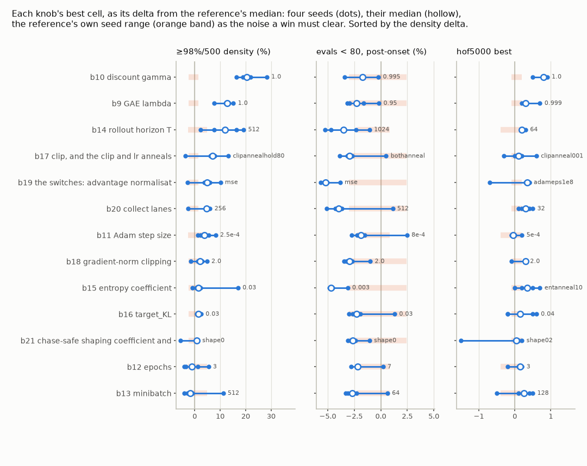

Each knob's best cell as its delta from the reference's median, on density, collapse share, `hof5000` best. The
orange band is the reference's own seed spread — the noise a win must clear.

**Three knobs moved density by more than the reference's spread, and all three are the same knob.** γ 1.0 (+20 pp),
λ 1.0 (+13 pp) and rollout 512 (+12 pp) each lengthen the horizon the advantage and the value target see;
everything else is inside 7 pp, with the clip anneal held at its floor (+7), `mse` (+5) and 256 lanes (+5) the
next tier, on wide seed ranges. **No knob moved collapses further than ~5 pp below the reference**, and b18's two
effectively-off cells differ by 3.8 pp between themselves, so most of the collapse column is inside its own noise;
`mse` (−5.2 pp, every seed) and entropy 0.003 (−4.7, every seed) are the two that clear it. **`hof5000` best moves by
at most 0.8** (γ 1.0, every seed) and by ≤ 0.6 elsewhere: the depth measurement is nearly flat across the whole sweep.

### Where each metric peaked, per knob

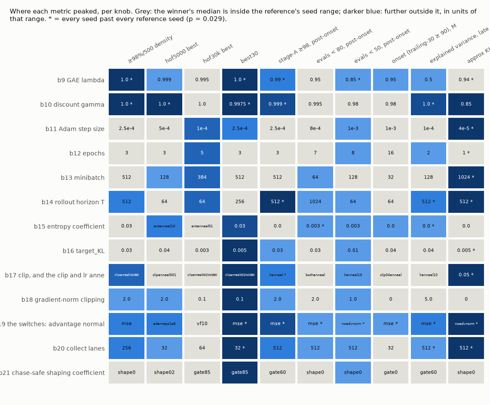

The winning cell per metric; shaded by how far the winner's median sits outside the reference's seed range, in
units of that range (grey = inside). `*` marks every seed past every reference seed.

<!-- peaks -->
| knob | ≥98%/500 density | hof5000 best | hof30k best | best30 | stage-A ≥98, post-onset | evals < 80, post-onset | evals < 50, post-onset | onset (trailing-30 ≥ 90), M | explained variance, late | approx KL p99, post-onset |
|---|---|---|---|---|---|---|---|---|---|---|
| b9 GAE lambda | **`1.0` 30.2 (+12.7)** p=0.0286 | `0.999` 99.0 (+0.3) | `0.995` 99.1 | **`1.0` 98.4 (+0.65)** p=0.0286 | **`0.99` 30.9 (+10.7)** p=0.0286 | `0.95` 3.90 (−2.29) | **`0.85` 0 (−0.29)** p=0.0286 | `0.95` 2.94 (−1.08) | `0.5` 0.935 (+0.016) | **`0.94` 0.004 (+0)** p=0.0286 |
| b10 discount gamma | **`1.0` 37.9 (+20.4)** p=0.0286 | **`1.0` 99.5 (+0.8)** p=0.0286 | `1.0` 99.5 | **`0.9975` 98.7 (+0.9)** p=0.0286 | **`0.999` 37.3 (+17.1)** p=0.0286 | `0.995` 4.48 (−1.70) | `0.98` 0.135 (−0.155) | `0.98` 5.28 (+1.26) | **`1.0` 0.977 (+0.058)** p=0.0286 | `0.85` 0.003 (−0.001) |
| b11 Adam step size | `2.5e-4` 30.4 (+3.80) | `5e-4` 98.8 (−0.05) | `1e-4` 99.4 (+0.6) | `2.5e-4` 98.5 (+0.15) | `2.5e-4` 30.6 (−0.4) | `8e-4` 4.56 (−1.86) | `1e-3` 0.25 (−0.515) | `1e-3` 3.23 (−4.01) | `1e-4` 0.917 (+0.005) | **`4e-5` 0.002 (−0.002)** p=0.0286 |
| b12 epochs | `3` 25.6 (−1.05) | `3` 99.0 (+0.15) | `5` 99.1 (+0.3) | `3` 98.3 (+0.05) | `3` 27.5 (−3.45) | `7` 4.26 (−2.16) | `8` 0.17 (−0.595) | `16` 3.08 (−4.17) | `2` 0.924 (+0.012) | **`1` 0.004 (+0)** p=0.0286 |
| b13 minibatch | `512` 24.8 (−1.85) | `128` 99.2 (+0.25) | `384` 99.2 (+0.4) | `512` 98.4 (+0.1) | `512` 27.9 (−3.05) | `64` 3.72 (−2.71) | `128` 0.32 (−0.445) | `32` 2.96 (−4.29) | `128` 0.918 (+0.006) | **`1024` 0.003 (−0.001)** p=0.0286 |
| b14 rollout horizon T | `512` 38.6 (+12.0) | `64` 99.1 (+0.2) | `64` 99.0 (+0.25) | `256` 98.4 (+0.1) | **`512` 45.1 (+14.2)** p=0.0286 | `1024` 2.89 (−3.54) | `64` 0.18 (−0.585) | `64` 3.30 (−3.95) | **`512` 0.936 (+0.024)** p=0.0286 | **`512` 0.003 (−0.001)** p=0.0286 |
| b15 entropy coefficient | `0.03` 18.9 (+1.45) | `entanneal10` 99.0 (+0.35) | `entanneal01` 99.3 | `0.03` 98.0 (+0.2) | `0.0` 22.3 (+2.05) | **`0.003` 1.50 (−4.68)** p=0.0286 | `0.003` 0 (−0.29) | `0.0` 2.69 (−1.32) | **`0.0` 0.934 (+0.015)** p=0.0286 | `0.0` 0.004 (+0) |
| b16 target_KL | `0.03` 18.9 (+1.35) | `0.04` 98.8 (+0.15) | `0.003` 99.3 | `0.005` 98.0 (+0.3) | `0.03` 25.6 (+5.35) | `0.03` 3.89 (−2.29) | `0.01` 0.065 (−0.225) | `0.04` 3.54 (−0.475) | `0.04` 0.928 (+0.009) | **`0.005` 0.004 (+0)** p=0.0286 |
| b17 clip, and the clip and lr anneals | `clipannealhold80` 24.5 (+7.00) | `clipanneal001` 98.8 (+0.1) | `clipanneal001hold80` 99.5 | `clipanneal001hold80` 98.6 (+0.85) | **`lranneal` 28.9 (+8.70)** p=0.0286 | `bothanneal` 3.25 (−2.93) | `lranneal10` 0.05 (−0.24) | `clip04anneal` 3.58 (−0.44) | `lranneal10` 0.931 (+0.012) | **`0.05` 0.001 (−0.003)** p=0.0286 |
| b18 gradient-norm clipping | `2.0` 19.6 (+2.10) | `2.0` 99.0 (+0.3) | `0.1` 98.9 | `0.1` 98.2 (+0.4) | `2.0` 25.9 (+5.65) | `2.0` 3.21 (−2.97) | `1.0` 0.05 (−0.24) | `0` 3.54 (−0.48) | `5.0` 0.93 (+0.011) | `0` 0.004 (+0) |
| b19 the switches: advantage normalisation, value loss, Adam epsilon, vf_coef | `mse` 22.4 (+4.85) | `adameps1e8` 99.0 (+0.35) | `vf10` 99.1 | **`mse` 98.3 (+0.55)** p=0.0286 | **`mse` 35.0 (+14.8)** p=0.0286 | **`mse` 0.965 (−5.21)** p=0.0286 | **`noadvnorm` 0 (−0.29)** p=0.0286 | **`mse` 2.21 (−1.80)** p=0.0286 | **`mse` 0.946 (+0.027)** p=0.0286 | **`noadvnorm` 0.003 (−0.001)** p=0.0286 |
| b20 collect lanes | `256` 22.1 (+4.65) | `32` 99.0 (+0.3) | `64` 99.3 | **`32` 98.2 (+0.5)** p=0.0286 | `512` 28.9 (+8.60) | `512` 2.19 (−3.99) | `512` 0 (−0.29) | `32` 3.42 (−0.595) | **`512` 0.937 (+0.018)** p=0.0286 | **`512` 0.003 (−0.001)** p=0.0286 |
| b21 chase-safe shaping coefficient and gate | `shape0` 18.4 (+0.9) | `shape02` 98.8 (+0.05) | `gate85` 98.9 | `gate85` 98.4 (+0.65) | `gate60` 23.4 (+3.20) | `shape0` 3.56 (−2.62) | `shape0` 0.07 (−0.22) | `gate0` 3.56 (−0.46) | `gate60` 0.928 (+0.009) | `shape0` 0.004 (+0) |
<!-- /peaks -->

What the table adds to the per-batch readings: **density and best30 name the same winner in 6 of 13 batches** and
correlate +0.85 over the 463 arms — a fair one-number proxy for the curve's shape, and too coarse to pick a cell at
n=4. **Stability picks a different cell from density in 9 of 13**; the four where they agree are three nulls (b16,
b18, b21) and `mse` — the trade-off `findings.md` has recorded three times, now visible as a column. And the diagnostic columns
pick cells the outcome columns do not: the highest late explained variance and the lowest KL tail belong to the
slow, tight cells (explained variance: λ 0.5, lr 1e-4, 2 epochs; KL tail: lr 4e-5, 1 epoch, minibatch 1024, clip
0.05) — a well-fit critic and a small policy step are what a config has when it is not learning much.

### Does the critic, or the KL tail, predict anything?

| | | |
|---|---|---|
| 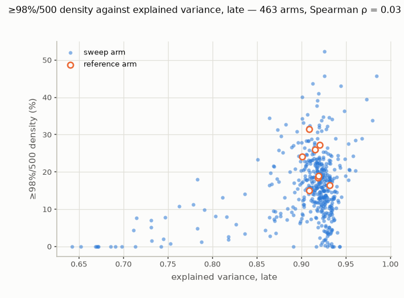 | 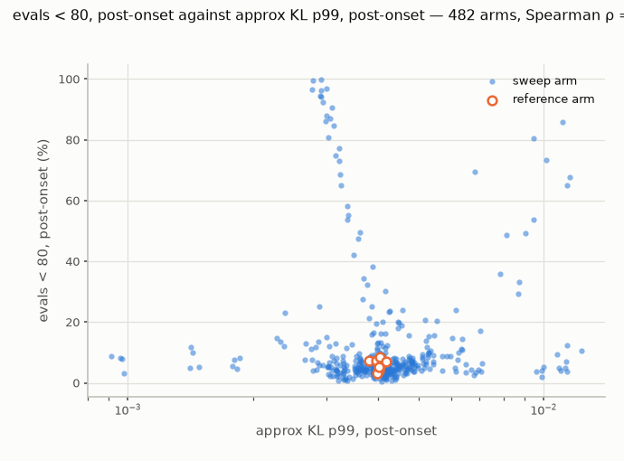 | |

Two hypotheses this sweep was partly designed to test, over all 463 arms at once:

| pair | Spearman ρ | reading |
|---|---:|---|
| explained variance (late) → ≥98%/500 density | **+0.03** | no relation. Below 0.85 the arm has not learned the endgame (b10's γ ≤ 0.93, λ 0.0) and density is zero; above it, *more* fit is not more records (ρ = −0.15 within that range). The b19 finding — collapses live in the critic — is about the *form* of the value loss, not its fit |
| approx-KL p99 (post-onset) → evals < 80 | **−0.02** | no relation. The tail of the policy step does not predict the deployed policy's collapses, which is what b18 (gradient clip a no-op) and b16 (target KL a no-op) each said for one knob |
| entropy at cap → density | −0.12 | the record cells are the committed ones, weakly |
| stage-A ≥98 share → density | **+0.85** | the free proxy holds across every knob, as b7 found for layouts |
| evals < 80 → density | −0.20 | the trade-off is real but loose: a stable arm is not a dense one, and the reverse |

So the two optimiser-side stories of the drawdowns — a badly fit critic, an oversized policy step — are both flat
across 463 arms. What does move both outcomes is the horizon (γ, λ, rollout) and, for stability alone, the value
loss form and the entropy coefficient.

## 2. The knobs, one by one

Each: the curve (readouts down, cells across), then the traces (metrics down, every cell overlaid as its seed
median, light → dark in value order, the reference grey). The reading is a paragraph; the table and the verdict
are in `results.md` and `findings.md`.

### b9 — GAE λ

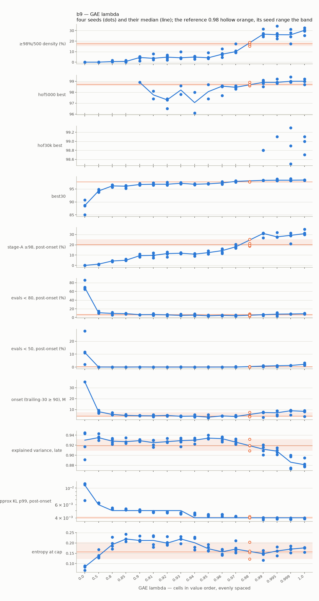
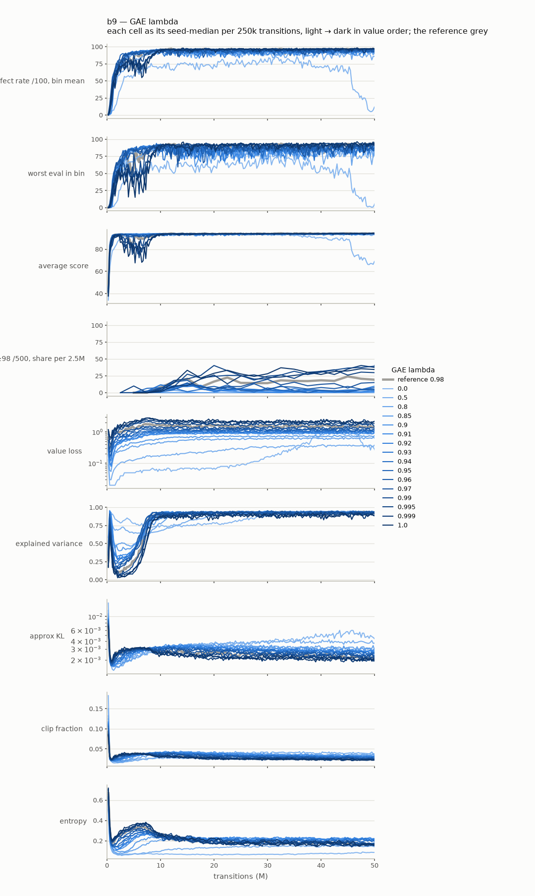

Density is monotone across sixteen values and the step that matters is 0.98 → 0.99; the plateau from 0.99 to 1.0
is flat at n=4 (25–33% per seed), and the collapse panel rises through it, 0 → 2% below 50. **The diagnostics
say why the top of the curve costs stability**: late explained variance falls from 0.93 at λ ≤ 0.97 to 0.88 at
1.0 — a Monte-Carlo advantage gives the critic less to do and it fits worse — while the KL tail falls with λ to
0.94 and is flat across the plateau, so the drawdowns at 1.0 are not big steps but a policy trained on noisier
advantages. The traces show λ 0.0 as the one cell that does not arrive (one seed of four reaches trailing-30 ≥ 90,
at 35M) and 0.5 as slow (onset ~8M) but stable. Corner grid:
0.99, with 1.0 as the risk cell.

### b10 — discount γ

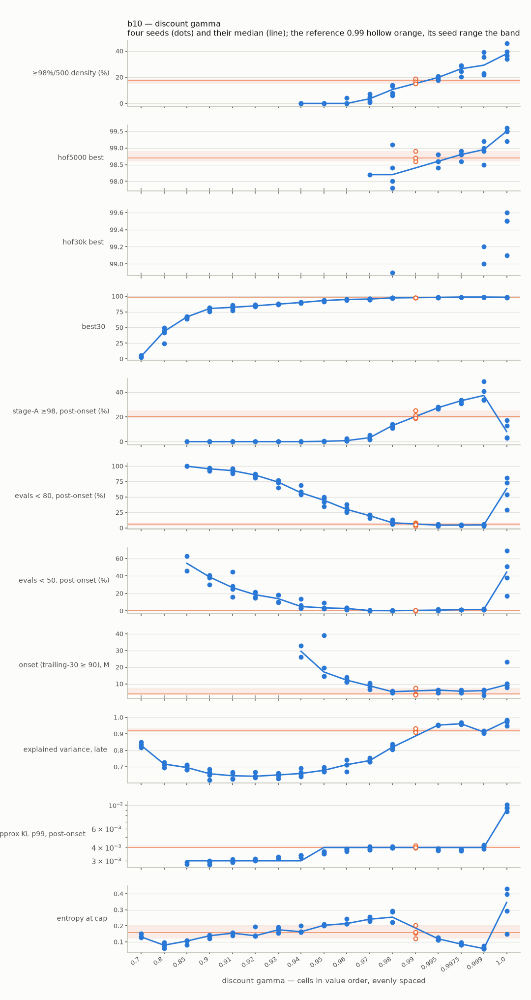
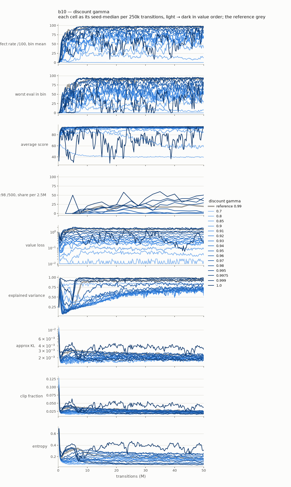

The starkest curve in the sweep: nothing below 0.94 reaches the screen, density climbs monotonically from 0.96 to
0.999 (0.9 → 30.7%), and 1.0 is a different regime — the densest cell measured (37.9% median, 99.5 at 5,000 and
**99.6 /30,000** on `b10ck-g100-seed3`, the sweep's best row at depth) with 44% of post-onset evals below 50. In
the traces the undiscounted cell's perfect-rate row oscillates between ~100 and collapse for its whole length,
and its explained variance is the *highest* in the batch (0.977): the whole-game return is an easy target to fit
and a terrible one to act on. best30 peaks at 0.9975. Corner grid: 0.995–0.999; 1.0 only with something that
holds it (the clip hold, `mse`).

### b11 — learning rate

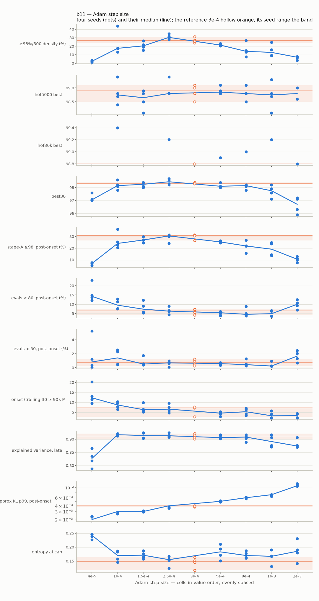
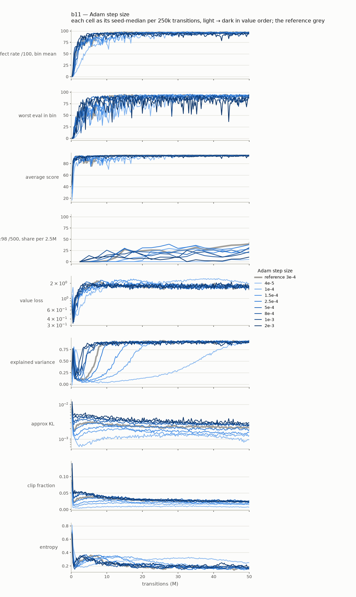

A plateau from 1e-4 to 5e-4 with cliffs at both ends (4e-5 never arrives, 2e-3 collapses), and stability that
*improves* with lr through 1e-3 while density peaks in the middle — the prediction had the sign wrong. The KL
tail scales with lr as it must; entropy at the cap is flat across the plateau, and 4e-5 is the one cell that never
commits (0.24). Nothing separates from the reference at n=4. Corner grid: 3e-4 stays, 2.5e-4 rides along.

### b12 — epochs

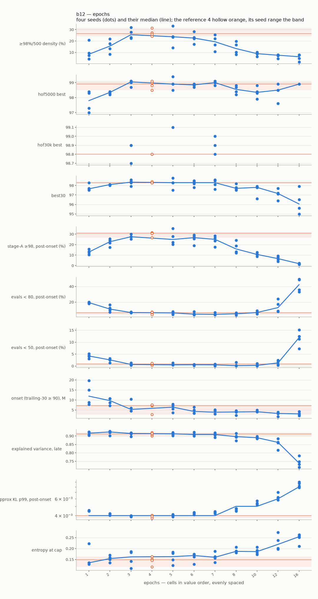
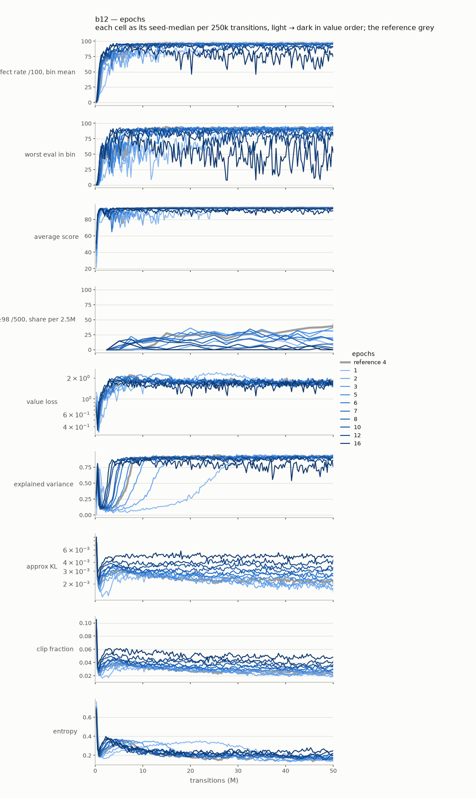

3–4 is the top; every epoch past 4 costs density and the collapse cliff is at 12–16, not 8 (8 is the most stable
cell). The traces make the mechanism visible: clip fraction and KL rise with epochs (16 re-fits the same rollout
sixteen times), entropy at the cap *rises* with epochs (0.14 at 1 → 0.25 at 16 — the over-fitted policy is less
committed, not more), and the worst-eval row at 16 sits far below every other cell for the whole run. 1 epoch is slow *and* unstable — the inert clip leaves the update unbounded. Corner grid: 4, with 3 equal.

### b13 — minibatch

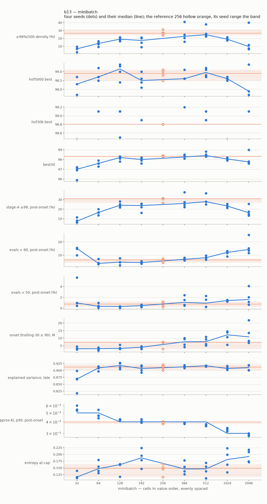
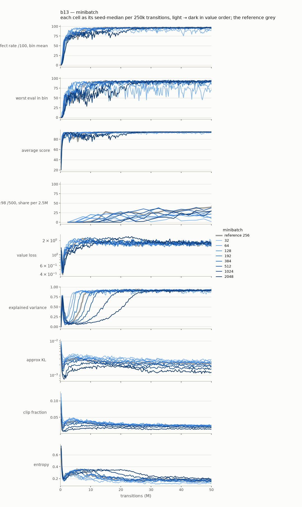

A plateau at 256–512, density lost on both sides; stability best at 64–192 and worst at 1024–2048 (fewer, larger
steps). 32 is the epochs-16 pattern by another route: high KL, high clip fraction, low density, 15% of evals
below 80. The KL-p99 column's winner, 1024, is the cell with 16 updates an epoch — the tail is small because
there are few steps, not because they are safe. Corner grid: 256, with 512 as the second value.

### b14 — rollout horizon T

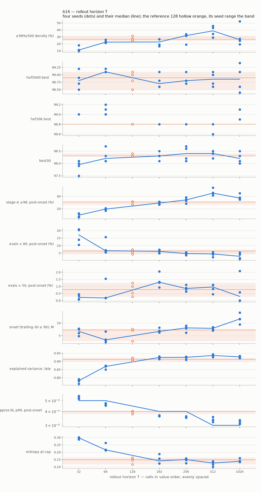
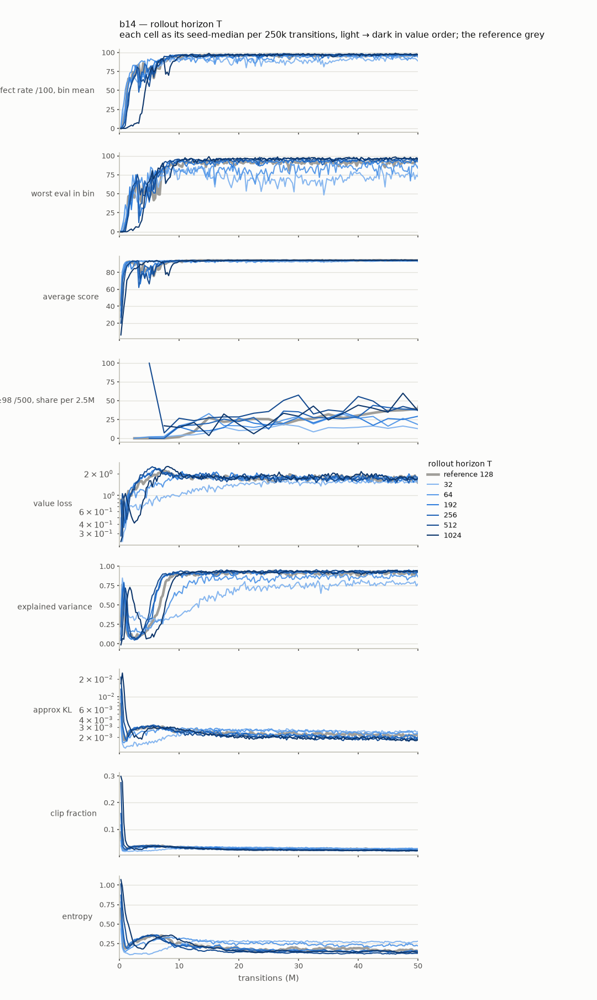

Density rises to 512 (+12 pp on the reference, 29–46% per seed) and gives some back at 1024; stability improves
at every step to 1024 (2.9% below 80). Read beside b20: the same batch size reached through lanes moves nothing,
so the gain is depth — a longer GAE window per lane. The traces' stage-B-density row shows 512 and 1024 lifting
late, and the explained-variance row shows the long rollouts fit the critic *better* (0.936 at 512, every seed
past the reference) — the one place in the sweep where a better critic and more records arrive together. Corner
grid: 512, 256 the conservative alternative.

### b15 — entropy coefficient

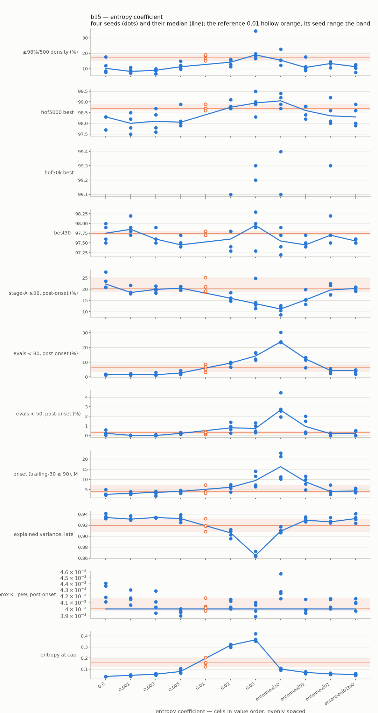
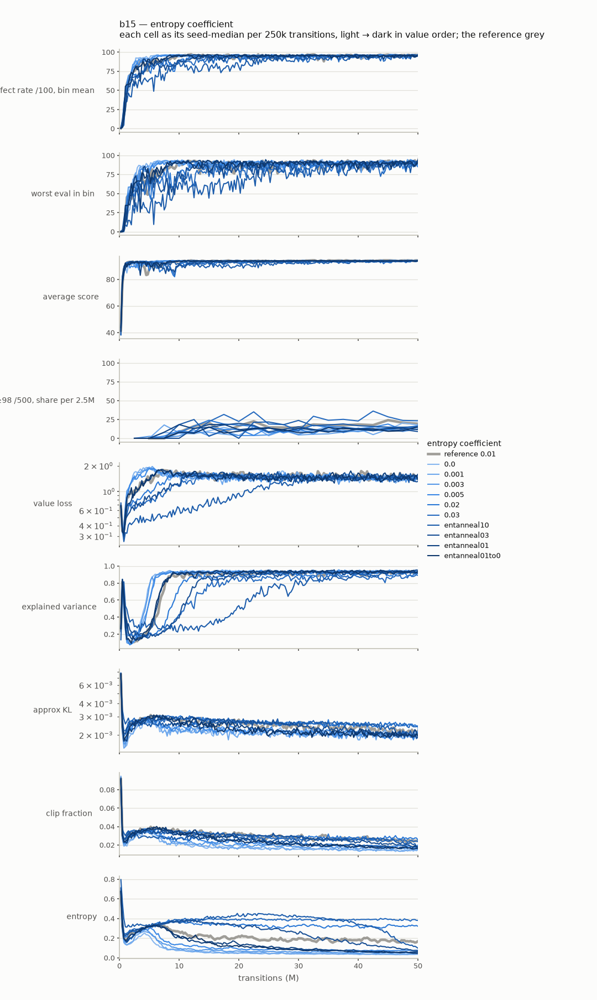

Density and stability trade monotonically along the fixed values, and an anneal averages its endpoints. The
entropy row of the traces is the knob itself — 0.0 and 0.001 commit to ~0.05 by 10M, 0.03 holds 0.35 to the cap,
the 0.1 anneal spends 20M above 0.4 — and the value-loss row shows the price: the high-entropy cells fit their
critic 10–20M later. 0.003 is the most stable fixed cell (1.5% below 80, every seed past the reference) at no
density cost; the 0.1→0.001 anneal has the batch's best `hof5000` row and a 99.4 at 30,000. Corner grid: 0.003,
the 0.1 anneal as the risk cell.

### b16 — target KL

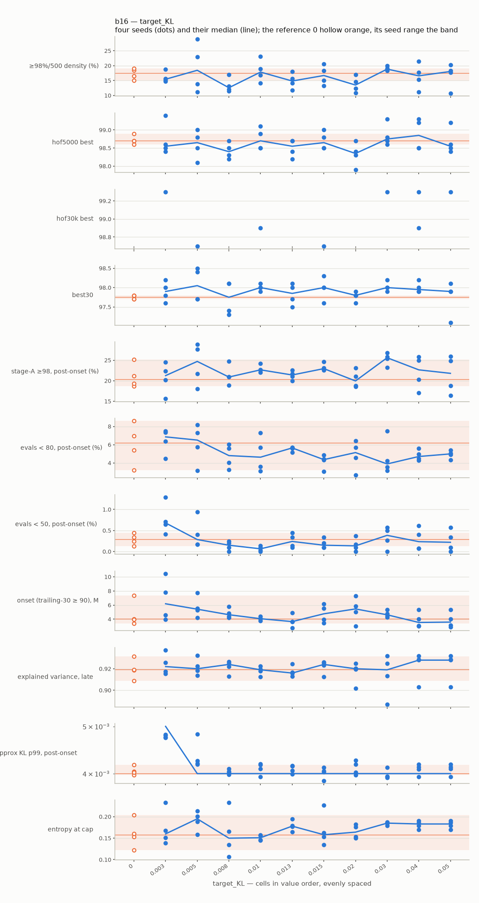
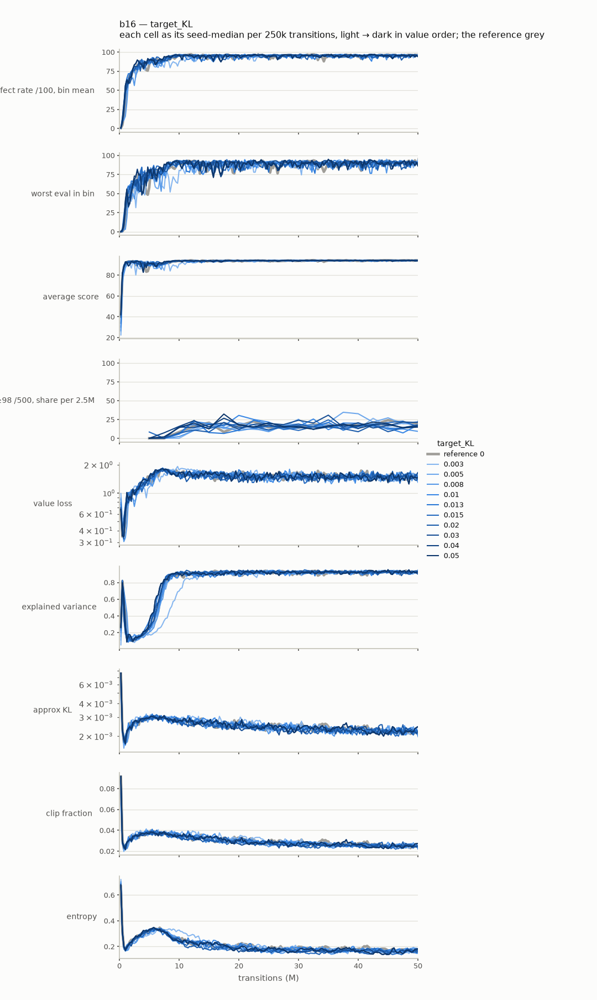

A null, as predicted: no panel trends along the sweep and no cell leaves the band. The traces are one bundle in
every row — the tightest cell's KL trace is within 1% of the reference's over the first 10M and the last, so the
early stop (which `findings.md` shows does fire, from same-seed divergence) changes nothing the optimiser can see
at this resolution. Off stays; the knob leaves the grid.

### b17 — clip, and the clip and lr anneals

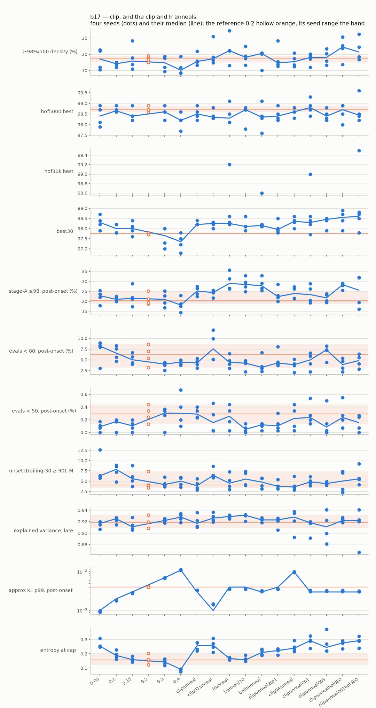
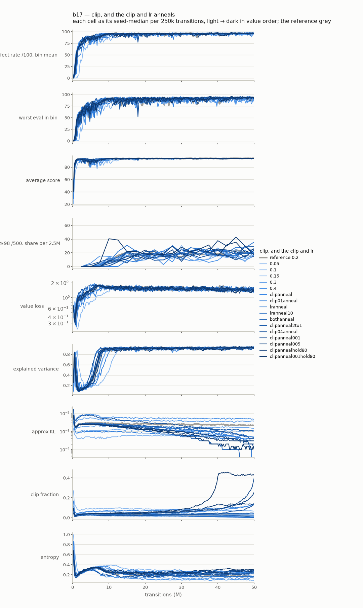

The static clip is flat from 0.05 to 0.2 and worse above it; every anneal beats the base on best30 but only the
two that **hold the floor for the last 10M** lift density (+7 pp, 14–31% per seed), and `lranneal` to zero does
the same (+6). The traces show what "hold" means: the KL row of the two hold cells falls to ~1e-4 from 40M while
their clip-fraction row climbs to 0.4 — the trust region binds on nearly half the samples and the policy is
nearly frozen — and the stage-B-density row lifts exactly there. `b17cl-clipanneal001hold80-seed4` @11.4M is the
99.5 /30,000 in the HOF; the 30k best belongs to the hold cells. Corner grid: a hold-at-floor clip anneal, and
`lranneal`.

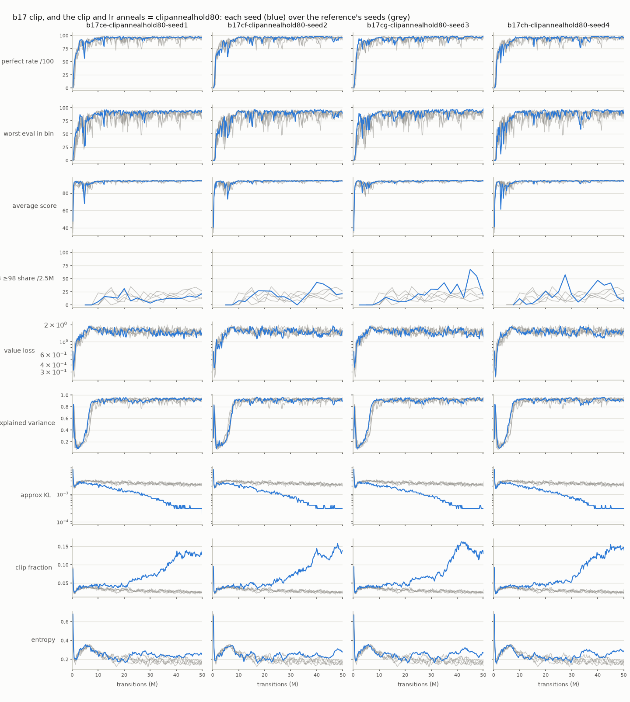

*The hold cell's four seeds over the reference's four: the late KL collapse and clip-fraction climb are the same
in all four; the stage-B density lift is in three.*

### b18 — gradient-norm clipping

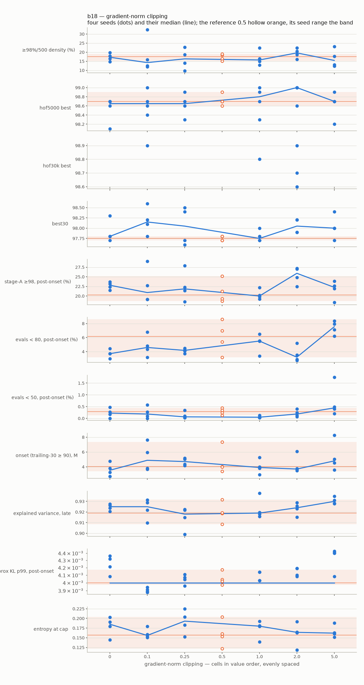
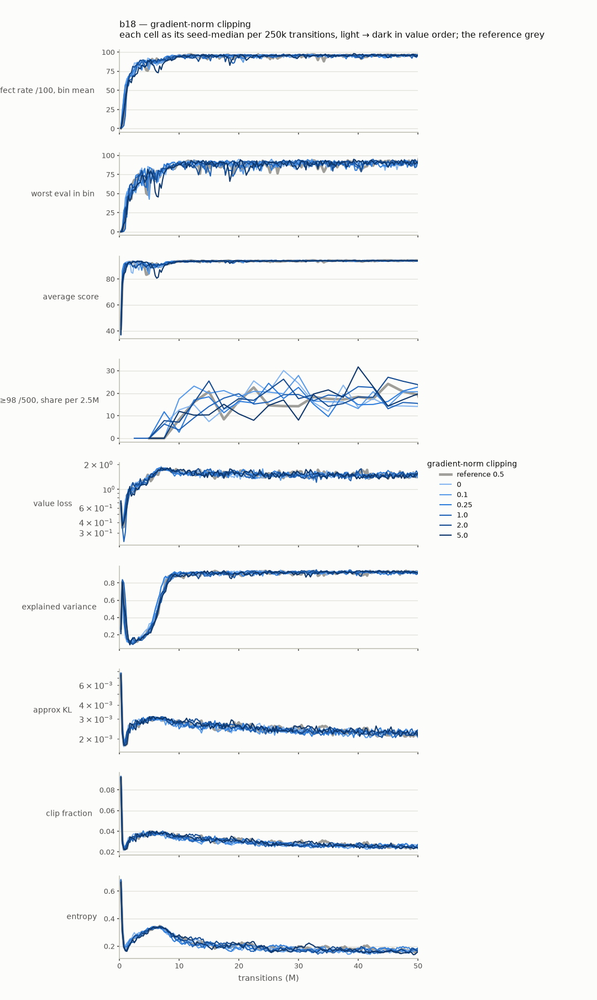

A null from off to 5.0 on every panel; the traces of the seven cells are one bundle. Off reads the base's density
to the decimal and is more stable, so the base's collapses are not rare huge gradients. The two effectively-off
cells (0, 5.0) differ by 3.8 pp on the collapse share, which calibrates that column's noise for every batch at this
base. 0.5 stays; the knob leaves the grid.

### b19 — the switches

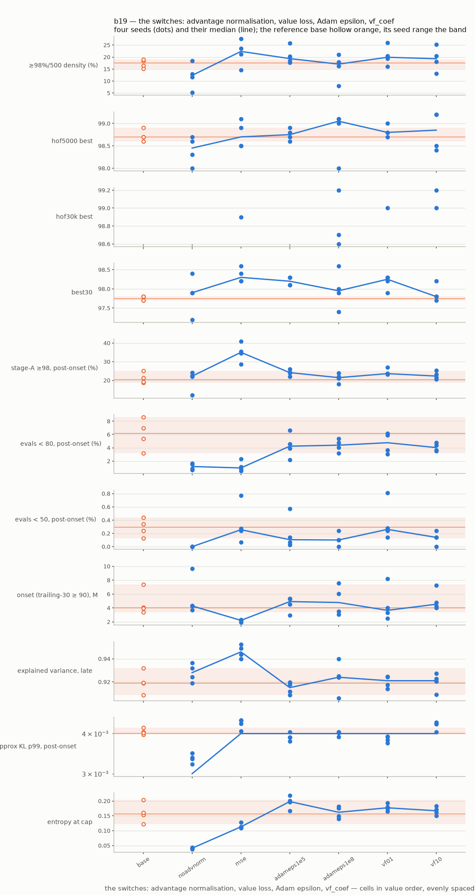
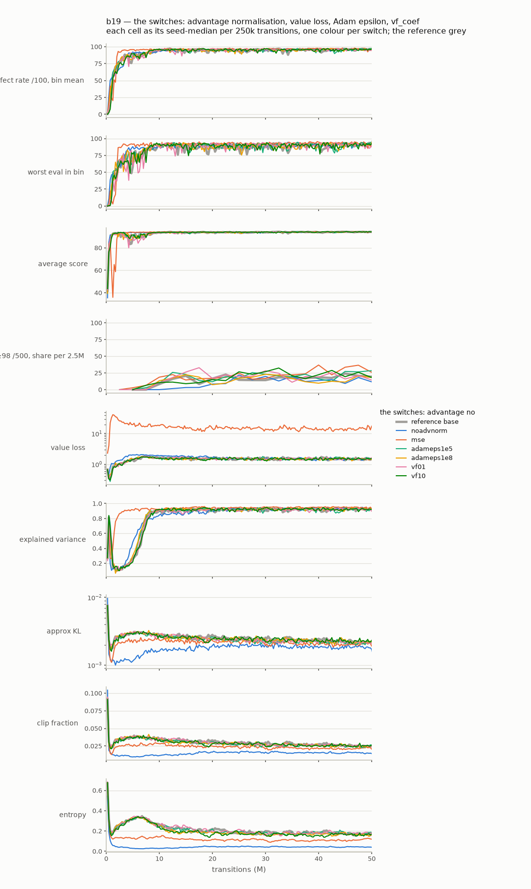

The one batch where stability and density agree: `mse` is the most stable cell at this base (0.97% below 80,
every seed past the reference) *and* 5 pp denser, with the batch's highest late explained variance (0.946) and an
entropy at the cap well below the base (0.11 against 0.16; only advantage normalisation *off* goes lower, 0.04). Its value-loss row sits at 13 against Huber's 1.5 — a different function, not a worse critic
— which is why value loss is drawn and not ranked here. Advantage normalisation off is as stable and 4 pp short.
Adam ε and the vf coefficient are inside the band. Corner grid: `mse`.

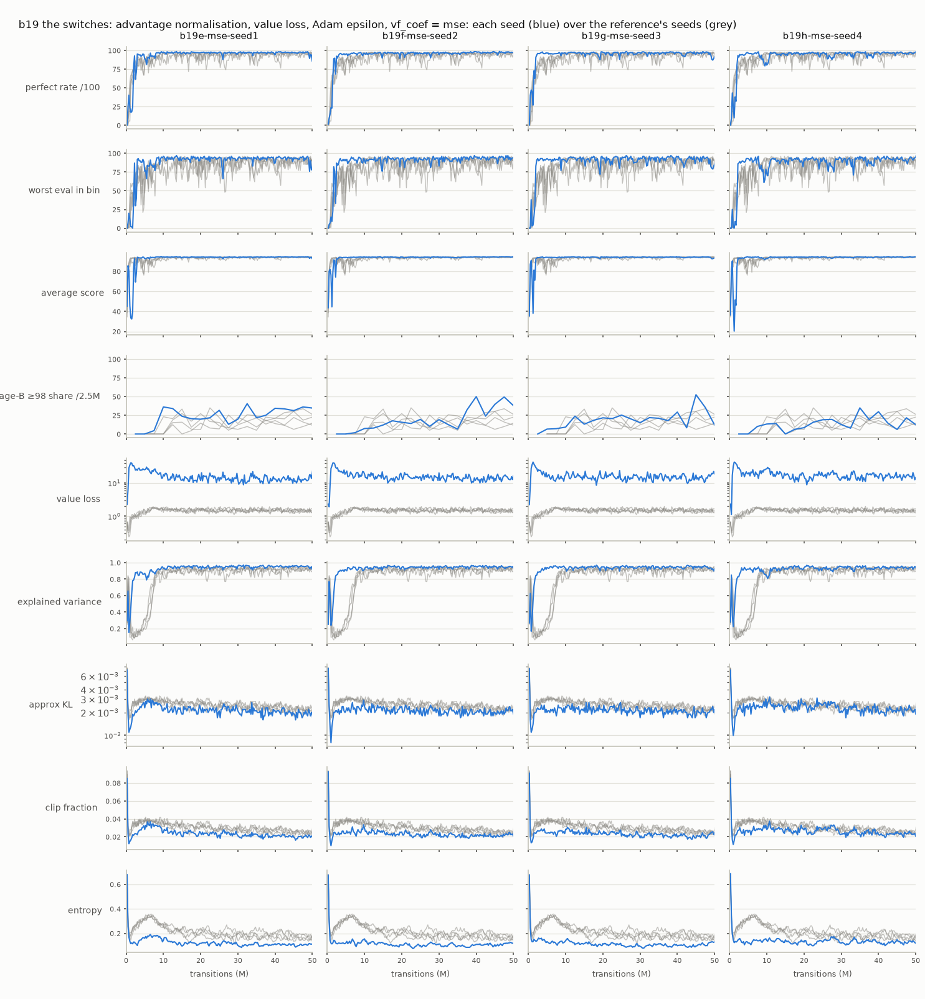

*`mse`'s four seeds: the reference's grey worst-eval traces dip to 40–60 for the whole run; the blue ones do not.*

### b20 — collect lanes

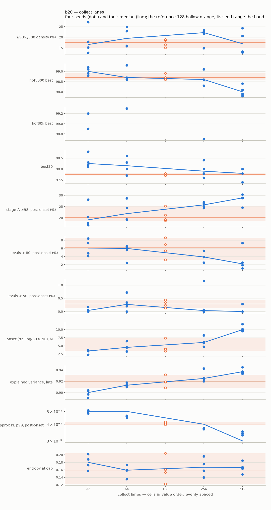
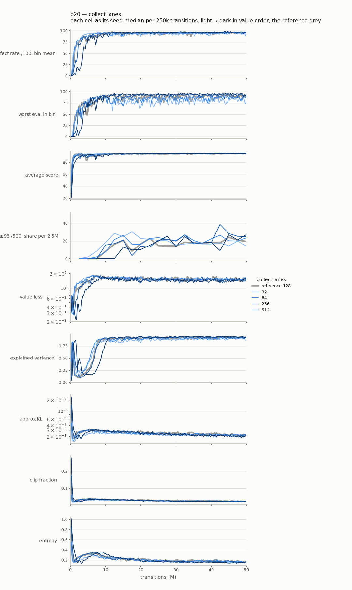

A throughput knob: density inside the band from 32 to 512, stability improving with lanes (512: 0.0% below 50,
2.2% below 80, every seed past the reference on explained variance and KL tail) — and against b14, the same
batch size reached two ways does not read the same, so the rollout's gain was depth. 128 stays for speed; 256–512
is a stability lever at no density cost.

### b21 — chase-safe shaping

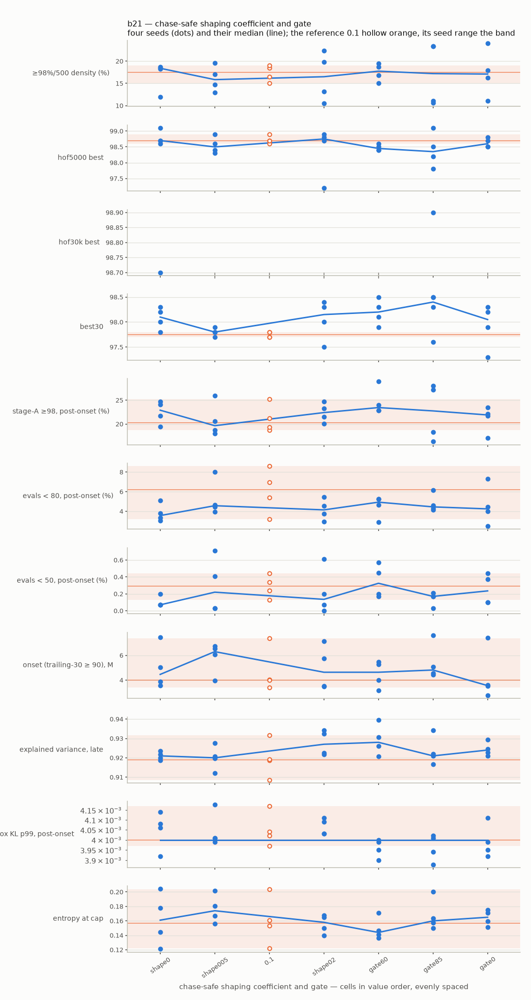
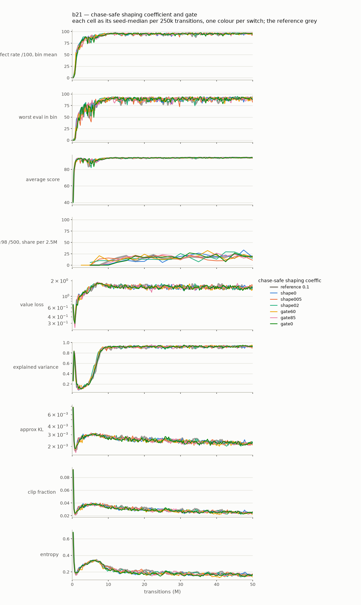

A no-op for PPO: dose 0–0.2 and gate 0–85 all inside the band, every cell a little more stable than the base.
Shaping *off* is the most stable cell and gate85 the densest with the batch's best at depth (98.9 /30,000). The
traces are one bundle in every row — the shaping does not even change the value-loss scale visibly. Shaping off
goes into the corner grid as a simplification.

## 3. What the diagnostics said, across the sweep

Read together for the first time, the five `ppo` metrics sort into two groups.

**Knob signatures — a metric that moves *because* of the knob and says the knob is live**: entropy at the cap
follows the entropy coefficient; KL and clip fraction follow epochs, minibatch and lr; the hold-at-floor anneals
show as a KL collapse to 1e-4 with a clip fraction climbing to 0.4. These are the `hyperparameter override:` grep
made visible over the whole run, and they caught nothing wrong in 464 arms.

**Outcome predictors — none.** Late explained variance is flat against density above 0.85 (ρ −0.15) and the KL
tail is flat against collapses (ρ −0.02). The critic fits *best* in the cells that learn least (λ 0.5, lr 1e-4,
2 epochs) and in the undiscounted cell that collapses most. The one batch where a better critic came with more
records is the rollout (b14), where both are downstream of a longer window. **So the diagnostics are for checking a
config took, not for ranking one** — the ranking still needs stage B.

## 5. Added after the sweep

Batches that were not in the plan but are read with the sweep's tools, listed in `plans/sweep-extra.json` (the
reducer reads the plan's manifest and then that file; `viewer/sweep.html` shows them in the batch picker). Their
references are whatever `viewer/references.json` says, and where the reference is another era or cap it is
orientation only — read the batch against its own control cell.

### b26 — step penalty, 0 / 0.0001 / 0.001 / 0.01 at 50M (2026-09-07)

The first batch of the 26-value observation era, on the b24 horizon-anneal config; the hollow orange reference is
b24 itself at 200M in the old era, so read the four cells against `pen0`. **0.01 is a lever**: 46.3% density against
25.5, every seed of the cell above every other arm in the batch, best30 98.88 against 98.47; the two small values sit
inside the control's band. The traces show why the table is the whole story — onset, late level and entropy are
identical across cells, and the separation is in the stage-B panel alone. Verdict in `results.md`, finding in
`findings.md`.

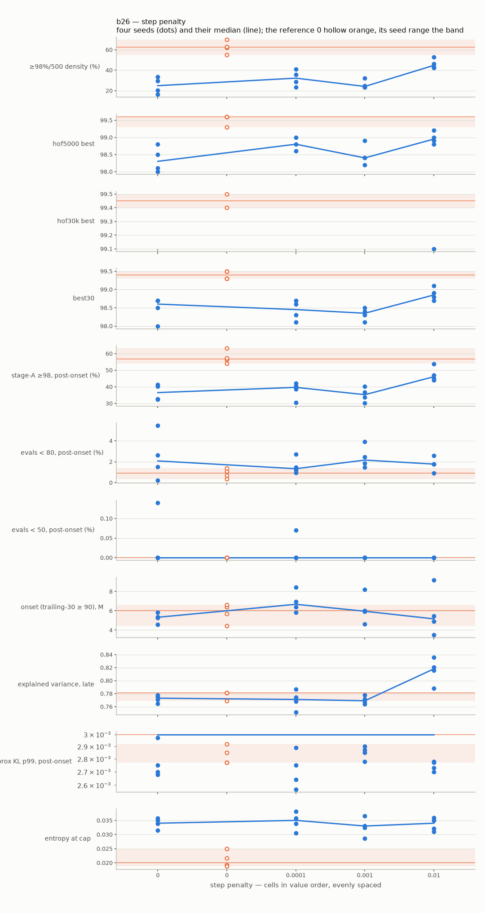

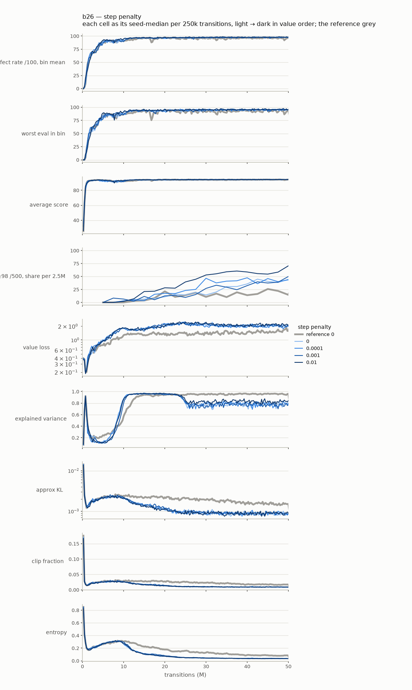

## 4. How this was made

```
cd snek3
PYTHONPATH=. python -m tools.sweep_analysis reduce            # runs/ -> viewer/sweep.json, viewer/sweep.js (~20 s)
PYTHONPATH=. python -m tools.sweep_analysis figures           # -> charts/sweep/*.png, all batches + levers, peaks, scatters
PYTHONPATH=. python -m tools.sweep_analysis figures --cell b17 clipannealhold80   # one cell's four seeds
PYTHONPATH=. python -m tools.sweep_analysis peaks             # the peaks table above, as Markdown
open viewer/sweep.html
```

`tools/sweep_analysis.py` reduces each arm to its scalars (the docs tables' definitions from `viewer_manifest`,
plus onset by trailing-30 ≥ 90, the last-20% diagnostics, the KL p99, worst post-onset eval), its traces binned
to 250k transitions at the sweep's 50M -- since 2026-09-08 each batch is binned on its own horizon, ~200 bins
of a clean step, so b27's 100M gets 500k (the mean, and for the perfect rate the min too — a bin mean hides a
one-eval collapse), its stage-B rows ≥98 per ten of those bins, and its hof rows. `tools/sweep_figures.py` draws the figures with matplotlib's
object API. Both are covered by `tests/test_sweep_analysis.py` and `tests/test_sweep_figures.py`. Cell x
values come from `plans/hyperparam-sweep.json`, the reference cells from `viewer/references.json`. Value loss is
not comparable across b10 (γ sets the value scale) or into b19's `mse` cell (a different function), so it is
drawn and never ranked there; explained variance is the scale-free reading.
