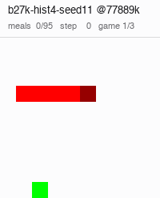
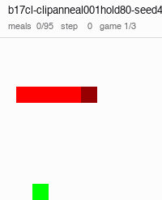
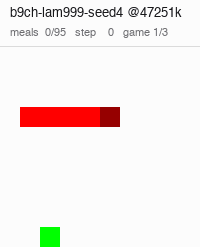
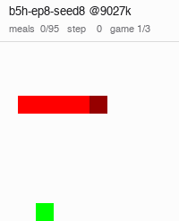

# Hall of Fame — snek3

The best policies the PyTorch era has produced, preserved as standalone checkpoints so they survive
whatever happens to `savedPolicies/`.

**Why this folder exists.** A training keeps a bounded number of checkpoints, so a long run
eventually deletes its own best one. That has already cost real evidence in snek2 — `b5c-schlongIS`'s
17.0% peak became permanently unmeasurable. Copies here are outside any rotation and are deleted by
nothing.

## The entries

All admitted on 30,000 fresh episodes at **seed 7** — a seed the selecting pass never used; `b5h` and
`b6b` on 2026-09-01, `b9ch` and the two `b10ck` checkpoints on 2026-09-03, `b17cl` on 2026-09-06, `b27t` and `b27k` (the first move-history
entries) on 2026-09-09. Add one with the
[`hof-promote`](../skills/hof-promote/SKILL.md) skill.

| entry | algo / net | confirmed **/30,000** | 95% CI | selected at | drop |
|---|---|---|---|---|---|
| **`b27t-hist8-seed20-ckpt85065728`** | PPO, `fc 320`, 4 epochs, b24's λ/γ anneal, step penalty 0.01, **move history 8** (26+16 values) | **99.81%** (29944) | [99.8, 99.9] | 99.8 /5000 | +0.01 pp |
| `b27k-hist4-seed11-ckpt77889536` | PPO, `fc 320`, 4 epochs, b24's λ/γ anneal, step penalty 0.01, **move history 4** (26+8 values) | **99.81%** (29942) | [99.8, 99.9] | 99.9 /5000 | −0.09 pp |
| `b10ck-g100-seed3-ckpt30523392` | PPO, `fc 320`, 4 epochs, λ 0.98, **γ 1.00** | **99.65%** (29894) | [99.6, 99.7] | 99.5 /5000 | +0.15 pp |
| `b10ck-g100-seed3-ckpt30539776` | PPO, `fc 320`, 4 epochs, λ 0.98, **γ 1.00** | **99.55%** (29866) | [99.5, 99.6] | 99.3 /5000 | +0.25 pp |
| `b17cl-clipanneal001hold80-seed4-ckpt11386880` | PPO, `fc 320`, 4 epochs, λ 0.98, **clip 0.2→0.001 annealed over 40M, held for the last 10M** | **99.50%** (29851) | [99.4, 99.6] | 99.6 /5000 | −0.10 pp |
| **`b9ch-lam999-seed4-ckpt47251456`** | PPO, `fc 320`, 4 epochs, **λ 0.999** | **99.30%** (29790) | [99.2, 99.4] | 99.40 /5000 | −0.10 pp |
| `b5h-ep8-seed8-ckpt9027584` | PPO, `fc 320`, 8 epochs | **98.96%** (29687) | [98.84, 99.07] | 99.20 /5000 | −0.24 pp |
| `b6b-fc200x100-seed2-ckpt133120000` | PPO, `fc 200,100`, 4 epochs | **98.73%** (29619) | [98.60, 98.85] | 99.10 /5000 | −0.37 pp |

`b27t` @85065728 and `b27k` @77889536 are **not distinguishable from each other** (z = 0.19, p = 0.85): two arms, two
history depths, one rate, admitted as a pair. Each leads `b10ck` @30523392 by 0.16 pp (`b27t` z = 3.9, p < 1e-4; `b27k`
z = 3.8, p = 0.0002), so the record moved. Below them: `b10ck` @30523392 leads `b9ch` by 0.35 pp (z = 5.9, p < 1e-8); the two `b10ck` entries are 16,384
transitions apart and **not distinguishable from each other** (z = 1.8, p = 0.07) — they are one
region admitted as a pair, not a first and a second place. `b17cl` @11386880 sits between them and `b9ch`:
it is **not distinguishable from the lower `b10ck` entry** (z = 0.9, p = 0.37), 0.15 pp behind the upper one
(z = 2.7, p = 0.007), and 0.20 pp ahead of `b9ch` (z = 3.2, p = 0.001). `b9ch` leads `b5h` by 0.34 pp (z = 4.5,
p < 1e-5) and `b5h` leads `b6b` by 0.23 pp (z = 2.60, p = 0.0094), so the rest of the ordering is real.

## Third place: `b17cl` @11386880, 99.50% over 30,000 episodes — 2026-09-06

**The first entry from an anneal, and the earliest checkpoint in the table by a factor of three.** b17 swept
the PPO clip off b7's `fc 320` / 4-epoch / λ 0.98 cell; `clipanneal001hold80` anneals the clip from 0.2 to 0.001
over the first 40M transitions and holds it there for the last 10M, and seed 4 is the arm. Its checkpoint at
11.4M — a fifth of the run, while the clip was still near 0.15 — is the one that held up: found by the protocol
end to end, 1,342 checkpoints screened at 500 episodes, 73 re-measured at 5,000 (`hof5000`, desktop), the 11 at
≥99 /5,000 re-measured at 30,000 on seed 7 (`hof30k`, desktop, 16 rows across the batch). **The region is
real**: its seven `hof30k` neighbours within ±1M read 98.8-99.4 with a mean of 99.14, and its 17 `hof5000`
neighbours within ±1M average 98.89 (16 of them ≥98.5), a basin above `b9ch`'s 98.70 and below `b10ck`'s
99.17. Across the batch's 16 confirmed rows the 5,000 → 30,000 drop was **−0.14 pp**; 8 of the 16 beat `b5h`'s
98.96 and 2 beat `b9ch`'s 99.30, both of them this arm's (@11370496 read 99.4). The cell it comes from is the
batch's densest with `clipannealhold80` (24.3 and 23.5% of stage-B rows ≥98%, against the base's 17.3%) —
`docs/findings.md`, "holding the last 10M at the floor". Not a record: it does not separate from the lower
`b10ck` entry and is behind the upper one.

The copy was verified from `hallOfFame/` at 500 episodes on seed 11: 496/500.

## ‡ The record: `b27t` @85065728 and `b27k` @77889536, 99.8% over 30,000 episodes — 2026-09-09

**The first entries with move history, and the first pair from two different arms.** b27 (`plans/obs-history.md`) put
the policy's last N turns into the observation as a left/right bit pair each, on b26's `pen01` base (b24's λ/γ anneal
plus a 0.01 step penalty) at 100M, 8 seeds a cell, N = 0 / 4 / 8. The depth-8 arm seed 20 and the depth-4 arm seed 11
are the entries; the plan had predicted no effect on the perfect rate (`docs/findings.md`). The protocol found both end
to end — `b27t`: 2,840 checkpoints screened at 500 episodes, 1,564 re-measured at 5,000 (`hof5000`, desktop), 384 at
≥99.6 /5,000 re-measured at 30,000 on seed 7 (`hof30k`, desktop); `b27k`: 2,783 screened, 1,451 at 5,000 (laptop),
365 at 30,000 (desktop, `b27-hof30k-hist4-desktop`). **Both regions are wide**: `b27t`'s 33 `hof30k` neighbours within
±1M read 99.4-99.7 with a mean of 99.62 and its 56 `hof5000` neighbours average 99.57 (45 of them ≥99.5); `b27k`'s 54
`hof30k` neighbours read 99.5-99.8 with a mean of 99.69 — above the old record's own number — and its 60 `hof5000`
neighbours average 99.69 (59 ≥99.5), against 99.17 for `b10ck`'s basin. `b27k` holds 15 rows at 99.8 /30,000 and 142
at ≥99.7; `b27t` 7 and 84. Across the batch's 3,191 confirmed rows the 5,000 → 30,000 drop was **−0.09 pp** (`hist4`
−0.10, `hist8` −0.09), and 493 of them, from 14 of the 16 history arms, beat `b10ck`'s 29,894 — the old record is
ordinary inside these two cells. **Why two, and why these**: the 28 rows at 99.8 across five arms are all within 19
games of each other, so no ranking among them is supported; one entry per depth is what the table can say, `b27k`
@77889536 is the centre of a seven-checkpoint plateau (77.59M-77.89M, every one 99.8 /30k) and `b27t` @85065728 is the
best count in the batch. `b27i` @96174080 (99.8, 29,942) adds nothing over `b27k` and is not promoted.

Each copy was verified from `hallOfFame/` at 500 episodes on seed 11: `b27k` 500/500, `b27t` 498/500. These are the
first entries whose observation is not the 30-value one: their `arch.json` eras carry the depth (`-hist4`, `-hist8`) and
`tools/sidecar_env.py` sets `SNEK_OBS_HISTORY` from it, so `watch.py`, `evaluate.py` and `record_gif.py` take the
`hallOfFame/` path with no environment set by hand.

## ‡ The previous record: `b10ck` @30523392 and @30539776, 99.6% over 30,000 episodes — 2026-09-03

**The undiscounted arm held the record from 2026-09-03 to 2026-09-09.** b10 swept the discount γ off b7's `fc 320` / 4-epoch /
λ 0.98 cell, and γ 1.00 seed 3 is the arm — the cell the batch's own read calls a cliff, because the
deployed policy collapses and recovers for its entire run (44% of its post-competence evals below 50%
perfect). Its *surviving* checkpoints are another matter: γ 1.00's 178 `hof5000` rows average 98.8
against 98.3 for γ 0.999 and 60 of the batch's 71 rows at ≥99 /5,000 are its. The protocol found it
end to end: 142 `b10ck` checkpoints screened at 500 episodes, 12 re-measured at 5,000 (`hof5000`, laptop),
the 9 at ≥99 /5,000 re-measured at 30,000 on seed 7 (`hof30k`, laptop, 71 rows across 7 arms). The
region is real: the arm's nine `hof30k` rows between 28.9M and 30.8M read 99.1-99.6 with a mean of 99.32,
itself equal to the old record, and its eight `hof5000` neighbours within ±1M average 99.17 (against
98.70 for `b9ch`'s basin). Across all 71 confirmed rows the 5,000 → 30,000 drop was **−0.07 pp**; 60 of
the 71 beat `b5h`'s 98.96 and 12 beat `b9ch`'s 99.30. Both 99.6 rows are admitted, at the user's
decision: they are statistically one checkpoint and the table says so. The same wave measured
`b10cl-g100-seed4` @32849920 and `b10cj-g100-seed2` @39682048 at 99.5; a third γ 1.00 arm adds nothing
the pair does not already say and they are not promoted.

Each copy was verified from `hallOfFame/` at 500 episodes on seed 11: 499/500 and 500/500.

**`record_gif.py`'s `HOF_RECORD` stays at `b9ch`** (user's decision, 2026-09-03: the constant is not
moved with the record). To record this entry, name it: `record_gif.py hallOfFame/b10ck-g100-seed3-ckpt30523392`.

## ‡ The previous record: `b9ch` @47251456, 99.30% over 30,000 episodes — 2026-09-03

**`b9ch` was the record for most of 2026-09-03, superseded the same evening.** The first entry above 99% at depth, and the first to come out of a hyperparameter sweep rather than
a seed batch.** b9 swept GAE λ off b7's `fc 320` / 4-epoch cell; λ 0.999 seed 4 is the arm. It was
found by the protocol working end to end: 1,258 checkpoints screened at 500 episodes, 80 of them
re-measured at 5,000 (`hof5000`), the 16 at ≥99 /5,000 re-measured at 30,000 on seed 7 (`hof30k`, on
the desktop). Its neighbours confirm it is a region and not a pixel: @47267840, @47235072, @47218688
and @47611904 all read **99.20** /30,000 and the arm's 27 `hof5000` neighbours within ±1M average
98.70, against 98.54 for `b5h`'s basin. The 5,000 → 30,000 drop across all 33 confirmed rows was
**−0.14 pp** (the smallest yet; `b5h` dropped −0.24 and snek2's entries −1.45), and 18 of the 33 beat
`b5h`'s 98.96 — six arms of the λ ≥ 0.99 plateau hold a checkpoint above the old record. Only the one
is promoted, per the rule below. The same wave measured `b9cl-lam100-seed4` @19316736 at 99.10 and
`b9cc-lam995-seed3` @18350080 at 99.10; they are not indistinguishable from `b9ch` (z ≈ 2.9) and are
not promoted, because a second λ-plateau entry adds nothing the table does not already say.

**`record_gif.py`'s `HOF_RECORD` names this entry and is pinned here**, so `record_gif.py hof` records it
and `record_gif.py --list` marks it `*`; the `*` means "the shortcut", not "the record".

## ‡ The previous record, and the first time this project beat snek2 on a matched measurement

**`b5h` @9027584 was the record at 98.96% over 30,000 episodes, 2026-09-01 to 2026-09-03.** The comparison that established it
was run the same day, same depth, same seed, same env and same eval path — which matters, because the
snek2 champion's published figure was itself measured shallower and is itself a selected high:

| policy | era | /30,000, seed 7 | 95% CI |
|---|---|---|---|
| **`b5h-ep8-seed8` @9027584** | snek3, PPO | **98.96%** | [98.84, 99.07] |
| `b6b-fc200x100-seed2` @133120000 | snek3, PPO | 98.73% | [98.60, 98.85] |
| `b44a-lowlr7-b29b` @2739000 | snek2, DQN — the champion | **98.48%** | [98.34, 98.62] |

- `b5h` beats the champion by **+0.47 pp, z = 5.16, p < 1e-6**. `b6b` beats it by +0.25 pp, p = 0.010.
- **The champion's own 98.73% / 3,000 fell to 98.48% / 30,000** — a −0.25 pp drop, and the reason
  cross-depth comparisons are not allowed to settle this question. Against the *published* 98.73% the
  same `b5h` measurement reads p = 0.26 and looks like a tie. Same weights, same afternoon; only the
  depth of the baseline differs.
- `record_gif.py`'s `HOF_RECORD` named this entry until 2026-09-03, when it moved to `b9ch` and was
  pinned there. This file stays the authority on what the record is; the constant is a shortcut for
  `record_gif.py hof`, and `tests/test_hof_entries.py` fails only if it names an entry that does not exist.

## The admission rule

**Step 0 is a fresh, deep re-measure at an unused seed, and it is not optional.** Every candidate
reaches this folder as the maximum of a selection, so it is biased upward.

| | selected | fresh | drop |
|---|---|---|---|
| snek2's top four entries (2026-08-20) | 98.0-99.0 /500 | 95.9-97.5 /1000 | mean **−1.45 pp** |
| `b5h` first look (2026-09-01) | 99.20 /5000 | 98.8 /2000 | −0.4 pp |
| `b5h` and `b6b` as admitted | 99.20, 99.10 /5000 | 98.96, 98.73 /30000 | −0.24, −0.37 |
| `b9ch` as admitted (2026-09-03) | 99.40 /5000 | 99.30 /30000 | **−0.10** |
| `b10ck` pair as admitted (2026-09-03) | 99.5, 99.3 /5000 | 99.65, 99.55 /30000 | **+0.15, +0.25** |
| `b27t`, `b27k` as admitted (2026-09-09) | 99.8, 99.9 /5000 | 99.81, 99.81 /30000 | +0.01, −0.09 |

Every entry held up far better than snek2's did, and the `b10ck` pair *rose*, which is what a wide basin
looks like when the selecting number was an under-draw rather than an over-draw. That is the *result*, not the process working as
usual — and the likely reason is the next section.

## Why these two, out of 2,172 candidates

Both batches were re-measured whole at 5,000 episodes: **b5 873 rows, b6 1,299**. The picks were not
simply the top rows.

- **Take the basin, not the pixel.** Two `b5h` rows both read 99.20 /5000. Their neighbourhoods within
  ±1M transitions did not: 28 neighbours at mean 98.54 for @9027584 against 10 at 98.14 for
  @6782976. The neighbourhood mean predicts a row's true deep rate **better than its own selected
  score does** (r = +0.46 against +0.25, n = 181), so @9027584 was promoted and @6782976 was not.
- **`b5h`'s record region is early and it is wide** — 65 rows between 4M and 12M transitions averaging
  98.41 /5000, nine of them ≥99%. That is 1.6-4.7% of the arm's 255M budget: the best policy the whole
  49.5-core-hour b5 batch produced was found about ten minutes into a 6.4-hour run.
- **`b6b`'s came at 58% of its budget**, which is characteristic of its batch — b6's champion-level
  rows are back-loaded (16 late against 4 early, p = 0.041) where b5's are front-loaded (21 of 29 in
  the first decile). **That analysis is not yet written into `docs/`** — it exists only here and in the
  `hof5000` JSONs under `runs/`.

## What is not here

- Any number that exists only at the depth it was selected at.
- A second checkpoint from the same arm a few hundred thousand transitions from one already in.
  `b5h`'s basin holds ten rows at ≥99% /5000 and promoting them would imply a ranking the data cannot
  support — snek2 declined to promote four indistinguishable sweep candidates for the same reason.
  **The `b10ck` pair is the one exception**, admitted together on the user's call with the table saying
  in so many words that the two are indistinguishable; it is not a precedent for ranking neighbours.
- Anything a recording shows. Three games settle nothing about a rate; the numbers are the tables'.

## Recordings — every entry, three complete games each

Captured with [`record_gif.py`](../record_gif.py) straight off the offscreen surface, one frame per
game step at 50 fps, snek2's settings (`--tile 20 --colors 32`, game seeds 1, 2, 3), so the two eras'
folders read alike. **The number under each is its confirmed rate from the table above, not anything
the recording shows** — three games settle nothing about a rate. 200x247, 67-202 s, 1.7-5.3 MB
(**21 MB for the section**), reproducible: the policy is greedy and food placement is the only
randomness, so the same command gives the same bytes.

```
PYTHONPATH=. python -u record_gif.py hallOfFame/<entry> --tile 20 --colors 32 --out hallOfFame/gifs/<entry>.gif
```

| recording | what to watch for |
|:--|:--|
| <br>**`b27t-hist8-seed20`** @85065728<br>**99.81% /30,000** — the record | **The first policy here that can see its own last eight turns.** Three perfect games of 1,014-1,027 steps — as direct as `b9ch`'s routes and a third of `b10ck`'s length, at a higher rate than either. Watch the late game against `b10ck`: it fills the board in tight sweeps rather than long circuits. |
| <br>**`b27k-hist4-seed11`** @77889536<br>**99.81% /30,000** | Four turns of history instead of eight, a different arm and seed, and indistinguishable at depth (z = 0.19). Games of 969-1,040 steps; set beside `b27t` the two read as one style, which is the claim the table makes. |
| <br>**`b10ck-g100-seed3`** @30523392<br>**99.65% /30,000** — the previous record | **The undiscounted policy is slow.** Its three perfect games run 2,774-3,727 steps against 1,081-1,329 for the three discounted entries: with γ 1.00 a reward later is worth exactly a reward now, so the critic has no reason to prefer the short way to the food, and the policy settles into long safe circuits. It also holds the record — the safety that costs it speed is the same thing that wins it games. `avg_steps` is not in the eval tables; it should be. |
| <br>**`b10ck-g100-seed3`** @30539776<br>**99.55% /30,000** | The same arm 16,384 transitions later, indistinguishable at depth (z = 1.8). Same long circuits (3,155-3,318 steps). Watch both and the two look like one policy, which is the claim the table makes. |
| <br>**`b17cl-clipanneal001hold80-seed4`** @11386880<br>**99.50% /30,000** | The first anneal in the folder, and its earliest checkpoint: 11.4M transitions, a fifth of the arm's budget, saved while the clip was still near 0.15 on its way from 0.2 to 0.001. Direct routes like `b9ch`'s, 1,123-1,283 steps a game, at 0.20 pp above it — the discounted family's best, indistinguishable from the lower `b10ck` entry at a third of its game length. |
| <br>**`b9ch-lam999-seed4`** @47251456<br>**99.30% /30,000** | The λ 0.999 record it displaced, from the same `fc 320` / 4-epoch / λ-and-γ family. Direct routes to the food, 1,081-1,177 steps a game — a third of `b10ck`'s length at 0.35 pp lower rate. |
| <br>**`b5h-ep8-seed8`** @9027584<br>**98.96% /30,000** | The first snek3 entry to beat snek2's champion on a matched measurement, and the earliest peak in the folder: 9M transitions, 3.5% of its arm's budget. 8 epochs where every later entry uses 4. |
| <br>**`b6b-fc200x100-seed2`** @133120000<br>**98.73% /30,000** | The only two-layer network here (`fc 200,100`, snek2's shape widened) and the latest peak, at 58% of a 230M budget. It ties snek2's published champion figure exactly, on 30,000 episodes where that figure was 3,000. |

## Running an entry

```
PYTHONPATH=. python -u watch.py hallOfFame/<entry>
PYTHONPATH=. python -u evaluate.py hallOfFame/<entry> one --step <step> --episodes 500 --seed 11
PYTHONPATH=. python -u record_gif.py hallOfFame/<entry>
```

An entry is addressable directly — `tools/restore.policy_dir` takes any directory with an `arch.json`
beside the checkpoint, so nothing has to be staged under `savedPolicies/` to be read.

`arch.json` sits beside every checkpoint and is **required** — width and observation era cannot be
recovered from weights, so a copy without it does not load at all rather than loading wrongly
(`tools/arch.py`). Every entry through `b17cl` is observation era `b09c616`, 30 values, 3 actions, and loads only under
a checkout of that era (`418cf047c` is its last commit); the two b27 entries are `obs26-20260907-hist4` (34 values) and
`obs26-20260907-hist8` (42 values) and load under the current code, the depth read from `arch.json`.
