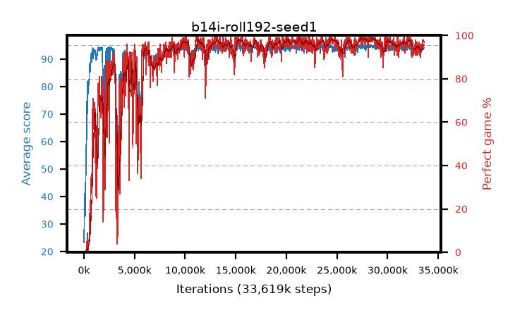

# b14i-roll192-seed1

step **33,619,968** · 1363 evals · trailing **93.89** · peak **94.67** @27,598,848 · sef **87.7** · best30 **98.3** @27,795,456

## Config

| | |
|---|---|
| algo | ppo |
| collect_envs | 128 |
| discount | 0.99 |
| eval_interval | 24576 |
| eval_queue | True |
| eval_queue_depth | 16 |
| eval_workers | 8 |
| fc_layers | (320,) |
| graph_eval_episodes | 100 |
| max_steps | 50003968 |
| min_checkpoint_score | 40.0 |
| ppo_adam_epsilon | 1e-07 |
| ppo_anneal_fraction | 1.0 |
| ppo_clip | 0.2 |
| ppo_clip_final | None |
| ppo_entropy_coef | 0.01 |
| ppo_entropy_coef_final | None |
| ppo_epochs | 4 |
| ppo_gae_lambda | 0.99 |
| ppo_gradient_clipping | 0.5 |
| ppo_horizon | 50.3 |
| ppo_learning_rate | 0.0003 |
| ppo_learning_rate_final | None |
| ppo_minibatch | 256 |
| ppo_normalize_adv | True |
| ppo_rollout | 192 |
| ppo_target_kl | 0.0 |
| ppo_transitions_per_rollout | 24576 |
| ppo_value_loss | huber |
| ppo_vf_coef | 0.5 |
| seed | 1 |
| torch_threads | 1 |

## Evals

| step | avg score | trailing avg | min score | max score | avg reward | perfect % | epsilon |
|---|---|---|---|---|---|---|---|
| 24576 | 23.31 | 23.31 | 6.0 | 42.0 | 18.31 | 0.0 |  |
| 49152 | 40.96 | 32.6 | 2.0 | 86.0 | 36.095 | 0.0 |  |
| 73728 | 32.77 | 28.04 | 8.0 | 63.0 | 27.77 | 0.0 |  |
| ... | ... | ... | ... | ... | ... | ... | ... |
| 33226752 | 94.26 | 93.85 | 73.0 | 95.0 | 185.3 | 92.0 |  |
| 33251328 | 93.54 | 93.82 | 14.0 | 95.0 | 182.59 | 90.0 |  |
| 33275904 | 94.65 | 93.86 | 84.0 | 95.0 | 189.67 | 96.0 |  |
| 33300480 | 94.02 | 93.86 | 66.0 | 95.0 | 188.045 | 95.0 |  |
| 33325056 | 94.43 | 93.85 | 69.0 | 95.0 | 189.45 | 96.0 |  |
| 33349632 | 92.56 | 93.89 | 10.0 | 95.0 | 184.595 | 93.0 |  |
| 33374208 | 94.13 | 93.88 | 62.0 | 95.0 | 188.11 | 95.0 |  |
| 33423360 | 93.38 | 93.86 | 26.0 | 95.0 | 186.365 | 94.0 |  |
| 33447936 | 93.77 | 93.89 | 24.0 | 95.0 | 187.795 | 95.0 |  |
| 33472512 | 94.04 | 93.93 | 12.0 | 95.0 | 191.05 | 98.0 |  |
| 33497088 | 93.44 | 93.88 | 16.0 | 95.0 | 190.45 | 98.0 |  |
| 33619968 | 94.15 | 93.89 | 60.0 | 95.0 | 190.165 | 97.0 |  |
