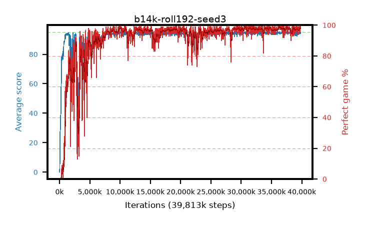

# b14k-roll192-seed3

step **39,813,120** · 1620 evals · trailing **94.18** · peak **94.62** @36,962,304 · sef **90.4** · best30 **98.3** @36,765,696

## Config

| | |
|---|---|
| algo | ppo |
| collect_envs | 128 |
| discount | 0.99 |
| eval_interval | 24576 |
| eval_queue | True |
| eval_queue_depth | 16 |
| eval_workers | 8 |
| fc_layers | (320,) |
| graph_eval_episodes | 100 |
| max_steps | 50003968 |
| min_checkpoint_score | 40.0 |
| ppo_adam_epsilon | 1e-07 |
| ppo_anneal_fraction | 1.0 |
| ppo_clip | 0.2 |
| ppo_clip_final | None |
| ppo_entropy_coef | 0.01 |
| ppo_entropy_coef_final | None |
| ppo_epochs | 4 |
| ppo_gae_lambda | 0.99 |
| ppo_gradient_clipping | 0.5 |
| ppo_horizon | 50.3 |
| ppo_learning_rate | 0.0003 |
| ppo_learning_rate_final | None |
| ppo_minibatch | 256 |
| ppo_normalize_adv | True |
| ppo_rollout | 192 |
| ppo_target_kl | 0.0 |
| ppo_transitions_per_rollout | 24576 |
| ppo_value_loss | huber |
| ppo_vf_coef | 0.5 |
| seed | 3 |
| torch_threads | 1 |

## Evals

| step | avg score | trailing avg | min score | max score | avg reward | perfect % | epsilon |
|---|---|---|---|---|---|---|---|
| 24576 | 0.05 | 0.05 | 0.0 | 1.0 | -2.025 | 0.0 |  |
| 49152 | 6.39 | 8.26 | 1.0 | 18.0 | 5.125 | 0.0 |  |
| 73728 | 18.35 | 9.2 | 0.0 | 33.0 | 13.755 | 0.0 |  |
| ... | ... | ... | ... | ... | ... | ... | ... |
| 39542784 | 94.38 | 94.08 | 63.0 | 95.0 | 191.39 | 98.0 |  |
| 39567360 | 94.34 | 94.09 | 56.0 | 95.0 | 191.305 | 98.0 |  |
| 39591936 | 93.9 | 94.06 | 57.0 | 95.0 | 188.92 | 96.0 |  |
| 39616512 | 94.79 | 94.07 | 86.0 | 95.0 | 190.805 | 97.0 |  |
| 39641088 | 94.92 | 94.16 | 87.0 | 95.0 | 192.925 | 99.0 |  |
| 39665664 | 93.84 | 94.12 | 57.0 | 95.0 | 187.82 | 95.0 |  |
| 39690240 | 94.91 | 94.18 | 86.0 | 95.0 | 192.915 | 99.0 |  |
| 39714816 | 94.83 | 94.13 | 78.0 | 95.0 | 192.835 | 99.0 |  |
| 39739392 | 93.89 | 94.14 | 8.0 | 95.0 | 190.9 | 98.0 |  |
| 39763968 | 94.32 | 94.15 | 58.0 | 95.0 | 191.33 | 98.0 |  |
| 39788544 | 94.79 | 94.19 | 74.0 | 95.0 | 192.75 | 99.0 |  |
| 39813120 | 94.21 | 94.18 | 16.0 | 95.0 | 192.215 | 99.0 |  |
