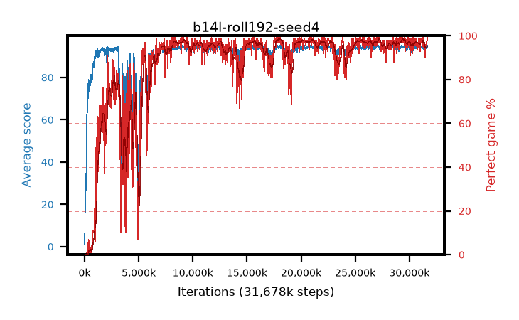

# b14l-roll192-seed4

step **31,678,464** · 1283 evals · trailing **94.21** · peak **94.39** @27,279,360 · sef **82.6** · best30 **98.1** @18,186,240

## Config

| | |
|---|---|
| algo | ppo |
| collect_envs | 128 |
| discount | 0.99 |
| eval_interval | 24576 |
| eval_queue | True |
| eval_queue_depth | 16 |
| eval_workers | 8 |
| fc_layers | (320,) |
| graph_eval_episodes | 100 |
| max_steps | 50003968 |
| min_checkpoint_score | 40.0 |
| ppo_adam_epsilon | 1e-07 |
| ppo_anneal_fraction | 1.0 |
| ppo_clip | 0.2 |
| ppo_clip_final | None |
| ppo_entropy_coef | 0.01 |
| ppo_entropy_coef_final | None |
| ppo_epochs | 4 |
| ppo_gae_lambda | 0.99 |
| ppo_gradient_clipping | 0.5 |
| ppo_horizon | 50.3 |
| ppo_learning_rate | 0.0003 |
| ppo_learning_rate_final | None |
| ppo_minibatch | 256 |
| ppo_normalize_adv | True |
| ppo_rollout | 192 |
| ppo_target_kl | 0.0 |
| ppo_transitions_per_rollout | 24576 |
| ppo_value_loss | huber |
| ppo_vf_coef | 0.5 |
| seed | 4 |
| torch_threads | 1 |

## Evals

| step | avg score | trailing avg | min score | max score | avg reward | perfect % | epsilon |
|---|---|---|---|---|---|---|---|
| 24576 | 0.91 | 0.91 | 0.0 | 4.0 | -4.0 | 0.0 |  |
| 49152 | 22.3 | 11.61 | 5.0 | 42.0 | 17.39 | 0.0 |  |
| 73728 | 24.75 | 15.99 | 5.0 | 46.0 | 19.75 | 0.0 |  |
| ... | ... | ... | ... | ... | ... | ... | ... |
| 31260672 | 93.7 | 94.19 | 36.0 | 95.0 | 188.72 | 96.0 |  |
| 31285248 | 94.18 | 94.13 | 65.0 | 95.0 | 188.205 | 95.0 |  |
| 31309824 | 93.01 | 94.18 | 10.0 | 95.0 | 187.035 | 95.0 |  |
| 31334400 | 95.0 | 94.2 | 95.0 | 95.0 | 194.0 | 100.0 |  |
| 31358976 | 94.34 | 94.17 | 57.0 | 95.0 | 190.355 | 97.0 |  |
| 31383552 | 94.03 | 94.15 | 58.0 | 95.0 | 187.06 | 94.0 |  |
| 31408128 | 92.77 | 94.16 | 28.0 | 95.0 | 181.82 | 90.0 |  |
| 31432704 | 94.19 | 94.22 | 75.0 | 95.0 | 187.22 | 94.0 |  |
| 31457280 | 93.38 | 94.16 | 55.0 | 95.0 | 182.385 | 90.0 |  |
| 31481856 | 94.58 | 94.18 | 78.0 | 95.0 | 189.6 | 96.0 |  |
| 31580160 | 93.66 | 94.16 | 12.0 | 95.0 | 188.68 | 96.0 |  |
| 31678464 | 95.0 | 94.21 | 95.0 | 95.0 | 194.0 | 100.0 |  |
