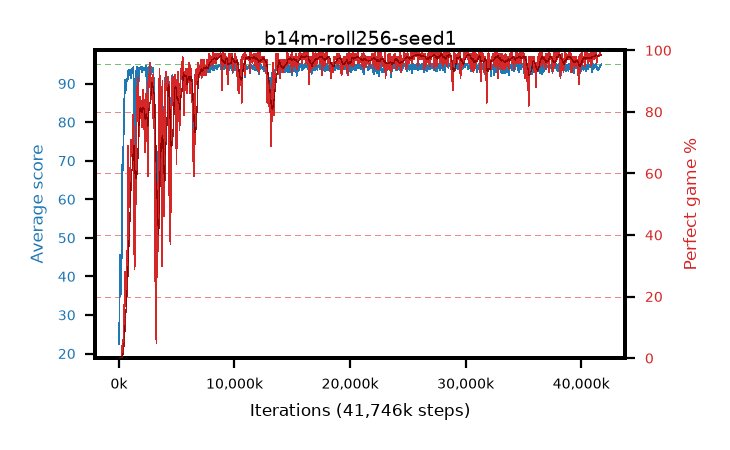

# b14m-roll256-seed1

step **41,746,432** · 1266 evals · trailing **94.41** · peak **94.48** @27,721,728 · sef **91.6** · best30 **98.4** @26,214,400

## Config

| | |
|---|---|
| algo | ppo |
| collect_envs | 128 |
| discount | 0.99 |
| eval_interval | 32768 |
| eval_queue | True |
| eval_queue_depth | 16 |
| eval_workers | 8 |
| fc_layers | (320,) |
| graph_eval_episodes | 100 |
| max_steps | 50003968 |
| min_checkpoint_score | 40.0 |
| ppo_adam_epsilon | 1e-07 |
| ppo_anneal_fraction | 1.0 |
| ppo_clip | 0.2 |
| ppo_clip_final | None |
| ppo_entropy_coef | 0.01 |
| ppo_entropy_coef_final | None |
| ppo_epochs | 4 |
| ppo_gae_lambda | 0.99 |
| ppo_gradient_clipping | 0.5 |
| ppo_horizon | 50.3 |
| ppo_learning_rate | 0.0003 |
| ppo_learning_rate_final | None |
| ppo_minibatch | 256 |
| ppo_normalize_adv | True |
| ppo_rollout | 256 |
| ppo_target_kl | 0.0 |
| ppo_transitions_per_rollout | 32768 |
| ppo_value_loss | huber |
| ppo_vf_coef | 0.5 |
| seed | 1 |
| torch_threads | 1 |

## Evals

| step | avg score | trailing avg | min score | max score | avg reward | perfect % | epsilon |
|---|---|---|---|---|---|---|---|
| 32768 | 22.45 | 22.45 | 1.0 | 43.0 | 18.44 | 0.0 |  |
| 65536 | 45.55 | 35.68 | 8.0 | 87.0 | 40.91 | 0.0 |  |
| 98304 | 39.81 | 31.13 | 9.0 | 71.0 | 34.855 | 0.0 |  |
| ... | ... | ... | ... | ... | ... | ... | ... |
| 41123840 | 93.9 | 94.38 | 18.0 | 95.0 | 190.91 | 98.0 |  |
| 41156608 | 94.33 | 94.34 | 58.0 | 95.0 | 190.345 | 97.0 |  |
| 41189376 | 94.64 | 94.35 | 59.0 | 95.0 | 192.645 | 99.0 |  |
| 41222144 | 94.9 | 94.35 | 85.0 | 95.0 | 192.905 | 99.0 |  |
| 41254912 | 95.0 | 94.37 | 95.0 | 95.0 | 194.0 | 100.0 |  |
| 41287680 | 94.4 | 94.33 | 35.0 | 95.0 | 192.36 | 99.0 |  |
| 41320448 | 94.14 | 94.39 | 14.0 | 95.0 | 191.15 | 98.0 |  |
| 41353216 | 93.78 | 94.41 | 18.0 | 95.0 | 188.8 | 96.0 |  |
| 41385984 | 94.29 | 94.4 | 59.0 | 95.0 | 191.3 | 98.0 |  |
| 41418752 | 93.4 | 94.37 | 10.0 | 95.0 | 190.41 | 98.0 |  |
| 41484288 | 93.55 | 94.39 | 10.0 | 95.0 | 190.515 | 98.0 |  |
| 41746432 | 95.0 | 94.41 | 95.0 | 95.0 | 194.0 | 100.0 |  |
