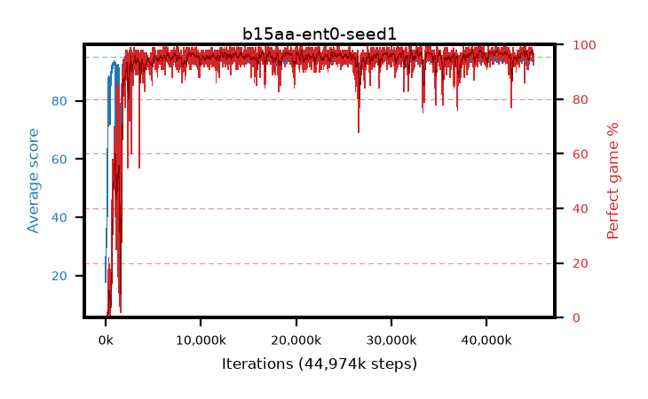

# b15aa-ent0-seed1

step **44,974,080** · 2736 evals · trailing **94.15** · peak **94.37** @40,943,616 · sef **95.7** · best30 **97.4** @41,254,912

## Config

| | |
|---|---|
| algo | ppo |
| collect_envs | 128 |
| discount | 0.99 |
| eval_interval | 16384 |
| eval_queue | True |
| eval_queue_depth | 16 |
| eval_workers | 8 |
| fc_layers | (320,) |
| graph_eval_episodes | 100 |
| max_steps | 50003968 |
| min_checkpoint_score | 40.0 |
| ppo_adam_epsilon | 1e-07 |
| ppo_anneal_fraction | 1.0 |
| ppo_clip | 0.2 |
| ppo_clip_final | None |
| ppo_entropy_coef | 0.0 |
| ppo_entropy_coef_final | None |
| ppo_epochs | 4 |
| ppo_gae_lambda | 0.98 |
| ppo_gradient_clipping | 0.5 |
| ppo_horizon | 33.6 |
| ppo_learning_rate | 0.0003 |
| ppo_learning_rate_final | None |
| ppo_minibatch | 256 |
| ppo_normalize_adv | True |
| ppo_rollout | 128 |
| ppo_target_kl | 0.0 |
| ppo_transitions_per_rollout | 16384 |
| ppo_value_loss | huber |
| ppo_vf_coef | 0.5 |
| seed | 1 |
| torch_threads | 1 |

## Evals

| step | avg score | trailing avg | min score | max score | avg reward | perfect % | epsilon |
|---|---|---|---|---|---|---|---|
| 16384 | 17.8 | 23.69 | 1.0 | 43.0 | 15.68 | 0.0 |  |
| 32768 | 34.31 | 30.1 | 1.0 | 88.0 | 30.795 | 0.0 |  |
| 49152 | 34.83 | 29.04 | 10.0 | 75.0 | 29.875 | 0.0 |  |
| ... | ... | ... | ... | ... | ... | ... | ... |
| 44646400 | 94.35 | 94.19 | 64.0 | 95.0 | 189.37 | 96.0 |  |
| 44662784 | 94.6 | 94.24 | 66.0 | 95.0 | 191.61 | 98.0 |  |
| 44761088 | 94.32 | 94.14 | 67.0 | 95.0 | 190.335 | 97.0 |  |
| 44777472 | 94.66 | 94.14 | 61.0 | 95.0 | 192.665 | 99.0 |  |
| 44793856 | 94.44 | 94.15 | 54.0 | 95.0 | 190.455 | 97.0 |  |
| 44810240 | 94.24 | 94.21 | 60.0 | 95.0 | 190.255 | 97.0 |  |
| 44826624 | 94.83 | 94.21 | 84.0 | 95.0 | 191.84 | 98.0 |  |
| 44843008 | 93.66 | 94.12 | 14.0 | 95.0 | 187.64 | 95.0 |  |
| 44875776 | 93.64 | 94.12 | 35.0 | 95.0 | 187.62 | 95.0 |  |
| 44892160 | 94.37 | 94.23 | 59.0 | 95.0 | 190.385 | 97.0 |  |
| 44924928 | 93.33 | 94.14 | 31.0 | 95.0 | 186.315 | 94.0 |  |
| 44974080 | 92.42 | 94.15 | 31.0 | 95.0 | 185.27 | 94.0 |  |
