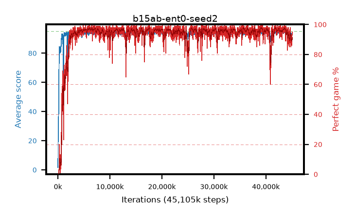

# b15ab-ent0-seed2

step **45,105,152** · 2746 evals · trailing **93.05** · peak **94.51** @43,778,048 · sef **94.4** · best30 **97.5** @39,305,216

## Config

| | |
|---|---|
| algo | ppo |
| collect_envs | 128 |
| discount | 0.99 |
| eval_interval | 16384 |
| eval_queue | True |
| eval_queue_depth | 16 |
| eval_workers | 8 |
| fc_layers | (320,) |
| graph_eval_episodes | 100 |
| max_steps | 50003968 |
| min_checkpoint_score | 40.0 |
| ppo_adam_epsilon | 1e-07 |
| ppo_anneal_fraction | 1.0 |
| ppo_clip | 0.2 |
| ppo_clip_final | None |
| ppo_entropy_coef | 0.0 |
| ppo_entropy_coef_final | None |
| ppo_epochs | 4 |
| ppo_gae_lambda | 0.98 |
| ppo_gradient_clipping | 0.5 |
| ppo_horizon | 33.6 |
| ppo_learning_rate | 0.0003 |
| ppo_learning_rate_final | None |
| ppo_minibatch | 256 |
| ppo_normalize_adv | True |
| ppo_rollout | 128 |
| ppo_target_kl | 0.0 |
| ppo_transitions_per_rollout | 16384 |
| ppo_value_loss | huber |
| ppo_vf_coef | 0.5 |
| seed | 2 |
| torch_threads | 1 |

## Evals

| step | avg score | trailing avg | min score | max score | avg reward | perfect % | epsilon |
|---|---|---|---|---|---|---|---|
| 16384 | 1.62 | 1.62 | 0.0 | 6.0 | -0.95 | 0.0 |  |
| 32768 | 15.54 | 8.58 | 4.0 | 28.0 | 10.855 | 0.0 |  |
| 49152 | 25.05 | 17.14 | 4.0 | 54.0 | 20.14 | 0.0 |  |
| ... | ... | ... | ... | ... | ... | ... | ... |
| 44810240 | 92.47 | 92.92 | 62.0 | 95.0 | 176.455 | 85.0 |  |
| 44826624 | 90.86 | 92.99 | 3.0 | 95.0 | 177.785 | 88.0 |  |
| 44843008 | 90.86 | 92.99 | 1.0 | 95.0 | 178.78 | 89.0 |  |
| 44941312 | 92.0 | 93.15 | 25.0 | 95.0 | 176.935 | 86.0 |  |
| 44957696 | 92.87 | 93.11 | 57.0 | 95.0 | 179.84 | 88.0 |  |
| 44974080 | 93.14 | 93.14 | 44.0 | 95.0 | 184.09 | 92.0 |  |
| 44990464 | 93.4 | 93.01 | 8.0 | 95.0 | 185.435 | 93.0 |  |
| 45006848 | 93.28 | 92.95 | 13.0 | 95.0 | 185.225 | 93.0 |  |
| 45056000 | 92.82 | 92.97 | 17.0 | 95.0 | 184.765 | 93.0 |  |
| 45072384 | 93.13 | 92.97 | 12.0 | 95.0 | 185.075 | 93.0 |  |
| 45088768 | 93.37 | 93.06 | 25.0 | 95.0 | 186.31 | 94.0 |  |
| 45105152 | 93.26 | 93.05 | 8.0 | 95.0 | 187.285 | 95.0 |  |
