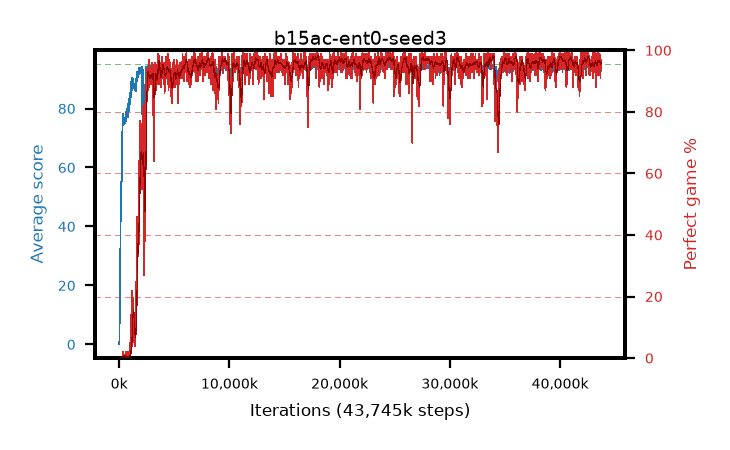

# b15ac-ent0-seed3

step **43,745,280** · 2663 evals · trailing **93.99** · peak **94.46** @41,189,376 · sef **93.7** · best30 **97.6** @17,989,632

## Config

| | |
|---|---|
| algo | ppo |
| collect_envs | 128 |
| discount | 0.99 |
| eval_interval | 16384 |
| eval_queue | True |
| eval_queue_depth | 16 |
| eval_workers | 8 |
| fc_layers | (320,) |
| graph_eval_episodes | 100 |
| max_steps | 50003968 |
| min_checkpoint_score | 40.0 |
| ppo_adam_epsilon | 1e-07 |
| ppo_anneal_fraction | 1.0 |
| ppo_clip | 0.2 |
| ppo_clip_final | None |
| ppo_entropy_coef | 0.0 |
| ppo_entropy_coef_final | None |
| ppo_epochs | 4 |
| ppo_gae_lambda | 0.98 |
| ppo_gradient_clipping | 0.5 |
| ppo_horizon | 33.6 |
| ppo_learning_rate | 0.0003 |
| ppo_learning_rate_final | None |
| ppo_minibatch | 256 |
| ppo_normalize_adv | True |
| ppo_rollout | 128 |
| ppo_target_kl | 0.0 |
| ppo_transitions_per_rollout | 16384 |
| ppo_value_loss | huber |
| ppo_vf_coef | 0.5 |
| seed | 3 |
| torch_threads | 1 |

## Evals

| step | avg score | trailing avg | min score | max score | avg reward | perfect % | epsilon |
|---|---|---|---|---|---|---|---|
| 16384 | 0.09 | 0.09 | 0.0 | 2.0 | -2.525 | 0.0 |  |
| 32768 | 1.65 | 0.87 | 0.0 | 7.0 | 1.06 | 0.0 |  |
| 49152 | 15.34 | 10.5 | 0.0 | 43.0 | 11.33 | 0.0 |  |
| ... | ... | ... | ... | ... | ... | ... | ... |
| 43450368 | 93.93 | 94.02 | 59.0 | 95.0 | 187.955 | 95.0 |  |
| 43548672 | 93.39 | 94.08 | 24.0 | 95.0 | 186.42 | 94.0 |  |
| 43565056 | 93.96 | 94.11 | 24.0 | 95.0 | 190.97 | 98.0 |  |
| 43581440 | 94.91 | 94.08 | 86.0 | 95.0 | 192.915 | 99.0 |  |
| 43597824 | 94.13 | 94.05 | 16.0 | 95.0 | 191.14 | 98.0 |  |
| 43614208 | 93.77 | 93.98 | 10.0 | 95.0 | 186.8 | 94.0 |  |
| 43630592 | 93.68 | 93.95 | 36.0 | 95.0 | 186.665 | 94.0 |  |
| 43646976 | 93.38 | 93.91 | 11.0 | 95.0 | 190.3 | 98.0 |  |
| 43663360 | 93.09 | 94.06 | 19.0 | 95.0 | 183.09 | 91.0 |  |
| 43679744 | 94.74 | 94.09 | 77.0 | 95.0 | 190.755 | 97.0 |  |
| 43696128 | 92.85 | 93.96 | 8.0 | 95.0 | 185.79 | 94.0 |  |
| 43745280 | 94.58 | 93.99 | 67.0 | 95.0 | 189.6 | 96.0 |  |
