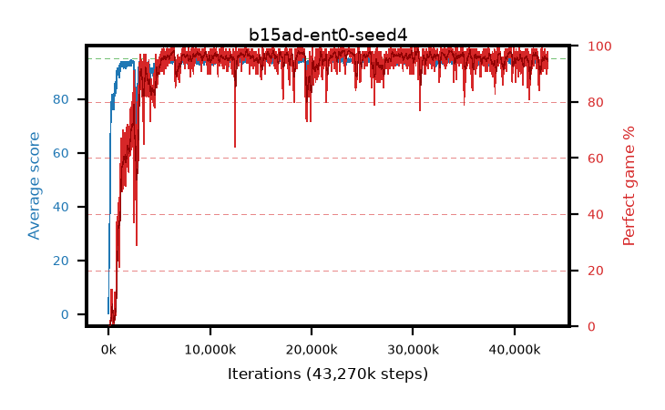

# b15ad-ent0-seed4

step **43,270,144** · 2634 evals · trailing **93.69** · peak **94.58** @22,937,600 · sef **92.5** · best30 **97.9** @33,832,960

## Config

| | |
|---|---|
| algo | ppo |
| collect_envs | 128 |
| discount | 0.99 |
| eval_interval | 16384 |
| eval_queue | True |
| eval_queue_depth | 16 |
| eval_workers | 8 |
| fc_layers | (320,) |
| graph_eval_episodes | 100 |
| max_steps | 50003968 |
| min_checkpoint_score | 40.0 |
| ppo_adam_epsilon | 1e-07 |
| ppo_anneal_fraction | 1.0 |
| ppo_clip | 0.2 |
| ppo_clip_final | None |
| ppo_entropy_coef | 0.0 |
| ppo_entropy_coef_final | None |
| ppo_epochs | 4 |
| ppo_gae_lambda | 0.98 |
| ppo_gradient_clipping | 0.5 |
| ppo_horizon | 33.6 |
| ppo_learning_rate | 0.0003 |
| ppo_learning_rate_final | None |
| ppo_minibatch | 256 |
| ppo_normalize_adv | True |
| ppo_rollout | 128 |
| ppo_target_kl | 0.0 |
| ppo_transitions_per_rollout | 16384 |
| ppo_value_loss | huber |
| ppo_vf_coef | 0.5 |
| seed | 4 |
| torch_threads | 1 |

## Evals

| step | avg score | trailing avg | min score | max score | avg reward | perfect % | epsilon |
|---|---|---|---|---|---|---|---|
| 16384 | 0.22 | 0.22 | 0.0 | 2.0 | -0.595 | 0.0 |  |
| 32768 | 14.53 | 18.88 | 1.0 | 26.0 | 10.43 | 0.0 |  |
| 49152 | 23.51 | 11.87 | 1.0 | 42.0 | 18.51 | 0.0 |  |
| ... | ... | ... | ... | ... | ... | ... | ... |
| 42975232 | 94.01 | 93.72 | 28.0 | 95.0 | 189.03 | 96.0 |  |
| 42991616 | 93.89 | 93.82 | 35.0 | 95.0 | 188.865 | 96.0 |  |
| 43008000 | 92.04 | 93.78 | 8.0 | 95.0 | 186.02 | 95.0 |  |
| 43024384 | 92.72 | 93.73 | 5.0 | 95.0 | 183.715 | 92.0 |  |
| 43122688 | 94.57 | 93.82 | 70.0 | 95.0 | 189.59 | 96.0 |  |
| 43139072 | 93.58 | 93.81 | 13.0 | 95.0 | 189.55 | 97.0 |  |
| 43155456 | 92.83 | 93.82 | 20.0 | 95.0 | 181.88 | 90.0 |  |
| 43171840 | 93.62 | 93.71 | 26.0 | 95.0 | 188.595 | 96.0 |  |
| 43220992 | 94.84 | 93.84 | 84.0 | 95.0 | 191.85 | 98.0 |  |
| 43237376 | 94.4 | 93.83 | 57.0 | 95.0 | 189.375 | 96.0 |  |
| 43253760 | 93.38 | 93.66 | 22.0 | 95.0 | 184.42 | 92.0 |  |
| 43270144 | 93.93 | 93.69 | 60.0 | 95.0 | 186.96 | 94.0 |  |
