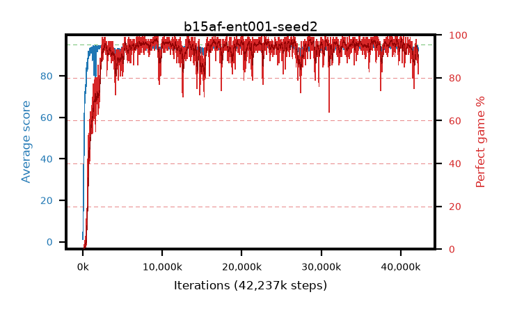

# b15af-ent001-seed2

step **42,237,952** · 2568 evals · trailing **93.23** · peak **94.45** @37,339,136 · sef **93.9** · best30 **97.7** @9,289,728

## Config

| | |
|---|---|
| algo | ppo |
| collect_envs | 128 |
| discount | 0.99 |
| eval_interval | 16384 |
| eval_queue | True |
| eval_queue_depth | 16 |
| eval_workers | 8 |
| fc_layers | (320,) |
| graph_eval_episodes | 100 |
| max_steps | 50003968 |
| min_checkpoint_score | 40.0 |
| ppo_adam_epsilon | 1e-07 |
| ppo_anneal_fraction | 1.0 |
| ppo_clip | 0.2 |
| ppo_clip_final | None |
| ppo_entropy_coef | 0.001 |
| ppo_entropy_coef_final | None |
| ppo_epochs | 4 |
| ppo_gae_lambda | 0.98 |
| ppo_gradient_clipping | 0.5 |
| ppo_horizon | 33.6 |
| ppo_learning_rate | 0.0003 |
| ppo_learning_rate_final | None |
| ppo_minibatch | 256 |
| ppo_normalize_adv | True |
| ppo_rollout | 128 |
| ppo_target_kl | 0.0 |
| ppo_transitions_per_rollout | 16384 |
| ppo_value_loss | huber |
| ppo_vf_coef | 0.5 |
| seed | 2 |
| torch_threads | 1 |

## Evals

| step | avg score | trailing avg | min score | max score | avg reward | perfect % | epsilon |
|---|---|---|---|---|---|---|---|
| 16384 | 1.17 | 1.17 | 0.0 | 5.0 | -0.905 | 0.0 |  |
| 32768 | 8.23 | 4.7 | 0.0 | 23.0 | 3.86 | 0.0 |  |
| 49152 | 23.88 | 11.09 | 6.0 | 45.0 | 18.88 | 0.0 |  |
| ... | ... | ... | ... | ... | ... | ... | ... |
| 41893888 | 94.5 | 93.22 | 75.0 | 95.0 | 189.52 | 96.0 |  |
| 41910272 | 92.6 | 93.16 | 16.0 | 95.0 | 186.625 | 95.0 |  |
| 41926656 | 94.58 | 93.13 | 73.0 | 95.0 | 191.59 | 98.0 |  |
| 41943040 | 93.29 | 93.23 | 22.0 | 95.0 | 186.23 | 94.0 |  |
| 42057728 | 93.77 | 93.16 | 65.0 | 95.0 | 183.77 | 91.0 |  |
| 42074112 | 92.72 | 93.11 | 45.0 | 95.0 | 178.65 | 87.0 |  |
| 42090496 | 94.03 | 93.22 | 76.0 | 95.0 | 183.08 | 90.0 |  |
| 42156032 | 94.47 | 93.24 | 81.0 | 95.0 | 186.505 | 93.0 |  |
| 42172416 | 91.9 | 93.18 | 6.0 | 95.0 | 173.895 | 83.0 |  |
| 42188800 | 93.57 | 93.24 | 71.0 | 95.0 | 181.625 | 89.0 |  |
| 42205184 | 92.14 | 93.17 | 14.0 | 95.0 | 173.14 | 82.0 |  |
| 42237952 | 93.18 | 93.23 | 26.0 | 95.0 | 179.2 | 87.0 |  |
